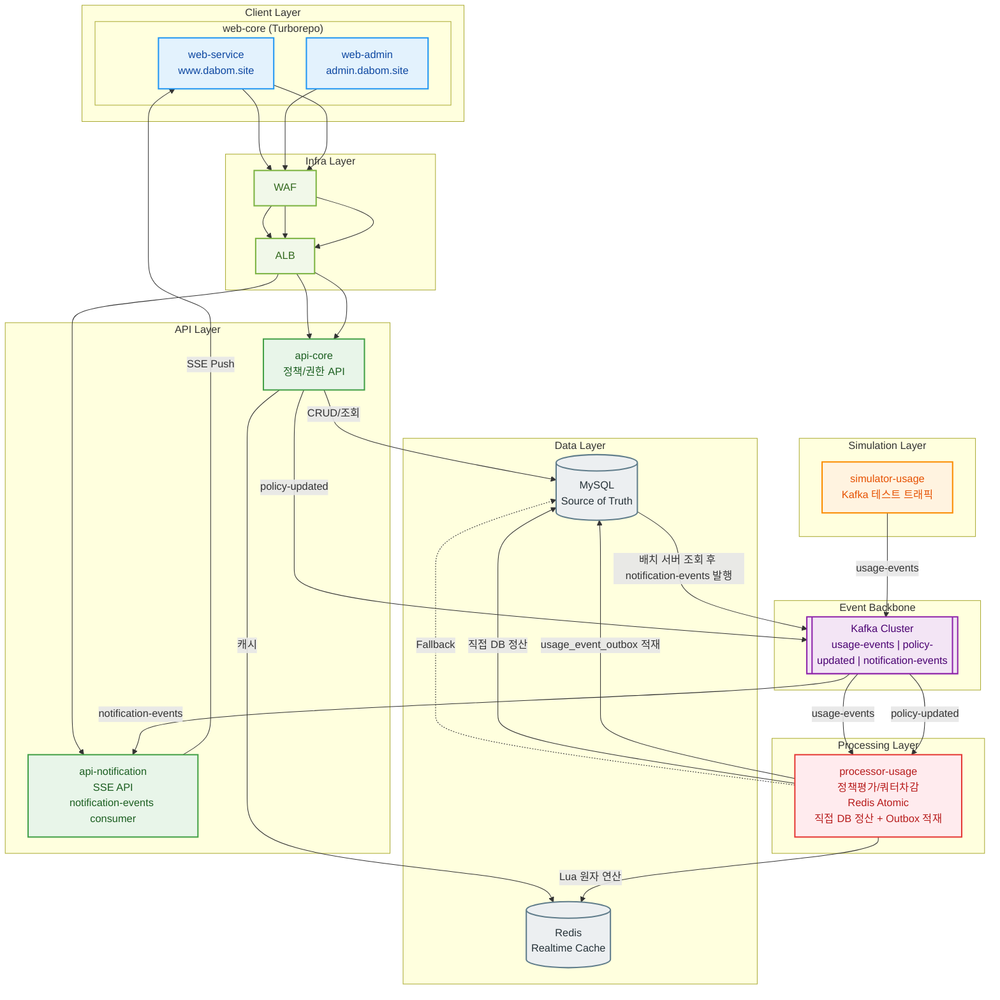
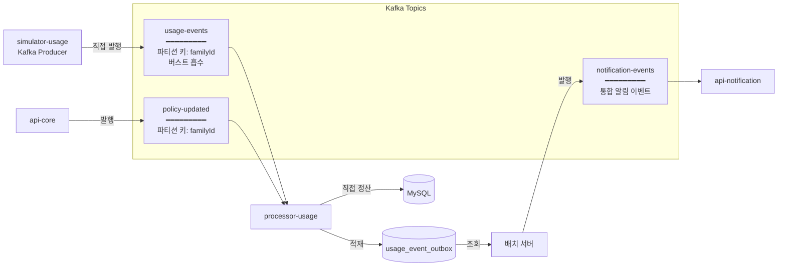
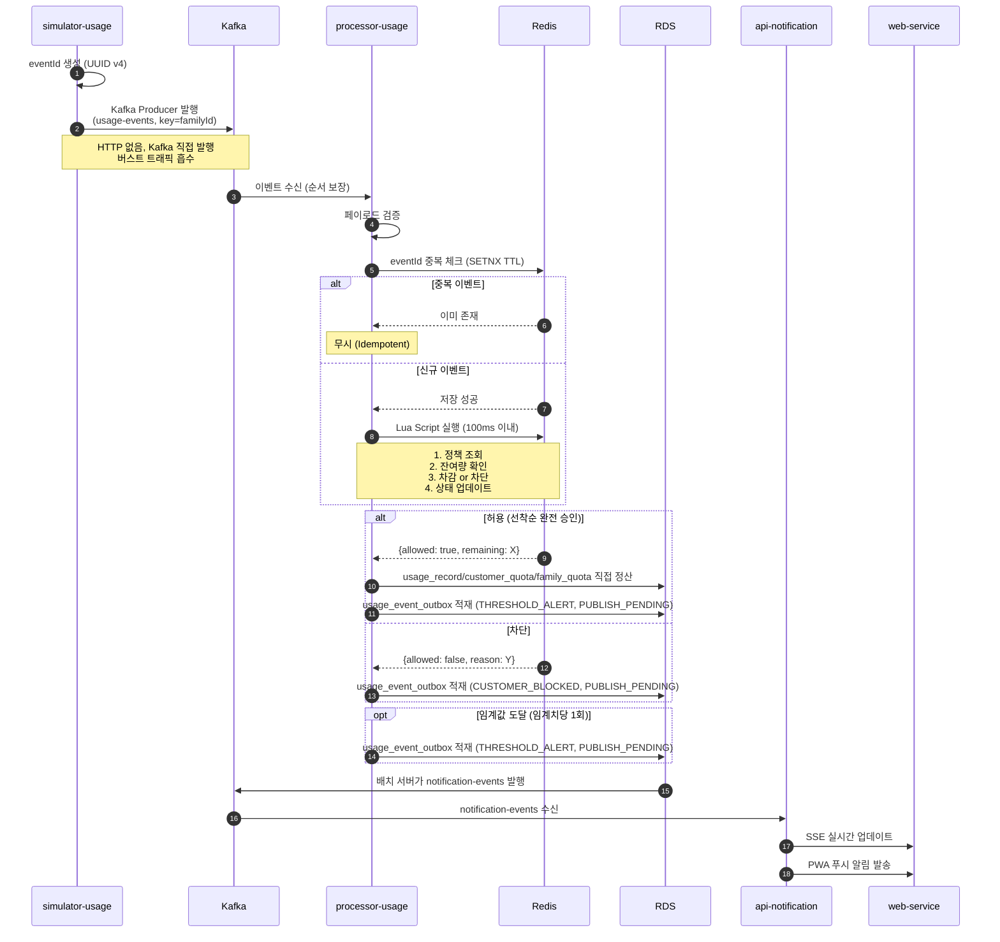
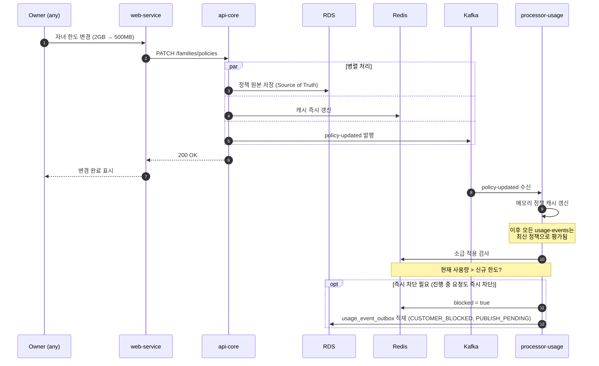
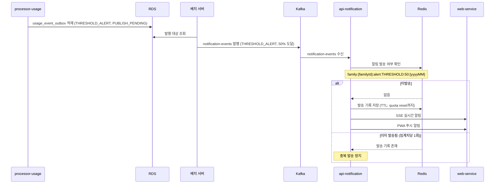
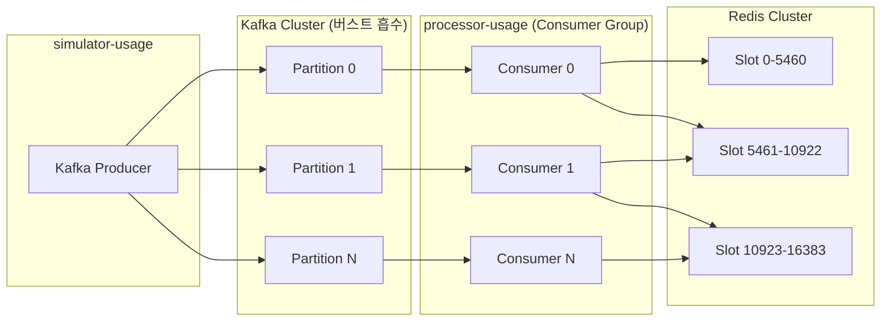
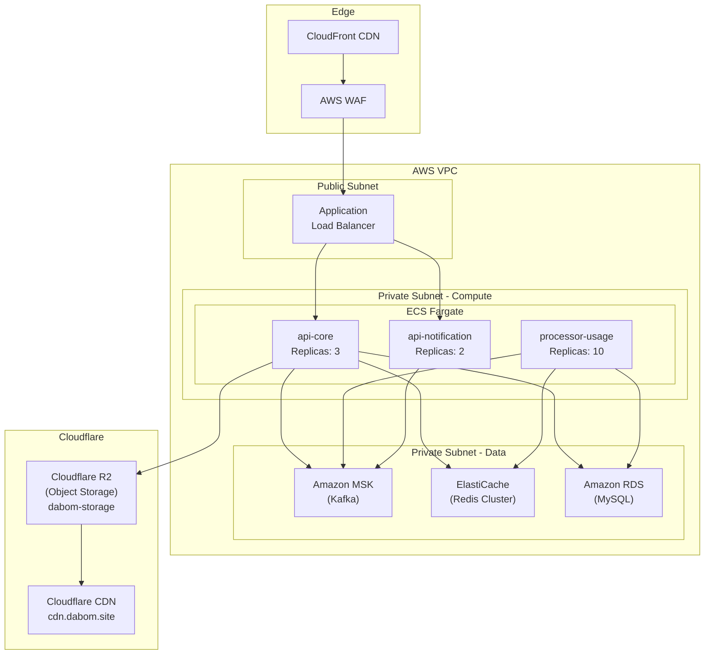

# 실시간 가족 데이터 통합 관리 시스템 - 아키텍처 설계서

> **문서 버전**: v25.0
> **작성일**: 2026-03-20
> **작성자**: DABOM 팀
> **변경 이력**: v25.0 - ERD v24.5 동기화: 리캡 배치 성능 인덱스 6종, notification 알림 타입 14종 확정. 전체 문서 v25.0 Major 버전 동기화 | v24.0 - usage-events 처리 흐름과 notification outbox 구조를 통합 반영: `usage-persist`/`usage-realtime` 제거, processor-usage가 Redis/Lua 이후 MySQL을 직접 정산하고 `usage_event_outbox`에 notification 발행 의도를 저장한 뒤 배치 서버가 `notification-events`로 후행 발행하도록 수정. notification payload는 subType 없는 평탄화 envelope 기준으로 정리 | v23.2 - API_SPECIFICATION v23.1 동기화: NOTIFICATIONS 엔드포인트 갱신 (alert/block 제거, unread-count/DELETE 추가, 읽음 경로 RESTful 개선), PUSH 도메인 추가 (4개 엔드포인트), SSE 경로 `/families/usage/sse` → `/events/stream` + 12개 이벤트 타입 확장 | v23.1 - `family`의 월별 상태를 `family_quota`로 분리하고, Family Redis 키(`info`, `remaining`, `alert`)에 `{yyyyMM}` suffix를 적용하는 구조로 동기화 | v22.0 - API_SPECIFICATION v22.2 Major 버전 동기화: 엔드포인트 총 60개 반영 | v21.0 - API_SPECIFICATION v21.6 동기화: 도메인 리네이밍 (NEGOTIATIONS→APPEALS, REPORTS→RECAPS), 엔드포인트 경로 갱신 6건, 알림 subType APPEAL_*/EMERGENCY_APPROVED 전환, 배치 흐름 FamilyRecapBatchJob/communication_score 갱신, SSE 경로 /families/usage/sse 반영 | v11.0 - 2차기획서 Phase 2 기능 반영: api-core 도메인 확장, 알림 subType 확장, E2E 플로우 추가, 배치 설계 추가 | v10.2 - POLICY 테이블 is_activate → is_active 리네이밍 버전 동기화 | v10.0 - web-core 서브도메인 분리: web-service (www.dabom.site) + web-admin (admin.dabom.site), 모노레포 구조 반영 | v9.0 - api-spec 최종 동기화: 도메인 구조 변경 (7→5도메인), 엔드포인트 URL/메서드/응답 구조 변경 | v8.0 - 전체 문서 버전 통일 (공유 Major + 독립 Minor 체계 도입) | v7.0 - simulator-traffic → simulator-usage 리네이밍, 기술 스택 Go 확정 | v6.0 - ERD v6.0 동기화: customerId 네이밍, POLICY 스키마 반영 | v5.0 - ERD v5.0 동기화: daily→monthly 전환, Redis 키/Lua Script 업데이트, 관리자 전용 인증 API 추가, CUSTOMER/ADMIN 분리 반영; v4.0 - API 엔드포인트 전면 재구성 (api-spec.csv 기반, /api/v1 prefix 제거, 도메인별 그룹핑, JWT familyId 추론, REST 알림 API 추가)

---

## 1. 아키텍처 개요

### 1.1 설계 목표

| 목표 | 설명 |
|------|------|
| **대규모 트래픽 처리** | 100만 유저, 25만 가족 그룹, 5,000 TPS 안정적 처리 |
| **실시간 이벤트 처리** | 이벤트 기반 실시간 처리 중심 시스템 구성 |
| **동시성 제어** | "마지막 10MB" 케이스에서 정합성 보장 (100ms 이내) |
| **정책 즉시 반영** | 정책 변경 시 다음 이벤트부터 즉시 적용 |
| **Idempotency** | 중복/재처리 상황에서 일관된 결과 보장 |
| **장애 내성** | Redis 장애 시 DB Fallback, Circuit Breaker 전체 적용 |

### 1.2 핵심 설계 원칙

| 원칙 | 설명 |
|------|------|
| **이벤트 기반 우선** | API보다 이벤트 스트리밍(Kafka)을 우선 처리 방식으로 채택 |
| **가족 단위 순서 보장** | Kafka 파티션 키를 familyId로 설정하여 동일 가족 이벤트 순서 처리 |
| **원자 연산** | Redis Lua 스크립트로 "확인→차감→상태 변경"을 단일 트랜잭션 처리 |
| **이중 저장** | Redis(실시간) + RDS(영속) 분리로 성능과 신뢰성 동시 확보 |
| **직접 DB 정산** | Redis/Lua 처리 직후 processor-usage가 `usage_record`·`customer_quota`·`family_quota`를 직접 반영 |
| **Soft Delete** | 영속 엔티티에 `deleted_at` 컬럼 적용. 물리 삭제 대신 논리 삭제로 데이터 복구 가능성과 감사 추적 보장. 모든 엔티티가 `BaseEntity`를 상속하므로 `created_at`, `updated_at`, `deleted_at` 3개 필드를 공통으로 가짐. 이력성/불변 테이블은 운영상 Soft Delete를 사용하지 않으나, `deleted_at` 컬럼은 존재 (항상 NULL) |

### 1.3 기술 스택 요약

| 영역 | 기술 | 선정 사유 |
|------|------|----------|
| **simulator-usage** | Go | Kafka 사용량 이벤트 직접 발행, eventId 생성, 고성능 |
| **processor-usage** | Spring Boot / Go | 정책평가/쿼터차감, Redis Atomic, 직접 DB 정산, Outbox 적재 |
| **api-core** | Spring Boot | 복잡한 비즈니스 로직, 생태계 |
| **api-notification** | Node.js / Spring Boot | SSE API, notification-events consumer |
| **Kafka** | Apache Kafka | 대용량 이벤트 스트림, 순서 보장, 버스트 흡수 |
| **Redis** | Redis Cluster | 원자 연산, Pub/Sub, 캐시 |
| **RDS** | MySQL | JSON, Read 성능, 안정성 |
| **web-core** | Next.js + PWA (Turborepo) | web-service (www.dabom.site) + web-admin (admin.dabom.site) 모노레포, 크로스 플랫폼, 실시간 UI, 푸시 알림 |
| **Object Storage** | Cloudflare R2 | S3 호환 API, 이그레스 무과금, 이미지 저장 (dabom-storage) |
| **CDN (이미지)** | Cloudflare CDN | R2 퍼블릭 버킷 연동, cdn.dabom.site |
| **Container** | Docker + K8s / ECS Fargate | 오케스트레이션, 오토스케일링 |
| **Observability** | Prometheus + Grafana + Jaeger | 로그 + 메트릭 + 트레이싱 통합 |

---

## 2. 시스템 아키텍처

### 2.1 전체 아키텍처 다이어그램



> **아키텍처 변경 사항 (v3.0)**
> - web-user + web-admin을 **web-core** Turborepo 모노레포로 통합, **web-service** (www.dabom.site) + **web-admin** (admin.dabom.site) 서브도메인 분리
> - Traffic Generator → **simulator-usage** 리네이밍 (Simulation Layer, v7.0에서 simulator-traffic → simulator-usage로 최종 확정)
> - Usage Engine → **processor-usage** 리네이밍, Redis/Lua 이후 직접 DB 정산 수행
> - api-message → **api-notification** 리네이밍, Processing Layer에서 API Layer로 이동
> - quota-updated, user-blocked, threshold-alert를 **notification-events** 단일 토픽으로 통합

### 2.2 컴포넌트 책임 분리

| 컴포넌트 | 역할 | 기술 스택 |
|---------|------|----------|
| **simulator-usage** | 데이터 사용 이벤트 시뮬레이션, eventId 생성, Kafka 사용량 이벤트 직접 발행 | Go |
| **processor-usage** | Kafka 소비, 페이로드 검증, 중복 체크, 정책평가/쿼터차감, Redis Atomic, 직접 DB 정산, `usage_event_outbox` 적재 | Spring Boot / Go |
| **api-core** | 9개 도메인 REST API (CUSTOMERS/FAMILIES/POLICIES/NOTIFICATIONS/ADMIN/APPEALS/MISSIONS/RECAPS/UPLOADS), JWT familyId 추론, 정책 즉시 반영 트리거, 이의제기 요청/승인/거절 (APPEAL, EMERGENCY) 처리, 미션 생성/삭제 및 보상 요청/승인/거절 처리, 이미지 업로드 (R2), 월간 가족 리캡 조회, 감사 로그 기록 | Spring Boot |
| **api-notification** | notification-events consumer, SSE API + REST 알림 조회 API, 실시간 알림 Push | Node.js / Spring Boot |
| **Redis** | 실시간 상태, 캐시, 중복 처리 키, Lua Script | Redis Cluster |
| **RDS** | 원본 데이터, 정책, 사용 이력, 감사 로그 | MySQL |
| **web-service** | 가족 사용자 PWA (www.dabom.site), 가족 대시보드, Owner 정책 관리, 실시간 알림 | Next.js + PWA |
| **web-admin** | 백오피스 관리 UI (admin.dabom.site), 정책 템플릿 관리, 가족/구성원 조회, 감사 로그 | Next.js |

> **Note**: web-core Turborepo 모노레포 내 web-service (www.dabom.site) + web-admin (admin.dabom.site) 서브도메인 분리 배포. api-message → api-notification 리네이밍 후 API Layer로 이동 (v3.0)

### 2.3 계층별 구조

```
┌─────────────────────────────────────────────────────────────┐
│                     Client Layer                            │
│  ┌─────────────── web-core (Turborepo) ─────────────────┐   │
│  │ ┌─────────────────────┐  ┌─────────────────────────┐ │   │
│  │ │ web-service          │  │ web-admin               │ │   │
│  │ │ www.dabom.site (PWA) │  │ admin.dabom.site        │ │   │
│  │ └─────────────────────┘  └─────────────────────────┘ │   │
│  └──────────────────────────────────────────────────────┘   │
└─────────────────────────────────────────────────────────────┘
          │                              ┌──────────────────┐
   ┌──────┴──────┐                       │ Simulation Layer │
   │ WAF + ALB   │                       │ simulator-usage│
   └──────┬──────┘                       │ (Kafka Direct)   │
          │                              └────────┬─────────┘
          │                                       │
┌─────────────────────────────────────────────────────────────┐
│                      API Layer                              │
│  ┌─────────────────────────┐  ┌────────────────────────┐   │
│  │       api-core          │  │   api-notification     │   │
│  │    (Command/Query)      │  │     (SSE API)          │   │
│  └─────────────────────────┘  └────────────────────────┘   │
└─────────────────────────────────────────────────────────────┘
                           │                │
                           ▼                ▼
┌─────────────────────────────────────────────────────────────┐
│                Event Backbone (버스트 흡수)                  │
│  ┌─────────────────────────────────────────────────────┐   │
│  │                      Kafka                          │   │
│  │ usage-events | policy-updated |                     │   │
│  │              notification-events                    │   │
│  └─────────────────────────────────────────────────────┘   │
└─────────────────────────────────────────────────────────────┘
                           │
┌─────────────────────────────────────────────────────────────┐
│                  Processing Layer                           │
│  ┌───────────────────────────────────────────────────┐     │
│  │              processor-usage                       │     │
│  │  (정책평가 + 쿼터차감 + 직접 DB 정산)             │     │
│  └───────────────────────────────────────────────────┘     │
└─────────────────────────────────────────────────────────────┘
                           │
┌─────────────────────────────────────────────────────────────┐
│                     Data Layer                              │
│  ┌─────────────┐  ┌─────────────┐                          │
│  │   Redis     │  │   MySQL     │                          │
│  │ (Realtime)  │  │ (Persist)   │                          │
│  └─────────────┘  └─────────────┘                          │
└─────────────────────────────────────────────────────────────┘
```

---

## 3. 핵심 컴포넌트 상세 설계

### 3.1 simulator-usage

**역할**: 데이터 사용 이벤트 시뮬레이션 (Kafka 사용량 이벤트), Kafka 직접 발행

**기능**:
- 고정 RPS로 랜덤 이벤트 생성
- **eventId 생성 (UUID v4)** - 멱등성 보장을 위한 고유 식별자
- familyId, userId, appId, bytesUsed, timestamp 포함
- **Kafka Producer로 직접 발행** (HTTP 엔드포인트 없음)
- 부하량(TPS) 조절 API 제공

**Kafka Producer 설정 (버스트 처리)**:
```properties
buffer.memory=67108864       # 64MB 버퍼
batch.size=65536             # 64KB 배치
linger.ms=5                  # 5ms 대기 후 발송
max.block.ms=60000           # 60초 블로킹 허용
acks=1                       # Leader 응답만 대기 (처리량 우선)
compression.type=lz4         # 압축으로 네트워크 효율화
```

**기술 스택**: Go

> **상세 설계**: [simulator-usage 설계서](./designs/simulator-usage/DESIGN.md), [기술 의사결정 기록](./designs/simulator-usage/DECISION.md) 참조

### 3.2 processor-usage

**역할**: 이벤트 검증, 중복 체크, 정책평가/쿼터차감, Redis Atomic, 직접 DB 정산

> **Note (v24.0)**: processor-usage는 `usage-persist` 자기소비 대신, usage-events 처리 흐름 안에서 MySQL을 직접 정산한다.

**책임**:
1. **Kafka Consumer**: `usage-events`, `policy-updated` 토픽 소비
2. **페이로드 검증**: 필수 필드 확인, 형식 검증
3. **중복 체크**: Redis `SETNX event:processed:{eventId}` (TTL 24시간)
4. **Redis Lua Script**: 원자적 정책 평가/차감 (100ms 이내)
5. **선착순 완전 승인**: 잔여량 부족 시 요청 전체 거부
6. **정책 변경 즉시 반영**: 메모리 캐시 갱신 + 소급 적용 검사
7. **DB Fallback**: Redis 장애 시 MySQL 전환 (Circuit Breaker)
8. **알림 발행 의도 영속화**: `usage_event_outbox`에 적재 후 배치 서버가 `notification-events` 발행
9. **직접 DB 정산**: Redis/Lua 결과를 해석한 뒤 `usage_record`, `customer_quota`, `family_quota` 즉시 반영

**처리 흐름**:
```
Kafka(usage-events) → 검증 → 중복체크(Redis) → Lua Script(쿼터 평가) → 직접 DB 정산 → usage_event_outbox 적재
```

**기술 스택**: Spring Boot / Go

### 3.3 api-core (Command/Query API)

**역할**: 정책/권한 CRUD, 대시보드 조회, 인증

**책임**:
1. JWT 인증/인가 처리 (Access/Refresh 토큰)
2. 가족/구성원 관리 API
3. 정책 CRUD API
4. 정책 변경 시 RDS + Redis + Kafka 동시 갱신
5. API 버전 관리 (Accept-Version 헤더)

**기술 스택**: Spring Boot

### 3.4 api-notification (SSE API)

**역할**: notification-events 소비, SSE 실시간 알림 전달

> **Note (v3.0)**: api-message에서 api-notification으로 리네이밍, Processing Layer에서 API Layer로 이동. 3개 토픽(quota-updated, user-blocked, threshold-alert)이 notification-events 단일 토픽으로 통합.

**책임**:
1. Kafka `notification-events` 토픽 소비 (통합 알림 이벤트)
2. 중복 알림 방지 (임계치당 1회)
3. SSE API 실시간 스트림 전송 (web-service에 Push)
4. PWA Push 알림 발송
5. 3회 실패 시 DLQ 이동

**기술 스택**: Node.js / Spring Boot

---

## 4. 이벤트 백본 설계 (Kafka)

### 4.1 토픽 설계 및 파티셔닝 전략



**파티셔닝 전략**:
- `usage-events`, `policy-updated`: familyId 기반 파티셔닝 (가족 단위 순서 보장)
- 파티션 수: 10개 (processor-usage 인스턴스 수와 동일)

**버스트 처리**:
- Kafka가 100만 동시 요청도 디스크 버퍼링으로 흡수
- Consumer(processor-usage)는 자신의 처리 속도로 소비 (Lag 허용)

**재시도 정책**:
- 3회 실패 시 Dead Letter Queue(DLQ)로 이동
- 지수 백오프: 1초, 5초, 30초 간격

### 4.2 이벤트 스키마 정의

> 상세 스키마 및 Java Record 구현체는 [Kafka 메시지 스키마](./designs/kafka/MESSAGE_SCHEMA.md), [Kafka 토픽 설계서](./designs/kafka/TOPIC_DESIGN.md) 참조

#### 공통 봉투 (EventEnvelope)

모든 이벤트는 `EventEnvelope<T>` 래퍼 구조로 전송됩니다. `eventType` 필드 값에 따라 `payload` 타입이 자동 매핑됩니다.

```json
{
  "eventId": "evt_550e8400-...",
  "eventType": "DATA_USAGE | POLICY_UPDATED | NOTIFICATION",
  "timestamp": "2026-02-06T14:30:00Z",
  "payload": { }
}
```

#### usage-events (데이터 사용 이벤트)
```json
{
  "eventId": "evt_550e8400-e29b-41d4-a716-446655440000",
  "eventType": "DATA_USAGE",
  "timestamp": "2026-02-06T14:30:00Z",
  "payload": {
    "familyId": 100,
    "customerId": 12345,
    "appId": "com.youtube.app",
    "bytesUsed": 5242880,
    "metadata": {
      "deviceId": "device_pixel_9",
      "networkType": "5G"
    }
  }
}
```

#### policy-updated (정책 변경 이벤트)
```json
{
  "eventId": "pol_7a3d2e1f-8b9c-4d5e-6f0a-1b2c3d4e5f6a",
  "eventType": "POLICY_UPDATED",
  "timestamp": "2026-02-06T14:35:00Z",
  "payload": {
    "familyId": 100,
    "targetCustomerId": 12345,
    "policyKey": "LIMIT:DATA:DAILY",
    "oldValue": "2147483648",
    "newValue": "536870912",
    "changedBy": 99999
  }
}
```

> **`policyKey` 예시**: `LIMIT:DATA:DAILY`, `LIMIT:DATA:MONTHLY`, `BLOCK:ACCESS`, `BLOCK:APP:{APP_ID}`, `BLOCK:TIME:START/END`, `THROTTLE:SPEED`

#### 직접 DB 정산

processor-usage가 `usage-events` 처리 흐름 안에서 `usage_record`, `customer_quota`, `family_quota`를 직접 반영한다.

#### notification-events (통합 알림 이벤트)

> **Note (v24.0)**: `eventType`은 `NOTIFICATION`으로 고정하며, `subType` 없이 `payload.type`으로 알림 유형을 구분한다.

**THRESHOLD_ALERT** 예시:
```json
{
  "eventId": "evt_123",
  "eventType": "NOTIFICATION",
  "timestamp": "2026-03-16T10:15:30Z",
  "payload": {
    "familyId": 100,
    "customerId": 1,
    "type": "THRESHOLD_ALERT",
    "title": "데이터 사용량 경고",
    "message": "가족 데이터 잔여량이 10% 미만입니다.",
    "data": {
      "threshold": 10,
      "triggerStatus": "WARNING_10"
    }
  }
}
```

### 4.3 Consumer Group 전략

| Consumer Group | 토픽 | 인스턴스 수 | 처리 방식 |
|---------------|------|-----------|----------|
| `processor-usage-group` | usage-events, policy-updated | 10 (파티션 수) | 순차 처리 + 직접 DB 정산 |
| `notification-group` | notification-events | 2 | 병렬 처리 |

> **Note (v24.0)**: usage-persist 제거 이후 processor-usage는 usage-events 처리 흐름 안에서 DB 정산을 끝내고, notification만 Outbox를 통해 후행 발행한다.

---

## 5. 데이터 모델

> 상세한 데이터 모델은 [DATA_MODEL.md](./DATA_MODEL.md), ERD는 [ERD.md](./ERD.md) 문서를 참조하세요.

### 5.1 Redis 키 설계

> 상세 설계는 [Redis Key 설계서](./designs/redis/KEY_DESIGN.md) 참조

#### 5.1.1 가족 데이터 (Family Domain)

| Key 패턴 | 타입 | 설명 | TTL |
|----------|------|------|-----|
| `family:{fid}:info:{yyyyMM}` | Hash | 가족 월별 메타 정보 (name, total_quota 등) | 해당 월 만료 시 |
| `family:{fid}:remaining:{yyyyMM}` | String | 가족 월별 실시간 잔여량 (DECRBY 대상) | 해당 월 만료 시 |

```bash
HSET family:100:info:202603 name "HappyFamily" total_quota "107374182400"
SET family:100:remaining:202603 "12884901888"
```

#### 5.1.2 사용자 월 사용량

현재 월별 고객 사용량 키는 월 suffix를 포함한 단일 패턴으로 고정합니다.

| Key 패턴 | 타입 | 설명 | TTL |
|----------|------|------|-----|
| `family:{fid}:customer:{cid}:usage:monthly:{yyyyMM}` | String | 고객 월 누적 사용량 | 해당 월 만료 시 |

```bash
# 월별 사용량 (2026년 3월 5GB 사용)
SET family:100:customer:1:usage:monthly:202603 "5368709120"
```

#### 5.1.3 런타임 제약 (Runtime Constraints) - 핵심 설계

다양한 정책이 계산되어 **실제 적용될 제약 조건**이 모인 Hash. Lua Script는 이 Hash를 조회하여 트래픽 승인/거부/QoS를 결정합니다.

| Key 패턴 | 타입 | 설명 |
|----------|------|------|
| `family:{fid}:customer:{cid}:constraints` | Hash | 사용자의 현재 유효 제약 조건 모음 |

**Field 표준 (ACTION:TYPE 패턴)**:

| Category | Field Name | Value | 설명 |
|----------|-----------|-------|------|
| **차단** | `BLOCK:ACCESS` | `'1'` | 전체 데이터 차단 |
|  | `BLOCK:APP:{APP_ID}` | `'1'` | 특정 앱 차단 |
|  | `BLOCK:TIME:START` | `"HHMM"` | 차단 시작 시간 |
|  | `BLOCK:TIME:END` | `"HHMM"` | 차단 종료 시간 |
| **한도** | `LIMIT:DATA:{PERIOD}` | Bytes (Long) | 기간별 데이터 한도 |
| **속도** | `THROTTLE:SPEED` | bps (Int) | 전송 속도 제한 |

```bash
# 일일 1GB 한도 + 유튜브 차단
HMSET family:100:customer:1:constraints \
  LIMIT:DATA:DAILY "1073741824" \
  BLOCK:APP:com.google.youtube "1"
```

#### 5.1.4 시스템 안정성 및 중복 방지

| Key 패턴 | 타입 | 설명 | TTL |
|----------|------|------|-----|
| `event:dedup:{uuid}` | String | Kafka 이벤트 중복 처리 방지 | 1시간 |
| `family:{fid}:alert:THRESHOLD:{threshold}:{yyyyMM}` | String | 월별 임계치 알림 중복 발송 방지 | 해당 월 만료 시 |

#### 5.1.5 정책 메타데이터 (API용)

| Key 패턴 | 타입 | 설명 |
|----------|------|------|
| `policy:def:{code}` | Hash | 관리자 정의 정책 템플릿 |
| `family:{fid}:policy:{code}` | Hash | 가족에게 적용된 정책 설정값 |

### 5.2 데이터 동기화 전략

**직접 DB 정산**:
1. Redis에 즉시 기록
2. processor-usage가 같은 처리 흐름에서 `usage_record`, `customer_quota`, `family_quota`를 직접 반영
3. notification은 `usage_event_outbox`에 적재하고 배치 서버가 후행 발행

**계층형 보관**:
- Hot (7일): Redis + RDS 실시간
- Warm (90일): RDS 원본
- Cold (90일+): S3 아카이브

---

## 6. E2E 데이터 플로우

### 6.1 데이터 사용 이벤트 처리 흐름



### 6.2 정책 변경 즉시 반영 흐름



> **다중 OWNER 정책 충돌**: 복수 OWNER가 동일 구성원의 정책을 동시에 수정할 경우, **Last Write Wins** 방식으로 마지막 수정이 적용됩니다. 모든 정책 변경은 `audit_log`에 `actor_id` (수행한 OWNER의 customerId)와 함께 기록되어 변경 이력을 추적할 수 있습니다.

### 6.3 알림 발송 흐름



### 6.4 긴급 요청 자동승인 흐름

```
자녀
→ POST /appeals/emergency
→ api-core (100~300MB 검증 → INSERT with emergency_grant_month UNIQUE 제약으로 월 1회 중복 방지 → 자동승인 처리 → customer_quota 반영)
→ Kafka notification-events (EMERGENCY_GRANTED)
→ api-notification
→ SSE Push + DB 저장
```

### 6.5 미션 보상 흐름

```
부모 → POST /missions (미션 생성, ACTIVE)
→ 자녀 → POST /missions/{missionId}/request (보상 요청, PENDING)
→ 부모 → PUT /rewards/requests/{id}/respond (APPROVED)
→ MISSION_ITEM.status=COMPLETED
→ Kafka notification-events (REWARD_APPROVED)
→ 알림
```

### 6.6 월간 리캡 배치 흐름

```
Spring Scheduler (월말 트리거)
→ FamilyRecapBatchJob
→ 사용량/이의제기/미션 데이터 집계
→ communication_score 계산
→ FAMILY_RECAP_MONTHLY UPSERT
→ completed_mission_json 스냅샷 저장
```

---

## 7. 동시성 제어 전략

### 7.1 "Last 10MB" 문제 해결

**문제**: 가족 구성원 4명이 동시에 데이터 사용 요청 시 정합성 보장 필요

**해결 전략**:
1. **Kafka 파티셔닝**: familyId를 파티션 키로 사용 → 동일 가족 이벤트 순서 보장
2. **단일 Consumer**: 파티션당 하나의 processor-usage Consumer가 순차 처리
3. **Redis Lua Script**: 원자적 "확인 → 차감 → 상태 변경"

```
┌─────────────────────────────────────────────────────────────┐
│                    동시 요청 (4명)                          │
│  아빠: 5MB  │  엄마: 3MB  │  자녀1: 8MB  │  자녀2: 4MB     │
└─────────────────────────────────────────────────────────────┘
                           │
            simulator-usage가 Kafka로 직접 발행
                           │
                           ▼
┌─────────────────────────────────────────────────────────────┐
│               Kafka (familyId 파티션)                       │
│                    순서 보장, 버스트 흡수                    │
└─────────────────────────────────────────────────────────────┘
                           │
                           ▼
┌─────────────────────────────────────────────────────────────┐
│              processor-usage (순차 처리)                    │
│                                                             │
│  아빠 5MB ✅ (잔여 5MB) → 엄마 3MB ✅ (잔여 2MB)           │
│  자녀1 8MB ❌ (차단)    → 자녀2 4MB ❌ (차단)              │
└─────────────────────────────────────────────────────────────┘
```

### 7.2 Redis Lua Script 설계 (Poly-Policy Engine)

> 상세 설계는 [Redis Key 설계서 섹션 4](./designs/redis/KEY_DESIGN.md) 참조

**선착순 완전 승인 + 다중 정책 동적 평가**:

constraints Hash를 순회하며 BLOCK/LIMIT/THROTTLE 등 다양한 정책을 **코드 수정 없이** 평가합니다.

**Input/Output 명세**:

| 구분 | Key/Arg | 설명 |
|------|---------|------|
| `KEYS[1]` | `family:{fid}:remaining:{yyyyMM}` | 가족 월별 잔여 데이터량 |
| `KEYS[2]` | `family:{fid}:customer:{cid}:usage:monthly:{yyyyMM}` | 고객 월별 사용량 Key |
| `KEYS[3]` | `family:{fid}:customer:{cid}:constraints` | 제약 조건 Hash |
| `ARGV[1]` | `request_bytes` | 요청 데이터량 |
| `ARGV[2]` | `app_id` | 현재 실행 앱 패키지명 |
| `ARGV[3]` | `current_hhmm` | 현재 시각 (예: "2230") |

```lua
-- 1. 제약 조건 로딩
local constraints_array = redis.call('HGETALL', KEYS[3])
local request_bytes = tonumber(ARGV[1])
local app_id = ARGV[2]
local current_time = tonumber(ARGV[3] or "0000")

local constraints = {}
for i = 1, #constraints_array, 2 do
    constraints[constraints_array[i]] = constraints_array[i+1]
end

-- 2. [Block] 무조건 차단 체크 (Priority 1)
if constraints['BLOCK:ACCESS'] == "1" then
    return "BLOCKED_ACCESS"
end
if app_id and constraints['BLOCK:APP:' .. app_id] == "1" then
    return "BLOCKED_APP"
end

-- 시간대 차단 (자정 넘기는 케이스 포함)
local start_time = tonumber(constraints['BLOCK:TIME:START'])
local end_time = tonumber(constraints['BLOCK:TIME:END'])
if start_time and end_time then
    if start_time < end_time then
        if current_time >= start_time and current_time < end_time then
            return "BLOCKED_TIME"
        end
    else
        if current_time >= start_time or current_time < end_time then
            return "BLOCKED_TIME"
        end
    end
end

-- 3. [Limit] 데이터 한도 체크 (Priority 2)
for field, value in pairs(constraints) do
    if string.sub(field, 1, 11) == "LIMIT:DATA:" then
        local period = string.sub(field, 12)
        local usage_key = KEYS[2] .. ":" .. string.lower(period)
        local current = tonumber(redis.call('GET', usage_key) or 0)
        if (current + request_bytes) > tonumber(value) then
            return "BLOCKED_LIMIT_" .. period
        end
    end
end

-- 4. [Family] 가족 공용 잔여량 체크 (Priority 3)
local family_rem = tonumber(redis.call('GET', KEYS[1]) or 0)
if family_rem < request_bytes then
    return "BLOCKED_FAMILY_QUOTA"
end

-- 5. [Apply] 사용 처리 (여기까지 왔으면 통과)
redis.call('DECRBY', KEYS[1], request_bytes)
for field, _ in pairs(constraints) do
    if string.sub(field, 1, 11) == "LIMIT:DATA:" then
        local period = string.sub(field, 12)
        local usage_key = KEYS[2] .. ":" .. string.lower(period)
        redis.call('INCRBY', usage_key, request_bytes)
    end
end

-- 6. [Result] 최종 결과 (QoS 속도 제한 포함)
local throttle = constraints['THROTTLE:SPEED'] or 0
return { "ALLOWED", family_rem, throttle }
```

### 7.3 Kafka 파티션 기반 순서 보장

| 계층 | 전략 | 효과 |
|------|------|------|
| **Kafka** | 파티션 키 = familyId | 동일 가족 이벤트는 같은 파티션 → 순서 보장 |
| **Consumer** | 단일 스레드 처리 (파티션당) | 파티션 내 이벤트 순차 처리 |
| **Redis** | Lua Script 원자 실행 | 확인-차감-상태변경 단일 트랜잭션 |

### 7.4 Idempotency (멱등성) 보장

```mermaid
flowchart TD
    A[이벤트 수신] --> B{eventId 존재?}

    B -->|Redis SETNX 성공| C[신규 이벤트<br/>처리 진행]
    B -->|Redis SETNX 실패| D[중복 이벤트<br/>무시 (200 OK)]

    C --> E[처리 완료]
    E --> F[RDS 저장<br/>event_id UNIQUE]

    F -->|성공| G[완료]
    F -->|Duplicate Key| H[재시도 케이스<br/>무시]
```

**이중 방어**:
1. **Redis**: `SETNX event:processed:{eventId}` (TTL 24시간)
2. **RDS**: `usage_record.event_id` UNIQUE 제약

---

## 8. 비기능 요구사항 대응

### 8.1 확장성 (Scalability)

#### 트래픽 예상

| 지표 | 예상 값 | 대응 전략 |
|------|--------|----------|
| 동시 접속자 | ~100,000 | SSE 서버 수평 확장, Redis Pub/Sub |
| 초당 Usage Event | ~5,000 TPS | Kafka 파티션 확장 (familyId 기반) |
| processor-usage 처리 | ~5,000 TPS | Consumer 인스턴스 = 파티션 수 (10개) |
| 버스트 트래픽 | ~1,000,000 동시 | Kafka 버퍼링으로 흡수 |
| 일일 이벤트 | ~4억 건 | RDS 파티셔닝, 콜드 데이터 아카이빙 |

#### 수평 확장 구조



### 8.2 장애 대응 (Fault Tolerance)

#### Circuit Breaker 전체 적용

| 대상 | 장애 감지 | Fallback |
|------|----------|----------|
| Redis | 연결 실패 3회 | MySQL Fallback |
| Kafka | Producer 실패 3회 | 로컬 버퍼 + 재시도 |
| MySQL | 쿼리 타임아웃 | Redis 캐시 조회 |
| 외부 알림 (SMS) | 발송 실패 3회 | DLQ + 수동 처리 |

#### Redis 장애 시 DB Fallback

```mermaid
flowchart TD
    A[요청 수신] --> B{Redis 상태?}

    B -->|정상| C[Redis Lua Script<br/>100ms 이내]
    B -->|장애 (Circuit Open)| D[MySQL Fallback<br/>성능 저하 감수]

    C --> E[처리 완료]
    D --> F[Row Lock으로<br/>동시성 제어]
    F --> E
```

#### 장애 시나리오별 대응

| 장애 시나리오 | 대응 전략 |
|--------------|----------|
| Kafka 브로커 장애 | 3개 이상 브로커, replication.factor=3 |
| processor-usage 장애 | Consumer Group 리밸런싱, 자동 복구 |
| Redis 노드 장애 | Cluster 모드, MySQL Fallback |
| RDS 장애 | 읽기 전용 Replica, Redis 캐시로 서비스 유지 |
| api-notification 발송 실패 | Dead Letter Queue, 3회 후 수동 처리 |

### 8.3 데이터 정합성 (Consistency)

| 시나리오 | 대응 |
|----------|------|
| 이벤트 유실 | 유실 허용, Batch 정산으로 보정 |
| Redis-RDS 불일치 | Redis/Lua와 직접 DB 정산 사이의 실패 시차, 주기적 Reconciliation |
| 중복 이벤트 | eventId 기반 Idempotency (Redis + RDS) |

### 8.4 보안 및 권한 (Security)

| 항목 | 구현 |
|------|------|
| 인증 | JWT 자체 구현 (Access + Refresh Token) |
| 인가 | RBAC (Member, Owner — 복수 가능, Admin). 복수 OWNER 간 정책 충돌 시 **Last Write Wins** 적용 (마지막 수정이 유효, `audit_log`에 전체 이력 기록) |
| DDoS 방어 | AWS WAF 자동 차단 |
| Rate Limiting | 동적 제한 (시스템 부하에 따라 조정) |
| 감사 로그 | 모든 정책 변경 이력 기록 |

---

## 9. 인프라 아키텍처

### 9.1 AWS 기반 배포 구성



> **Note**: simulator-usage는 별도 환경(온프레미스/EC2)에서 실행되며, MSK로 직접 이벤트 발행

### 9.2 Kubernetes / ECS Fargate 병행 배포

| 서비스 | 배포 환경 | Replicas | 리소스 |
|--------|----------|----------|--------|
| api-core | ECS Fargate | 3 | 2 vCPU, 4GB |
| processor-usage | ECS Fargate | 10 | 2 vCPU, 4GB |
| api-notification | ECS Fargate | 2 | 1 vCPU, 2GB |
| simulator-usage | EC2 / 온프레미스 | 1-3 | 가변 |
| web-service | CloudFront + S3 | - | Static (www.dabom.site) |
| web-admin | CloudFront + S3 | - | Static (admin.dabom.site) |
| Object Storage | Cloudflare R2 | - | dabom-storage 버킷 |
| CDN (이미지) | Cloudflare CDN | - | cdn.dabom.site |

> **Note**: web-core 모노레포 내 web-service (www.dabom.site) + web-admin (admin.dabom.site) 서브도메인 분리 배포. api-message → api-notification 리네이밍 (v3.0)

### 9.3 모니터링 및 관측성 (전체 Observability)

| 영역 | 도구 | 용도 |
|------|------|------|
| **로그** | CloudWatch Logs / ELK | 애플리케이션 로그 수집 |
| **메트릭** | Prometheus + Grafana | 시스템 메트릭 시각화 |
| **트레이싱** | Jaeger / X-Ray | 분산 추적 |
| **알림** | PagerDuty / Slack | 장애 알림 |

#### 핵심 메트릭

| 메트릭 | 임계값 | 알림 |
|--------|--------|------|
| processor-usage 처리 지연 | > 100ms (p99) | Slack 알림 |
| Kafka Consumer Lag | > 10,000 | PagerDuty |
| Redis 응답 시간 | > 5ms (p99) | Slack 알림 |
| 차단 비율 급증 | > 10% (1분간) | Slack 알림 |
| 에러율 | > 1% | PagerDuty |

---

## 10. API 엔드포인트 설계

> 상세한 API 명세는 [API_SPECIFICATION.md](./API_SPECIFICATION.md) 문서를 참조하세요.

### 10.1 simulator-usage → Kafka (이벤트 스키마)

> **Note**: HTTP 엔드포인트 제거됨. simulator-usage가 Kafka로 직접 발행.

```json
// Kafka Topic: usage-events
// Partition Key: familyId
// EventEnvelope<UsagePayload> 구조
{
  "eventId": "evt_550e8400-e29b-41d4-a716-446655440000",
  "eventType": "DATA_USAGE",
  "timestamp": "2026-02-06T14:30:00Z",
  "payload": {
    "familyId": 100,
    "customerId": 12345,
    "appId": "com.youtube.app",
    "bytesUsed": 5242880,
    "metadata": {
      "deviceId": "device_pixel_9",
      "networkType": "5G"
    }
  }
}
```

### 10.2 api-core (28개 엔드포인트)

> **Note (v9.0)**: `/api/v1` 프리픽스 제거, familyId는 JWT 토큰에서 추론, 5개 도메인 기반 그룹핑

```
# CUSTOMERS (member)
POST   /customers/login
POST   /customers/refresh
POST   /customers/logout
POST   /customers/signup
GET    /customers/usage
GET    /customers/policies

# FAMILIES (mixed)
GET    /families/dashboard/usage?year={year}&month={month}   (member)
GET    /families/reports/usage?year={year}&month={month}     (member)
GET    /families/usage/current                               (member, SSE)
GET    /families/usage/customers                             (member)
POST   /families/{familyId}/invite                           (owner)
POST   /admin/families                                       (admin)
GET    /admin/families/{familyId}                            (admin)
GET    /families/policies                                    (owner)
PATCH  /families/policies                                    (owner)

# POLICIES (admin)
GET    /policies
POST   /policies
DELETE /policies/{policyId}
GET    /policies/{policyId}
PUT    /policies/{policyId}

# NOTIFICATIONS (member) — api-notification
GET    /notifications
GET    /notifications/unread-count
PATCH  /notifications/{notificationId}/read
PATCH  /notifications/read-all
DELETE /notifications/{notificationId}

# PUSH (member/admin) — api-notification
GET    /push/vapid-public-key
POST   /push/subscribe
DELETE /push/subscribe
POST   /push/send

# ADMIN (admin)
POST   /admin/login
POST   /admin/refresh
POST   /admin/logout
GET    /admin/audit/logs
GET    /admin/dashboard
```

### 10.3 SSE 연결 (api-notification)

> **Note (v4.0)**: SSE 실시간 스트림과 REST `/notifications/*` 엔드포인트가 공존. SSE는 실시간 푸시용, REST는 이력 조회용.

```
GET    /events/stream
       Headers: Accept: text/event-stream
       Response: SSE 스트림 (12개 이벤트 타입: QUOTA_UPDATED, CUSTOMER_BLOCKED, THRESHOLD_ALERT,
                CUSTOMER_UNBLOCKED, policy-updated, POLICY_CHANGED, MISSION_CREATED,
                REWARD_REQUESTED, REWARD_APPROVED, REWARD_REJECTED,
                APPEAL_CREATED, APPEAL_APPROVED, APPEAL_REJECTED, EMERGENCY_APPROVED)
```

---

## 11. 테스트 전략

### 11.1 simulator-usage 시나리오 (기본 부하 테스트)

| 시나리오 | 설정 | 검증 포인트 |
|----------|------|------------|
| 기본 부하 | 고정 RPS 5,000 | 처리량, 지연 시간 |
| 랜덤 이벤트 | 무작위 familyId/userId | 순서 보장, 정합성 |

### 11.2 부하 테스트 계획

| 단계 | TPS | 지속 시간 | 목표 |
|------|-----|----------|------|
| Warm-up | 1,000 | 5분 | 시스템 안정화 |
| Normal | 5,000 | 30분 | 정상 운영 확인 |
| Peak | 10,000 | 10분 | 피크 대응 확인 |
| Stress | 15,000 | 5분 | 한계점 파악 |

### 11.3 장애 테스트 시나리오

| 시나리오 | 테스트 방법 | 예상 결과 |
|----------|-----------|----------|
| Redis 장애 | 노드 강제 종료 | MySQL Fallback 전환 |
| Kafka 브로커 장애 | 브로커 1개 종료 | 자동 리밸런싱 |
| processor-usage 장애 | 인스턴스 강제 종료 | Consumer Group 리밸런싱 |
| 네트워크 지연 | tc를 통한 지연 주입 | 타임아웃 처리 확인 |
| 버스트 트래픽 | 100만 동시 이벤트 발행 | Kafka 버퍼링, Lag 증가 후 정상 처리 |
| usage-events 재처리 지연 | Redis dedup TTL/Outbox PREPARED 복구 구간 점검 | 직접 DB 정산 + 재처리 복구 경로 확인 |

### 11.4 테스트 커버리지 목표
- **목표**: 70%
- **필수 테스트 영역**: 동시성 제어 Lua Script, 정책 엔진, Idempotency

---

## 12. 배치 처리 설계

### 12.1 배치 잡 전체 현황

| 잡 이름 | 실행 주기 | 목적 |
|---------|----------|------|
| `monthlyUsageResetJob` | 매월 1일 00:01 KST | DB/Redis 사용량 카운터 초기화 |
| `weeklyFamilyRecapJob` | 매주 월요일 00:10 KST | 주간 가족 사용량/미션/이의제기 집계 |
| `monthlyFamilyRecapJob` | 매월 1일 00:20 KST | 주간 스냅샷 합산 → 월간 리포트 + 소통 지수 산출 |
| `notificationOutboxPublishJob` | 상시 또는 짧은 주기 반복 | `usage_event_outbox`의 `PUBLISH_PENDING`/`FAILED` 조회 후 `notification-events` 발행 |
| `dbRedisReconciliationJob` | 매일 03:00 KST | Redis 캐시 무효화 → DB 기준 재동기화 |

**공통 설계 원칙**:

| 항목 | 설계 |
|------|------|
| **배치 프레임워크** | Spring Batch (Chunk-Oriented Processing) |
| **분산 락** | Redis `SET NX EX` + Lua Script 소유자 검증으로 다중 인스턴스 중복 실행 방지 |
| **재실행 안전성** | UPSERT 전략으로 동일 조건 재실행 시 멱등성 보장 |
| **커서 기반 읽기** | PK 커서 기반 배치 조회로 대량 데이터 효율적 처리 |
| **잡 파라미터** | 대상 기간(월/주)을 파라미터로 전달, 기본값은 직전 기간 |

### 12.2 주간 가족 리캡 배치 (Weekly Family Recap)

**설계 원칙**:

| 항목 | 설계 |
|------|------|
| **실행 주기** | 매주 월요일 00:10 KST (`@Scheduled`) |
| **중복 방지** | `UNIQUE(family_id, week_start_date)` 제약 |
| **집계 대상** | 사용량(바이트), 요일별 분포(%), 피크 시간대, 미션/이의제기 카운트 |

**처리 흐름**:

```
Spring Scheduler (매주 월요일 00:10 트리거)
→ [Acquire Lock] Redis 분산 락 획득
→ [Process Recap] Chunk 기반 처리
    ├─ Reader: 활성 가족 PK 커서 조회
    ├─ Processor: 가족별 주간 집계 (usage_record + mission_item + policy_appeal)
    │    ├─ 요일별 사용 비율(%) 계산
    │    ├─ 피크 시간대(startHour, endHour, peakBytes) 추출
    │    └─ 미션/이의제기 카운트 수집
    └─ Writer: family_recap_weekly UPSERT (ON DUPLICATE KEY UPDATE)
→ [Release Lock] 락 해제
```

### 12.3 월간 가족 리캡 배치 (Monthly Family Recap)

**설계 원칙**:

| 항목 | 설계 |
|------|------|
| **실행 주기** | 매월 1일 00:20 KST (`@Scheduled`, 주간 리캡 이후 실행) |
| **중복 방지** | `UNIQUE(family_id, report_month)` 제약 |
| **집계 방식** | 주간 스냅샷(`family_recap_weekly`)의 full week만 합산 |
| **communication_score** | 이의제기 승인율/응답률/행동 실행력 가중 합산 |

**처리 흐름**:

```text
Spring Scheduler (매월 1일 00:20 트리거)
→ [Acquire Lock] Redis 분산 락 획득
→ [Process Recap] Chunk 기반 처리
    ├─ Reader: 활성 가족 PK 커서 조회
    ├─ Processor: 주간 스냅샷 합산 → 월간 메트릭 산출
    │    ├─ full week 사용량 합산
    │    ├─ 요일별 분포 가중합 재계산 (주간 퍼센트 × 주간 사용량 → 월간 비율)
    │    ├─ 피크 시간대 선정 (최대 peakBytes, 동률 시 이른 시간대 우선)
    │    ├─ 미션/이의제기 카운트 합산
    │    └─ communication_score 계산
    └─ Writer: family_recap_monthly UPSERT (ON DUPLICATE KEY UPDATE)
→ [Release Lock] 락 해제
```

**소통 지수 (communication_score) 산출 공식**:

```
이의제기 ≥ 1건:
  소통 지수 = (승인율 × 0.5 + 응답률 × 0.3 + 행동실행력 × 0.2) × 100
  - 승인율 = 승인 / (승인 + 거절)
  - 응답률 = (승인 + 거절) / 전체 이의제기
  - 행동실행력 = min(미션완료 / 승인, 1.0)

이의제기 0건 + 미션 ≥ 1건:
  소통 지수 = (미션완료 / 미션총수) × 100

이의제기 0건 + 미션 0건:
  소통 지수 = null (미산정)
```

### 12.4 월간 사용량 초기화 배치 (Monthly Usage Reset)

**설계 원칙**:

| 항목 | 설계 |
|------|------|
| **실행 주기** | 매월 1일 00:01 KST (모든 배치 중 가장 먼저 실행) |
| **초기화 대상** | DB `family_month` + Redis 잔여량/알림플래그/구성원 월사용량 |
| **Redis 삭제** | 파이프라인 일괄 삭제로 라운드트립 최소화 |

**처리 흐름**:

```
Spring Scheduler (매월 1일 00:01 트리거)
→ [Acquire Lock]
→ [Reset Family Month]              DB: family.family_month 갱신
→ [Precreate Next Family Quota]    MySQL: 다음 달 family_quota 선생성
→ [Reset Family Redis Keys]         Redis: 전월 info + remaining + alert 임계치 키 삭제
→ [Reset Customer Monthly Usage]    Redis: 전월 suffix 구성원 월사용량 키 삭제
→ [Release Lock]
```

### 12.5 DB-Redis 정합성 보정 배치 (DB-Redis Reconciliation)

**설계 원칙**:

| 항목 | 설계 |
|------|------|
| **실행 주기** | 매일 03:00 KST (트래픽 저점 시간대) |
| **보정 전략** | Redis 캐시 키 무효화 → 다음 조회 시 DB(Source of Truth)에서 재로딩 |

**처리 흐름**:

```
Spring Scheduler (매일 03:00 트리거)
→ [Acquire Lock]
→ [Invalidate Family Keys]              Redis: family:{id}:info:{yyyyMM}, remaining:{yyyyMM} 삭제
→ [Invalidate Customer Monthly Usage]   Redis: 구성원 월사용량 suffix 키 삭제
→ [Release Lock]
```

---

## 13. 확장 아이디어

### 13.1 Circuit Breaker 패턴

대용량 시스템에서 연쇄 장애 방지를 위한 Circuit Breaker 적용:

- **Redis 장애 시 Fallback**: DB(RDB) 기반으로 정밀도는 낮지만 서비스 유지
- **가족 그룹별 Circuit**: 특정 가족 그룹 처리 실패 시 해당 그룹만 차단

### 13.2 지능형 예측 알림

"현재 속도로 쓰면 15분 뒤에 데이터가 소진됩니다" 예측 알림:

- **구현 방법**: 최근 1분간 데이터 소모 속도 계산 → 잔여량과 매칭
- **기술**: Kafka Streams 또는 이동 평균 알고리즘

### 13.3 Adaptive Throttling (QoS)

데이터 소진 시 완전 차단 대신 속도 제한 옵션:

- **안심 차단 모드**: 400kbps로 속도 제한 (카톡 정도 가능)
- **구현**: Redis에서 '허용 속도' 값 반환 → simulator-usage에서 제어

### 13.4 Observability Dashboard

실시간 트래픽 흐름 시각화:

- Grafana + Prometheus: Kafka Lag, Redis Ops, 응답 시간 시각화
- 시스템 안정성을 그래프로 증명

---

## 관련 문서

- [기획서](./SPECIFICATION.md)
- [API 명세서](./API_SPECIFICATION.md)
- [데이터 모델](./DATA_MODEL.md)
- [ERD 설계서](./ERD.md)
- [용어집](./GLOSSARY.md)
- [simulator-usage 설계서](./designs/simulator-usage/DESIGN.md)
- [simulator-usage 기술 의사결정 기록](./designs/simulator-usage/DECISION.md)
- [Kafka 토픽 설계서](./designs/kafka/TOPIC_DESIGN.md)
- [Kafka 메시지 스키마](./designs/kafka/MESSAGE_SCHEMA.md)
- [Redis Key 설계서](./designs/redis/KEY_DESIGN.md)
