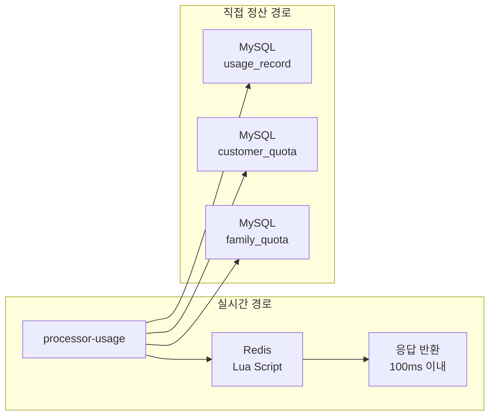
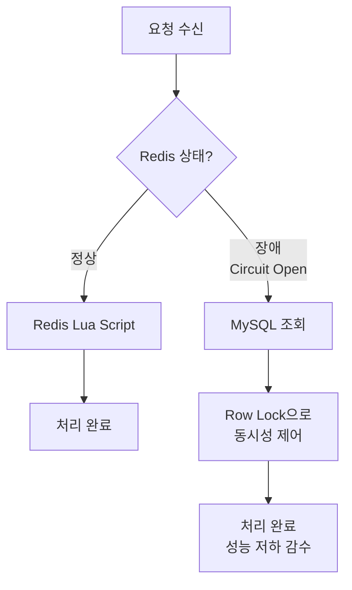

# 실시간 가족 데이터 통합 관리 시스템 - 데이터 모델

> **문서 버전**: v25.0
> **작성일**: 2026-03-20
> **작성자**: DABOM 팀
> **변경 이력**: v25.0 - ERD v24.5 동기화: 리캡 배치 성능 인덱스 6종 추가 (mission_item 2, mission_request 1, mission_log 1, policy_appeal 2). 전체 문서 v25.0 Major 버전 동기화 | v24.0 - usage-events 처리 흐름과 notification outbox 구조를 통합 반영: `usage-persist`/`usage-realtime` 제거, processor-usage의 `usage_record`·`customer_quota`·`family_quota` 직접 DB 정산, `usage_event_outbox` 테이블 및 DDL 추가, notification payload 평탄화, Outbox + 배치 서버 발행 흐름, 재시도 인덱스/UNIQUE/FK, Redis 폴링 기반 조회 서술 최소 반영 | v23.2 - API_SPECIFICATION v23.1 동기화: `idx_notif_customer_type` 인덱스 설명을 `GET /notifications?type=...` 통합 엔드포인트 기준으로 갱신 | v23.1 - ERD v23.1 동기화: `family`를 가족 메타 정보 전용으로 축소하고 `family_quota`를 월별 가족 총량 스냅샷 테이블로 재정의. Family Redis 키(`info`, `remaining`, `alert`)에 `{yyyyMM}` suffix를 적용하고 월경계 처리 기준을 `family_quota` 선생성 + 전월 키 정리로 정리 | v22.0 - API_SPECIFICATION v22.2 Major 버전 동기화 | v21.3 - ERD v21.4 동기화: NEGOTIATION→POLICY_APPEAL, NEGOTIATION_MESSAGE→POLICY_APPEAL_COMMENT, FAMILY_REPORT→FAMILY_RECAP_MONTHLY 리네이밍, NOTIFICATION_LOG 타입 APPEAL_*/EMERGENCY_APPROVED 전환, Flyway 마이그레이션 갱신 | v21.2 - ERD v21.2 동기화: POLICY_APPEAL 테이블에 `emergency_grant_month` 컬럼 추가 (DATE, NULL), `uk_appeal_emergency_month` UNIQUE 제약 (`requester_id`, `emergency_grant_month`)으로 긴급 요청 월 1회 동시성 안전 중복 방지 | v21.1 - ERD v21.1 동기화: BaseEntity 일관성 확보 — Mermaid 다이어그램 및 DDL에 created_at/updated_at/deleted_at 누락 컬럼 추가 (10개 엔티티 Mermaid + 9개 DDL) | v11.0 - 2차기획서 Phase 2 기능 반영: 6개 신규 테이블 DDL 추가, Redis 긴급요청 카운터 키, Flyway V17-V22, CUSTOMER 프로필 컬럼 추가, NOTIFICATION_LOG 타입 확장 | v10.4 - ERD v10.4 동기화: CUSTOMER_QUOTA 테이블 created_at 컬럼 추가 | v10.3 - ERD v10.3 동기화: FAMILY_MEMBER 테이블 joined_at 컬럼 잔존 참조 제거 (다이어그램·DDL 동기화) | v10.2 - ERD v10.2 동기화: POLICY 테이블 is_active → is_active 리네이밍 | v10.1 - ERD v10.1 동기화: POLICY_ASSIGNMENT 테이블에 created_at, updated_at 컬럼 추가 | v10.0 - web-core 서브도메인 분리 Major 버전 동기화 | v9.0 - api-spec 최종 동기화: API 경로 참조 업데이트 | v8.1 - ERD v8.1 동기화: POLICY 테이블 is_active 필드 추가, CUSTOMER/INVITE phone_number VARCHAR(11) 숫자만 형식으로 변경, V16 마이그레이션 추가 | v8.0 - 전체 문서 버전 통일 (공유 Major + 독립 Minor 체계 도입) | v6.1 - ERD v6.2 동기화: ADMIN 테이블 phone_number 삭제, email을 NOT NULL UNIQUE 로그인 ID로 변경 | v6.0 - ERD v6.0 동기화: FAMILY_GROUP→FAMILY 리네이밍, POLICY 테이블 필드 추가(description, require_role, default_rules) | v5.0 - ERD v5.0 동기화: USER→CUSTOMER/ADMIN 분리, daily→monthly, FAMILY_QUOTA→FAMILY_GROUP 통합, MEMBER_QUOTA→CUSTOMER_QUOTA, POLICY.rules→POLICY_ASSIGNMENT 이동, TINYINT→BOOLEAN | v4.0 - Soft Delete 전체 적용, REST 알림 API 지원 인덱스 추가, Flyway 마이그레이션 추가, ERD 문서 연결 | v1.0 - 초기 작성

---

## 1. 데이터 저장소 개요

### 1.1 저장소 역할 분리

| 저장소 | 역할 | 특징 |
|--------|------|------|
| **Redis Cluster** | 실시간 캐시, 동시성 제어, 상태 관리 | 원자 연산(Lua Script), 저지연, 휘발성 |
| **MySQL** | 영속 데이터, 원본(Source of Truth), 감사 로그 | ACID 보장, 장기 보관, 복잡한 쿼리 |
| **Kafka** | 이벤트 백본, 비동기 메시징 | 순서 보장, 재처리 가능, 이력 보관 |
| **S3** | 콜드 데이터 아카이브 | 저비용 장기 보관 |

### 1.2 데이터 흐름

```
┌─────────────────────────────────────────────────────────────┐
│                      Real-time Path                         │
│  Usage Event → Redis (Lua Script) → 즉시 응답              │
└─────────────────────────────────────────────────────────────┘
                           │
                           ▼ (직접 DB 정산)
┌─────────────────────────────────────────────────────────────┐
│                    Persistence Path                         │
│  processor-usage → MySQL (`usage_record`, `customer_quota`, `family_quota`) │
└─────────────────────────────────────────────────────────────┘
                           │
                           ▼ (90일 후)
┌─────────────────────────────────────────────────────────────┐
│                      Archive Path                           │
│  MySQL → S3 (Cold Storage)                            │
└─────────────────────────────────────────────────────────────┘
```

---

## 2. Redis 키 설계

> 상세 설계는 [Redis Key 설계서](./designs/redis/KEY_DESIGN.md) 참조

### 2.1 가족 데이터 키 (Family Domain)

| Key 패턴 | 타입 | 설명 | TTL |
|----------|------|------|-----|
| `family:{fid}:info:{yyyyMM}` | Hash | 가족 월별 메타 정보 (name, total_quota 등) | 해당 월 만료 시 |
| `family:{fid}:remaining:{yyyyMM}` | String | 가족 월별 실시간 잔여량 (DECRBY 대상) | 해당 월 만료 시 |

```bash
# 가족 월별 메타 정보 (가족명: "HappyFamily", 총 할당량: 100GB)
HSET family:100:info:202603 name "HappyFamily" total_quota "107374182400"

# 가족 월별 잔여량 (2026년 3월 현재 12GB 남음)
SET family:100:remaining:202603 "12884901888"
```

### 2.2 사용자 월 사용량 키

현재 월별 고객 사용량 키는 월 suffix를 포함한 단일 패턴으로 고정합니다.

| Key 패턴 | 타입 | 설명 | TTL |
|----------|------|------|-----|
| `family:{fid}:customer:{cid}:usage:monthly:{yyyyMM}` | String | 고객 월 누적 사용량 | 해당 월 만료 시 |

```bash
# 월별 사용량 (2026년 3월 5GB 사용) - TTL: 다음 달 1일
SET family:100:customer:1:usage:monthly:202603 "5368709120"
```

### 2.3 런타임 제약 키 (Runtime Constraints) - 핵심 설계

다양한 정책이 계산되어 **실제 적용될 제약 조건**이 모인 Hash입니다. Lua Script는 이 Hash를 조회하여 트래픽 승인/거부/QoS를 결정합니다.

| Key 패턴 | 타입 | 설명 |
|----------|------|------|
| `family:{fid}:customer:{cid}:constraints` | Hash | 사용자의 현재 유효 제약 조건 모음 |

**Field 표준 (ACTION:TYPE 패턴)**:

| Category | Field Name | Value | 설명 |
|----------|-----------|-------|------|
| **차단** | `BLOCK:ACCESS` | `'1'` | 전체 데이터 차단 |
|  | `BLOCK:APP:{APP_ID}` | `'1'` | 특정 앱 차단 |
|  | `BLOCK:TIME:START` | `"HHMM"` | 차단 시작 시간 (예: "2200") |
|  | `BLOCK:TIME:END` | `"HHMM"` | 차단 종료 시간 (예: "0700") |
| **한도** | `LIMIT:DATA:{PERIOD}` | Bytes (Long) | 기간별 데이터 한도 |
| **속도** | `THROTTLE:SPEED` | bps (Int) | 전송 속도 제한 |

```bash
# 일일 1GB 한도 + 유튜브 차단
HMSET family:100:customer:1:constraints \
  LIMIT:DATA:DAILY "1073741824" \
  BLOCK:APP:com.google.youtube "1"

# 수동 전체 차단
HMSET family:100:customer:2:constraints \
  BLOCK:ACCESS "1"

# 야간 시간대 접속 차단 (22:00 ~ 07:00)
HMSET family:100:customer:4:constraints \
  BLOCK:TIME:START "2200" \
  BLOCK:TIME:END "0700"
```

### 2.4 시스템 안정성 및 중복 방지

| Key 패턴 | 타입 | 설명 | TTL |
|----------|------|------|-----|
| `event:dedup:{uuid}` | String | Kafka 이벤트 중복 처리 방지 | 1시간 |
| `family:{fid}:alert:THRESHOLD:{threshold}:{yyyyMM}` | String | 월별 임계치 알림 중복 발송 방지 | 해당 월 만료 시 |

```bash
# 이벤트 처리 완료 마킹
SET event:dedup:evt_550e8400-e29b-41d4-a716-446655440000 "1707462000" EX 3600

# 알림 발송 이력 (2026년 3월 50% 소진 알림)
SET family:100:alert:THRESHOLD:50:202603 "SENT"
```

### 2.5 정책 메타데이터 (API용)

API 서버가 정책 관리 화면을 렌더링하거나, 부모가 정책 설정 시 유효성(Admin 한도 체크)을 검증하기 위한 데이터입니다.

| Key 패턴 | 타입 | 설명 |
|----------|------|------|
| `policy:def:{code}` | Hash | 관리자 정의 정책 템플릿 |
| `family:{fid}:policy:{code}` | Hash | 가족에게 적용된 정책 설정값 |

```bash
# Admin 정책 정의 (일일 한도: 기본 1GB, 최대 10GB)
HMSET policy:def:DAILY_LIMIT \
  name "일일 데이터 한도" \
  default_value "1073741824" \
  max_value "10737418240" \
  value_type "BYTES"

# Family 적용 설정 (가족 100번은 일일 한도를 2GB로 설정)
HMSET family:100:policy:DAILY_LIMIT \
  is_active "1" \
  value "2147483648" \
  target_user "ALL"
```

### 2.6 세션/인증 키

```
# Refresh Token (TTL: 7일)
auth:refresh:{customerId}:{tokenId}

# 사용자 세션 (SSE 연결용)
customer:{customerId}:connections
```

### 2.7 긴급 요청 카운터 키

| Key 패턴 | 타입 | 설명 | TTL |
|----------|------|------|-----|
| `emergency:limit:{customerId}:{yearMonth}` | String (counter) | 긴급 요청 월 1회 사용 여부 빠른 체크 (캐시 용도, 실제 중복 방지는 DB `emergency_grant_month` UNIQUE 제약) | 월말까지 자동 만료 |

```bash
# 긴급 요청 캐시 (2026년 3월, customerId=1, 사용 완료)
SET emergency:limit:1:2026-03 "1" EXAT {월말_유닉스타임스탬프}

# 조회 (1이면 이미 사용, 빠른 사전 체크용 — 최종 중복 방지는 DB UNIQUE 제약)
GET emergency:limit:1:2026-03
```

---

## 3. MySQL ERD

### 3.1 ERD 다이어그램

```mermaid
erDiagram
    CUSTOMER ||--|{ FAMILY_MEMBER : "belongs to"
    FAMILY ||--|{ FAMILY_MEMBER : "contains"
    FAMILY ||--o{ FAMILY_QUOTA : "has monthly quota"
    CUSTOMER ||--o{ CUSTOMER_QUOTA : "has monthly quota"
    FAMILY ||--o{ CUSTOMER_QUOTA : "scoped to"
    CUSTOMER ||--o{ USAGE_RECORD : "generates"
    FAMILY ||--o{ USAGE_RECORD : "belongs to"
    POLICY ||--o{ POLICY_ASSIGNMENT : "applied as"
    FAMILY ||--o{ POLICY_ASSIGNMENT : "receives"
    CUSTOMER ||--o{ POLICY_ASSIGNMENT : "targeted by"
    CUSTOMER ||--o{ NOTIFICATION_LOG : "receives"
    FAMILY ||--o{ NOTIFICATION_LOG : "scoped to"
    FAMILY ||--o{ INVITE : "has"
    CUSTOMER ||--o{ AUDIT_LOG : "performs"
    POLICY_ASSIGNMENT |o--o{ POLICY_APPEAL : "challenged by"
    CUSTOMER ||--o{ POLICY_APPEAL : "requests"
    CUSTOMER ||--o{ POLICY_APPEAL : "resolves"
    POLICY_APPEAL ||--o{ POLICY_APPEAL_COMMENT : "has"
    CUSTOMER ||--o{ POLICY_APPEAL_COMMENT : "authors"
    FAMILY ||--o{ MISSION_ITEM : "has"
    CUSTOMER ||--o{ MISSION_ITEM : "creates"
    REWARD_TEMPLATE ||--o{ REWARD : "template of"
    REWARD ||--|| MISSION_ITEM : "rewards"
    REWARD ||--o{ REWARD_GRANT : "grants"
    CUSTOMER ||--o{ REWARD_GRANT : "receives"
    MISSION_ITEM ||--o{ REWARD_GRANT : "issued for"
    MISSION_ITEM ||--o{ MISSION_REQUEST : "receives"
    CUSTOMER ||--o{ MISSION_REQUEST : "requests"
    FAMILY ||--o{ FAMILY_RECAP_MONTHLY : "monthly snapshot"

    CUSTOMER {
        bigint id PK "AUTO_INCREMENT"
        varchar phone_number UK "NOT NULL, 숫자만 11자리 (01012345678, 로그인 ID)"
        varchar password_hash "NOT NULL, BCrypt 해시"
        varchar name "NOT NULL, 사용자 이름"
        varchar email "NULL, 이메일"
        varchar profile_image_url "NULL, 프로필 이미지 URL"
        boolean is_onboarded "NOT NULL DEFAULT FALSE, 온보딩 완료 여부"
        datetime terms_agreed_at "NULL, 약관 동의 시각"
        datetime created_at "DEFAULT CURRENT_TIMESTAMP"
        datetime updated_at "DEFAULT CURRENT_TIMESTAMP"
        datetime deleted_at "NULL, Soft Delete"
    }

    ADMIN {
        bigint id PK "AUTO_INCREMENT"
        varchar email UK "NOT NULL, 이메일 (로그인 ID)"
        varchar password_hash "NOT NULL, BCrypt 해시"
        varchar name "NOT NULL, 운영자 이름"
        datetime created_at "DEFAULT CURRENT_TIMESTAMP"
        datetime updated_at "DEFAULT CURRENT_TIMESTAMP"
        datetime deleted_at "NULL, Soft Delete"
    }

    FAMILY {
        bigint id PK "AUTO_INCREMENT"
        varchar name "NOT NULL, 가족 그룹명"
        bigint created_by_id FK "NOT NULL → customer.id, 그룹 최초 생성자 (이력/감사 전용)"
        datetime created_at "DEFAULT CURRENT_TIMESTAMP"
        datetime updated_at "DEFAULT CURRENT_TIMESTAMP"
        datetime deleted_at "NULL, Soft Delete"
    }

    FAMILY_QUOTA {
        bigint id PK "AUTO_INCREMENT"
        bigint family_id FK "NOT NULL → family.id"
        date current_month "NOT NULL, 해당 월 (매월 1일 기준)"
        bigint total_quota_bytes "NOT NULL, 월별 총 할당량 스냅샷"
        bigint used_bytes "NOT NULL DEFAULT 0, 월별 총 사용량"
        datetime created_at "DEFAULT CURRENT_TIMESTAMP"
        datetime updated_at "DEFAULT CURRENT_TIMESTAMP"
        datetime deleted_at "NULL, Soft Delete"
    }

    FAMILY_MEMBER {
        bigint id PK "AUTO_INCREMENT"
        bigint family_id FK "NOT NULL → family.id"
        bigint customer_id FK "NOT NULL → customer.id"
        enum role "MEMBER | OWNER"
        datetime created_at "DEFAULT CURRENT_TIMESTAMP"
        datetime updated_at "DEFAULT CURRENT_TIMESTAMP"
        datetime deleted_at "NULL, Soft Delete"
    }

    CUSTOMER_QUOTA {
        bigint id PK "AUTO_INCREMENT"
        bigint customer_id FK "NOT NULL → customer.id"
        bigint family_id FK "NOT NULL → family.id"
        bigint monthly_limit_bytes "NULL = 무제한"
        bigint monthly_used_bytes "NOT NULL DEFAULT 0"
        date current_month "NOT NULL, 해당 월 (매월 1일 기준)"
        boolean is_blocked "NOT NULL DEFAULT FALSE"
        varchar block_reason "NULL, 차단 사유 코드"
        datetime created_at "DEFAULT CURRENT_TIMESTAMP"
        datetime updated_at "DEFAULT CURRENT_TIMESTAMP"
        datetime deleted_at "NULL, Soft Delete"
    }

    USAGE_RECORD {
        bigint id PK "AUTO_INCREMENT"
        varchar event_id UK "NOT NULL, Idempotency 키"
        bigint customer_id FK "NOT NULL → customer.id"
        bigint family_id FK "NOT NULL → family.id"
        bigint bytes_used "NOT NULL, 사용 바이트"
        varchar app_id "NULL, 앱 식별자"
        datetime event_time "NOT NULL, 이벤트 발생 시각"
        datetime created_at "DEFAULT CURRENT_TIMESTAMP"
        datetime updated_at "DEFAULT CURRENT_TIMESTAMP"
        datetime deleted_at "NULL, Soft Delete"
    }

    POLICY {
        bigint id PK "AUTO_INCREMENT"
        varchar name "NOT NULL, 정책 이름"
        varchar description "NULL, 정책 설명"
        enum require_role "NOT NULL, DEFAULT 'MEMBER', 최소 요구 역할"
        enum type "MONTHLY_LIMIT | TIME_BLOCK | APP_BLOCK | MANUAL_BLOCK"
        json default_rules "NOT NULL, 기본 정책 규칙 JSON"
        boolean is_system "DEFAULT FALSE, 시스템 정책 여부"
        boolean is_active "NOT NULL DEFAULT TRUE, 정책 활성화 여부"
        datetime created_at "DEFAULT CURRENT_TIMESTAMP"
        datetime updated_at "DEFAULT CURRENT_TIMESTAMP"
        datetime deleted_at "NULL, Soft Delete"
    }

    POLICY_ASSIGNMENT {
        bigint id PK "AUTO_INCREMENT"
        bigint policy_id FK "NOT NULL → policy.id"
        bigint family_id FK "NOT NULL → family.id"
        bigint target_customer_id FK "NULL → customer.id (NULL=가족 전체)"
        json rules "NOT NULL, 정책 규칙 JSON"
        boolean is_active "NOT NULL DEFAULT TRUE"
        datetime applied_at "DEFAULT CURRENT_TIMESTAMP"
        bigint applied_by_id FK "NOT NULL → customer.id, 적용자"
        datetime created_at "DEFAULT CURRENT_TIMESTAMP"
        datetime updated_at "DEFAULT CURRENT_TIMESTAMP"
        datetime deleted_at "NULL, Soft Delete"
    }

    NOTIFICATION_LOG {
        bigint id PK "AUTO_INCREMENT"
        bigint customer_id FK "NOT NULL → customer.id"
        bigint family_id FK "NOT NULL → family.id"
        enum type "THRESHOLD_ALERT | BLOCKED | UNBLOCKED | POLICY_CHANGED | MISSION_CREATED | REWARD_REQUESTED | REWARD_APPROVED | REWARD_REJECTED | APPEAL_CREATED | APPEAL_APPROVED | APPEAL_REJECTED | EMERGENCY_APPROVED"
        text message "NOT NULL, 알림 메시지"
        json payload "NULL, 추가 데이터"
        boolean is_read "NOT NULL DEFAULT FALSE"
        datetime sent_at "DEFAULT CURRENT_TIMESTAMP"
        datetime created_at "DEFAULT CURRENT_TIMESTAMP"
        datetime updated_at "DEFAULT CURRENT_TIMESTAMP"
        datetime deleted_at "NULL, Soft Delete"
    }

    AUDIT_LOG {
        bigint id PK "AUTO_INCREMENT"
        bigint actor_id FK "NULL → customer.id, 수행자"
        varchar action "NOT NULL, 수행 액션"
        varchar entity_type "NOT NULL, 대상 엔티티 종류"
        bigint entity_id "NOT NULL, 대상 엔티티 ID"
        json old_value "NULL, 변경 전 값"
        json new_value "NULL, 변경 후 값"
        varchar ip_address "NULL, 요청 IP"
        datetime created_at "DEFAULT CURRENT_TIMESTAMP"
        datetime updated_at "DEFAULT CURRENT_TIMESTAMP"
        datetime deleted_at "NULL, Soft Delete"
    }

    INVITE {
        bigint id PK "AUTO_INCREMENT"
        bigint family_id FK "NOT NULL → family.id"
        varchar phone_number "NOT NULL, 숫자만 11자리, 초대 대상 전화번호"
        enum role "MEMBER | OWNER"
        enum status "PENDING | ACCEPTED | EXPIRED | CANCELLED"
        datetime expires_at "NOT NULL, 만료 시각"
        datetime created_at "DEFAULT CURRENT_TIMESTAMP"
        datetime updated_at "DEFAULT CURRENT_TIMESTAMP"
        datetime deleted_at "NULL, Soft Delete"
    }

    POLICY_APPEAL {
        bigint id PK "AUTO_INCREMENT"
        bigint policy_assignment_id FK "NULL → policy_assignment.id"
        bigint requester_id FK "NOT NULL → customer.id"
        enum type "NORMAL | EMERGENCY"
        enum status "PENDING | APPROVED | REJECTED | CANCELLED"
        varchar request_reason "NULL, 요청 사유"
        varchar reject_reason "NULL, 거절 사유"
        json desired_rules "NULL, 원하는 정책 값 JSON"
        date emergency_grant_month "NULL, EMERGENCY 시 해당 월 1일 (UK)"
        bigint resolved_by_id FK "NULL → customer.id"
        datetime resolved_at "NULL"
        datetime cancelled_at "NULL"
        datetime created_at "DEFAULT CURRENT_TIMESTAMP"
        datetime updated_at "DEFAULT CURRENT_TIMESTAMP"
        datetime deleted_at "NULL, Soft Delete"
    }

    POLICY_APPEAL_COMMENT {
        bigint id PK "AUTO_INCREMENT"
        bigint appeal_id FK "NOT NULL → policy_appeal.id"
        bigint author_id FK "NOT NULL → customer.id"
        text message "NOT NULL, 코멘트 내용"
        datetime created_at "DEFAULT CURRENT_TIMESTAMP"
        datetime updated_at "DEFAULT CURRENT_TIMESTAMP"
        datetime deleted_at "NULL, Soft Delete"
    }

    REWARD_TEMPLATE {
        bigint id PK "AUTO_INCREMENT"
        varchar name "NOT NULL, 보상명"
        enum category "NOT NULL, DATA | GIFTICON"
        varchar thumbnail_url "NULL, 상품 이미지 (S3/R2)"
        int price "NOT NULL, 단가(원)"
        boolean is_system "NOT NULL DEFAULT TRUE, 시스템 제공 여부"
        boolean is_active "NOT NULL DEFAULT TRUE"
        datetime created_at "DEFAULT CURRENT_TIMESTAMP"
        datetime updated_at "DEFAULT CURRENT_TIMESTAMP"
        datetime deleted_at "NULL, Soft Delete"
    }

    MISSION_ITEM {
        bigint id PK "AUTO_INCREMENT"
        bigint family_id FK "NOT NULL → family.id"
        bigint created_by_id FK "NOT NULL → customer.id"
        bigint reward_id FK "NOT NULL → reward.id"
        text mission_text "NOT NULL, 미션 내용"
        enum status "ACTIVE | COMPLETED | CANCELLED"
        datetime completed_at "NULL"
        datetime created_at "DEFAULT CURRENT_TIMESTAMP"
        datetime updated_at "DEFAULT CURRENT_TIMESTAMP"
        datetime deleted_at "NULL, Soft Delete"
    }

    REWARD {
        bigint id PK "AUTO_INCREMENT"
        bigint reward_template_id FK "NOT NULL → reward_template.id"
        varchar name "NOT NULL, 보상명 (스냅샷)"
        enum category "NOT NULL, DATA | GIFTICON"
        varchar thumbnail_url "NULL, 이미지 (스냅샷)"
        datetime created_at "DEFAULT CURRENT_TIMESTAMP"
        datetime updated_at "DEFAULT CURRENT_TIMESTAMP"
        datetime deleted_at "NULL, Soft Delete"
    }

    REWARD_GRANT {
        bigint id PK "AUTO_INCREMENT"
        bigint reward_id FK "NOT NULL → reward.id"
        bigint customer_id FK "NOT NULL → customer.id"
        bigint mission_item_id FK "NOT NULL → mission_item.id"
        varchar coupon_code "NULL, 쿠폰 코드 (100)"
        varchar coupon_url "NULL, 쿠폰 URL (255)"
        enum status "ISSUED | USED | EXPIRED"
        datetime expired_at "NULL, 만료 시각"
        datetime created_at "DEFAULT CURRENT_TIMESTAMP"
        datetime updated_at "DEFAULT CURRENT_TIMESTAMP"
        datetime deleted_at "NULL, Soft Delete"
    }

    MISSION_REQUEST {
        bigint id PK "AUTO_INCREMENT"
        bigint mission_item_id FK "NOT NULL → mission_item.id"
        bigint requester_id FK "NOT NULL → customer.id"
        enum status "PENDING | APPROVED | REJECTED"
        bigint resolved_by_id FK "NULL → customer.id"
        datetime resolved_at "NULL"
        datetime created_at "DEFAULT CURRENT_TIMESTAMP"
        datetime updated_at "DEFAULT CURRENT_TIMESTAMP"
        datetime deleted_at "NULL, Soft Delete"
    }

    FAMILY_RECAP_MONTHLY {
        bigint id PK "AUTO_INCREMENT"
        bigint family_id FK "NOT NULL → family.id"
        date report_month "NOT NULL, 리캡 월 (예: 2026-03-01)"
        bigint total_used_bytes "NOT NULL"
        bigint total_quota_bytes "NOT NULL"
        decimal usage_rate_percent "NOT NULL"
        json usage_by_weekday "NULL, 월간 요일별 사용 비율"
        json peak_usage "NULL, {startHour, endHour, mostUsedWeekday}"
        json mission_summary_json "NULL, {totalMissionCount, completedMissionCount, rejectedRequestCount}"
        json appeal_summary_json "NULL, {totalAppeals, approvedAppeals, rejectedAppeals}"
        json appeal_highlights_json "NULL, {topSuccessfulRequester, topAcceptedApprover}"
        decimal communication_score "NULL, 0~100 소통 점수"
        datetime created_at "DEFAULT CURRENT_TIMESTAMP"
        datetime updated_at "DEFAULT CURRENT_TIMESTAMP"
        datetime deleted_at "NULL, Soft Delete"
    }
```



### 3.2 테이블 상세 정의

#### CUSTOMER 테이블

```sql
CREATE TABLE customer (
    id                  BIGINT AUTO_INCREMENT PRIMARY KEY,
    phone_number        VARCHAR(11) NOT NULL COMMENT '숫자만 11자리 (01012345678)',
    password_hash       VARCHAR(255) NOT NULL,
    name                VARCHAR(100) NOT NULL,
    email               VARCHAR(255),
    profile_image_url   VARCHAR(512) NULL COMMENT '프로필 이미지 URL',
    is_onboarded        BOOLEAN NOT NULL DEFAULT FALSE COMMENT '온보딩 완료 여부',
    terms_agreed_at     DATETIME NULL COMMENT '약관 동의 시각',
    created_at          DATETIME DEFAULT CURRENT_TIMESTAMP,
    updated_at          DATETIME DEFAULT CURRENT_TIMESTAMP,
    deleted_at          DATETIME NULL,

    UNIQUE (phone_number, deleted_at)
);

CREATE INDEX idx_customer_phone ON customer(phone_number);
CREATE INDEX idx_customer_email ON customer(email);
```

#### ADMIN 테이블

```sql
CREATE TABLE admin (
    id              BIGINT AUTO_INCREMENT PRIMARY KEY,
    email           VARCHAR(255) NOT NULL,
    password_hash   VARCHAR(255) NOT NULL,
    name            VARCHAR(100) NOT NULL,
    created_at      DATETIME DEFAULT CURRENT_TIMESTAMP,
    updated_at      DATETIME DEFAULT CURRENT_TIMESTAMP,
    deleted_at      DATETIME NULL,

    UNIQUE (email, deleted_at)
);

CREATE INDEX idx_admin_email ON admin(email);
```

#### FAMILY 테이블

```sql
CREATE TABLE family (
    id                  BIGINT AUTO_INCREMENT PRIMARY KEY,
    name                VARCHAR(100) NOT NULL,
    created_by_id       BIGINT NOT NULL REFERENCES customer(id), -- 그룹 최초 생성자 (이력/감사 전용, OWNER 권한 판단은 family_member.role 기준)
    created_at          DATETIME DEFAULT CURRENT_TIMESTAMP,
    updated_at          DATETIME DEFAULT CURRENT_TIMESTAMP,
    deleted_at          DATETIME NULL
);

CREATE INDEX idx_family_created_by ON family(created_by_id);
```

#### FAMILY_QUOTA 테이블

```sql
CREATE TABLE family_quota (
    id                  BIGINT AUTO_INCREMENT PRIMARY KEY,
    family_id           BIGINT NOT NULL REFERENCES family(id),
    current_month       DATE NOT NULL,
    total_quota_bytes   BIGINT NOT NULL,
    used_bytes          BIGINT NOT NULL DEFAULT 0,
    created_at          DATETIME DEFAULT CURRENT_TIMESTAMP,
    updated_at          DATETIME DEFAULT CURRENT_TIMESTAMP,
    deleted_at          DATETIME NULL,

    UNIQUE (family_id, current_month, deleted_at)
);

CREATE INDEX idx_fquota_family_month ON family_quota(family_id, current_month);
```

#### FAMILY_MEMBER 테이블

```sql
CREATE TABLE family_member (
    id          BIGINT AUTO_INCREMENT PRIMARY KEY,
    family_id   BIGINT NOT NULL REFERENCES family(id),
    customer_id BIGINT NOT NULL REFERENCES customer(id),
    role        ENUM('MEMBER', 'OWNER') NOT NULL DEFAULT 'MEMBER',
    created_at  DATETIME NOT NULL DEFAULT CURRENT_TIMESTAMP,
    updated_at  DATETIME NOT NULL DEFAULT CURRENT_TIMESTAMP ON UPDATE CURRENT_TIMESTAMP,
    deleted_at  DATETIME NULL,

    UNIQUE (family_id, customer_id, deleted_at)
);

CREATE INDEX idx_member_family ON family_member(family_id);
CREATE INDEX idx_member_customer ON family_member(customer_id);
```

> **다중 OWNER 지원**: `family_member.role='OWNER'`인 구성원이 복수 존재 가능합니다. `role` 컬럼에 UNIQUE 제약이 없으므로 한 가족 그룹에 여러 OWNER를 허용합니다. OWNER 권한 판단은 이 테이블의 `role` 컬럼으로만 수행하며, `family.created_by_id`는 이력/감사 전용입니다. 복수 OWNER 간 정책 충돌 시 **Last Write Wins** 방식으로 마지막 수정이 적용되며, `audit_log`에 전체 변경 이력이 기록됩니다.

#### CUSTOMER_QUOTA 테이블

```sql
CREATE TABLE customer_quota (
    id                      BIGINT AUTO_INCREMENT PRIMARY KEY,
    customer_id             BIGINT NOT NULL REFERENCES customer(id),
    family_id               BIGINT NOT NULL REFERENCES family(id),
    monthly_limit_bytes     BIGINT, -- NULL이면 제한 없음
    monthly_used_bytes      BIGINT NOT NULL DEFAULT 0,
    current_month           DATE NOT NULL,
    is_blocked              BOOLEAN NOT NULL DEFAULT FALSE,
    block_reason            VARCHAR(50),
    created_at              DATETIME DEFAULT CURRENT_TIMESTAMP,
    updated_at              DATETIME DEFAULT CURRENT_TIMESTAMP,
    deleted_at              DATETIME NULL,

    UNIQUE (customer_id, family_id, current_month, deleted_at)
);

CREATE INDEX idx_cquota_customer_month ON customer_quota(customer_id, current_month);
CREATE INDEX idx_cquota_family ON customer_quota(family_id);
```

#### USAGE_RECORD 테이블

```sql
CREATE TABLE usage_record (
    id          BIGINT AUTO_INCREMENT PRIMARY KEY,
    event_id    VARCHAR(50) NOT NULL UNIQUE, -- Idempotency (deleted_at 미포함)
    customer_id BIGINT NOT NULL REFERENCES customer(id),
    family_id   BIGINT NOT NULL REFERENCES family(id),
    bytes_used  BIGINT NOT NULL,
    app_id      VARCHAR(100),
    event_time  DATETIME NOT NULL,
    created_at  DATETIME DEFAULT CURRENT_TIMESTAMP,
    updated_at  DATETIME DEFAULT CURRENT_TIMESTAMP,
    deleted_at  DATETIME NULL
);

-- 파티셔닝 (월별)
CREATE INDEX idx_usage_family_time ON usage_record(family_id, event_time);
CREATE INDEX idx_usage_customer_time ON usage_record(customer_id, event_time);
CREATE INDEX idx_usage_event_id ON usage_record(event_id);
```

#### POLICY 테이블

```sql
CREATE TABLE policy (
    id              BIGINT AUTO_INCREMENT PRIMARY KEY,
    name            VARCHAR(100) NOT NULL,
    description     VARCHAR(255),
    require_role    ENUM('MEMBER', 'OWNER') NOT NULL DEFAULT 'MEMBER',
    type            ENUM('MONTHLY_LIMIT', 'TIME_BLOCK', 'APP_BLOCK', 'MANUAL_BLOCK') NOT NULL,
    default_rules   JSON NOT NULL,
    is_system       BOOLEAN DEFAULT FALSE,
    is_active     BOOLEAN NOT NULL DEFAULT TRUE,
    created_at      DATETIME DEFAULT CURRENT_TIMESTAMP,
    updated_at      DATETIME DEFAULT CURRENT_TIMESTAMP,
    deleted_at      DATETIME NULL
);
```

**타입별 default_rules JSON 예시**:

| type | default_rules JSON 예시 |
|------|------------------------|
| MONTHLY_LIMIT | `{"limitBytes": 5368709120}` |
| TIME_BLOCK | `{"start": "22:00", "end": "07:00", "timezone": "Asia/Seoul"}` |
| MANUAL_BLOCK | `{"reason": "MANUAL"}` |
| APP_BLOCK | `{"blockedApps": ["com.youtube.app"]}` |

#### POLICY_ASSIGNMENT 테이블

```sql
CREATE TABLE policy_assignment (
    id                  BIGINT AUTO_INCREMENT PRIMARY KEY,
    policy_id           BIGINT NOT NULL REFERENCES policy(id),
    family_id           BIGINT NOT NULL REFERENCES family(id),
    target_customer_id  BIGINT REFERENCES customer(id), -- NULL이면 가족 전체
    rules               JSON NOT NULL,
    is_active           BOOLEAN NOT NULL DEFAULT TRUE,
    applied_at          DATETIME DEFAULT CURRENT_TIMESTAMP,
    applied_by_id       BIGINT NOT NULL REFERENCES customer(id),
    created_at          DATETIME DEFAULT CURRENT_TIMESTAMP,
    updated_at          DATETIME DEFAULT CURRENT_TIMESTAMP,
    deleted_at          DATETIME NULL
);

CREATE INDEX idx_pa_family ON policy_assignment(family_id);
CREATE INDEX idx_pa_target ON policy_assignment(target_customer_id);
```

#### NOTIFICATION_LOG 테이블

```sql
CREATE TABLE notification_log (
    id          BIGINT AUTO_INCREMENT PRIMARY KEY,
    customer_id BIGINT NOT NULL REFERENCES customer(id),
    family_id   BIGINT NOT NULL REFERENCES family(id),
    type        ENUM('THRESHOLD_ALERT', 'BLOCKED', 'UNBLOCKED', 'POLICY_CHANGED', 'MISSION_CREATED', 'REWARD_REQUESTED', 'REWARD_APPROVED', 'REWARD_REJECTED', 'APPEAL_CREATED', 'APPEAL_APPROVED', 'APPEAL_REJECTED', 'EMERGENCY_APPROVED') NOT NULL,
    message     TEXT NOT NULL,
    payload     JSON,
    is_read     BOOLEAN NOT NULL DEFAULT FALSE,
    sent_at     DATETIME DEFAULT CURRENT_TIMESTAMP,
    created_at  DATETIME DEFAULT CURRENT_TIMESTAMP,
    updated_at  DATETIME DEFAULT CURRENT_TIMESTAMP,
    deleted_at  DATETIME NULL
);

CREATE INDEX idx_notif_customer ON notification_log(customer_id, sent_at DESC);
CREATE INDEX idx_notif_customer_type ON notification_log(customer_id, type, sent_at DESC); -- REST 알림 타입 필터 (GET /notifications?type=...)
CREATE INDEX idx_notif_family ON notification_log(family_id, sent_at DESC);
```

#### USAGE_EVENT_OUTBOX 테이블

```sql
CREATE TABLE usage_event_outbox (
    id            BIGINT NOT NULL AUTO_INCREMENT,
    event_id      VARCHAR(191) NOT NULL,
    family_id     BIGINT NOT NULL,
    customer_id   BIGINT NOT NULL,
    status        ENUM('PREPARED', 'PUBLISH_PENDING', 'SKIPPED', 'FAILED', 'SENT') NOT NULL DEFAULT 'PREPARED',
    payload_json  TEXT NULL,
    retry_count   INT NOT NULL DEFAULT 0,
    next_retry_at DATETIME NULL,
    last_error    VARCHAR(1000) NULL,
    created_at    DATETIME NOT NULL DEFAULT CURRENT_TIMESTAMP,
    updated_at    DATETIME NOT NULL DEFAULT CURRENT_TIMESTAMP ON UPDATE CURRENT_TIMESTAMP,
    deleted_at    DATETIME NULL,
    PRIMARY KEY (id),
    CONSTRAINT uk_usage_event_outbox_event_id UNIQUE (event_id),
    CONSTRAINT fk_usage_outbox_family FOREIGN KEY (family_id) REFERENCES family(id),
    CONSTRAINT fk_usage_outbox_customer FOREIGN KEY (customer_id) REFERENCES customer(id)
);

CREATE INDEX idx_usage_outbox_status_retry ON usage_event_outbox(status, next_retry_at);
```

#### AUDIT_LOG 테이블

```sql
CREATE TABLE audit_log (
    id          BIGINT AUTO_INCREMENT PRIMARY KEY,
    actor_id    BIGINT REFERENCES customer(id),
    action      VARCHAR(50) NOT NULL,
    entity_type VARCHAR(50) NOT NULL,
    entity_id   BIGINT NOT NULL,
    old_value   JSON,
    new_value   JSON,
    ip_address  VARCHAR(45),
    created_at  DATETIME DEFAULT CURRENT_TIMESTAMP,
    updated_at  DATETIME DEFAULT CURRENT_TIMESTAMP,
    deleted_at  DATETIME NULL
);

CREATE INDEX idx_audit_actor ON audit_log(actor_id, created_at DESC);
CREATE INDEX idx_audit_entity ON audit_log(entity_type, entity_id, created_at DESC);
CREATE INDEX idx_audit_action ON audit_log(action, created_at DESC);
```

#### INVITE 테이블

```sql
CREATE TABLE invite (
    id              BIGINT AUTO_INCREMENT PRIMARY KEY,
    family_id       BIGINT NOT NULL REFERENCES family(id),
    phone_number    VARCHAR(11) NOT NULL COMMENT '숫자만 11자리 (01012345678)',
    role            ENUM('MEMBER', 'OWNER') NOT NULL DEFAULT 'MEMBER',
    status          ENUM('PENDING', 'ACCEPTED', 'EXPIRED', 'CANCELLED') NOT NULL DEFAULT 'PENDING',
    expires_at      DATETIME NOT NULL,
    created_at      DATETIME DEFAULT CURRENT_TIMESTAMP,
    updated_at      DATETIME DEFAULT CURRENT_TIMESTAMP,
    deleted_at      DATETIME NULL
);

CREATE INDEX idx_invite_phone ON invite(phone_number, status);
CREATE INDEX idx_invite_family ON invite(family_id, status);
```

#### POLICY_APPEAL 테이블

```sql
CREATE TABLE `policy_appeal` (
  `id` BIGINT NOT NULL AUTO_INCREMENT,
  `policy_assignment_id` BIGINT NULL,
  `requester_id` BIGINT NOT NULL,
  `type` ENUM('NORMAL','EMERGENCY') NOT NULL,
  `status` ENUM('PENDING','APPROVED','REJECTED','CANCELLED') NOT NULL DEFAULT 'PENDING',
  `request_reason` VARCHAR(500) NULL COMMENT '요청 사유',
  `reject_reason` VARCHAR(500) NULL COMMENT '거절 사유',
  `desired_rules` JSON NULL COMMENT '원하는 정책 값 JSON',
  `emergency_grant_month` DATE NULL COMMENT 'EMERGENCY 시 해당 월 1일, NORMAL은 NULL',
  `resolved_by_id` BIGINT NULL,
  `resolved_at` DATETIME NULL,
  `cancelled_at` DATETIME NULL,
  `created_at` DATETIME NOT NULL DEFAULT CURRENT_TIMESTAMP,
  `updated_at` DATETIME NOT NULL DEFAULT CURRENT_TIMESTAMP ON UPDATE CURRENT_TIMESTAMP,
  `deleted_at` DATETIME NULL COMMENT 'Soft Delete',
  PRIMARY KEY (`id`),
  INDEX `idx_appeal_assignment` (`policy_assignment_id`),
  INDEX `idx_appeal_requester` (`requester_id`),
  INDEX `idx_appeal_emergency_monthly` (`requester_id`, `type`, `status`, `created_at`),
  INDEX `idx_appeal_recap_assignment_type_created` (`policy_assignment_id`, `type`, `created_at`, `deleted_at`),
  INDEX `idx_appeal_recap_assignment_type_status_resolved` (`policy_assignment_id`, `type`, `status`, `resolved_at`, `deleted_at`),
  UNIQUE KEY `uk_appeal_emergency_month` (`requester_id`, `emergency_grant_month`),
  CONSTRAINT `fk_appeal_assignment` FOREIGN KEY (`policy_assignment_id`) REFERENCES `policy_assignment`(`id`) ON DELETE SET NULL,
  CONSTRAINT `fk_appeal_requester` FOREIGN KEY (`requester_id`) REFERENCES `customer`(`id`) ON DELETE RESTRICT,
  CONSTRAINT `fk_appeal_resolver` FOREIGN KEY (`resolved_by_id`) REFERENCES `customer`(`id`) ON DELETE SET NULL
) ENGINE=InnoDB DEFAULT CHARSET=utf8mb4;
```

#### POLICY_APPEAL_COMMENT 테이블

```sql
CREATE TABLE `policy_appeal_comment` (
  `id` BIGINT NOT NULL AUTO_INCREMENT,
  `appeal_id` BIGINT NOT NULL,
  `author_id` BIGINT NOT NULL,
  `message` TEXT NOT NULL COMMENT '코멘트 내용',
  `created_at` DATETIME NOT NULL DEFAULT CURRENT_TIMESTAMP,
  `updated_at` DATETIME NOT NULL DEFAULT CURRENT_TIMESTAMP ON UPDATE CURRENT_TIMESTAMP,
  `deleted_at` DATETIME NULL COMMENT 'Soft Delete',
  PRIMARY KEY (`id`),
  INDEX `idx_appeal_comment_appeal` (`appeal_id`, `created_at`),
  INDEX `idx_appeal_comment_author` (`author_id`),
  CONSTRAINT `fk_appeal_comment_appeal` FOREIGN KEY (`appeal_id`) REFERENCES `policy_appeal`(`id`) ON DELETE CASCADE,
  CONSTRAINT `fk_appeal_comment_author` FOREIGN KEY (`author_id`) REFERENCES `customer`(`id`) ON DELETE CASCADE
) ENGINE=InnoDB DEFAULT CHARSET=utf8mb4;
```

#### REWARD_TEMPLATE 테이블

```sql
CREATE TABLE `reward_template` (
  `id` BIGINT NOT NULL AUTO_INCREMENT,
  `name` VARCHAR(100) NOT NULL COMMENT '보상명',
  `category` ENUM('DATA','GIFTICON') NOT NULL,
  `thumbnail_url` VARCHAR(500) NULL COMMENT '상품 이미지 (S3/R2)',
  `price` INT NOT NULL COMMENT '단가(원)',
  `is_system` BOOLEAN NOT NULL DEFAULT TRUE COMMENT '시스템 제공 여부',
  `is_active` BOOLEAN NOT NULL DEFAULT TRUE,
  `created_at` DATETIME NOT NULL DEFAULT CURRENT_TIMESTAMP,
  `updated_at` DATETIME NOT NULL DEFAULT CURRENT_TIMESTAMP ON UPDATE CURRENT_TIMESTAMP,
  `deleted_at` DATETIME NULL COMMENT 'Soft Delete',
  PRIMARY KEY (`id`)
) ENGINE=InnoDB DEFAULT CHARSET=utf8mb4;
```

#### REWARD 테이블

```sql
CREATE TABLE `reward` (
  `id` BIGINT NOT NULL AUTO_INCREMENT,
  `reward_template_id` BIGINT NOT NULL,
  `name` VARCHAR(100) NOT NULL COMMENT '보상명 (스냅샷)',
  `category` ENUM('DATA','GIFTICON') NOT NULL,
  `thumbnail_url` VARCHAR(500) NULL COMMENT '이미지 (스냅샷)',
  `created_at` DATETIME NOT NULL DEFAULT CURRENT_TIMESTAMP,
  `updated_at` DATETIME NOT NULL DEFAULT CURRENT_TIMESTAMP ON UPDATE CURRENT_TIMESTAMP,
  `deleted_at` DATETIME NULL COMMENT 'Soft Delete',
  PRIMARY KEY (`id`),
  INDEX `idx_reward_template` (`reward_template_id`),
  CONSTRAINT `fk_reward_template` FOREIGN KEY (`reward_template_id`) REFERENCES `reward_template`(`id`) ON DELETE RESTRICT
) ENGINE=InnoDB DEFAULT CHARSET=utf8mb4;
```

#### REWARD_GRANT 테이블

```sql
CREATE TABLE `reward_grant` (
  `id` BIGINT NOT NULL AUTO_INCREMENT,
  `reward_id` BIGINT NOT NULL,
  `customer_id` BIGINT NOT NULL,
  `mission_item_id` BIGINT NOT NULL,
  `coupon_code` VARCHAR(100) NULL COMMENT '쿠폰 코드',
  `coupon_url` VARCHAR(255) NULL COMMENT '쿠폰 URL',
  `status` ENUM('ISSUED','USED','EXPIRED') NOT NULL DEFAULT 'ISSUED',
  `expired_at` DATETIME NULL COMMENT '만료일시',
  `created_at` DATETIME NOT NULL DEFAULT CURRENT_TIMESTAMP,
  `updated_at` DATETIME NOT NULL DEFAULT CURRENT_TIMESTAMP ON UPDATE CURRENT_TIMESTAMP,
  `deleted_at` DATETIME NULL COMMENT 'Soft Delete',
  PRIMARY KEY (`id`),
  INDEX `idx_reward_grant_customer` (`customer_id`),
  INDEX `idx_reward_grant_status` (`status`),
  INDEX `idx_reward_grant_expired` (`expired_at`),
  INDEX `idx_reward_grant_status_created` (`status`, `created_at` DESC),
  CONSTRAINT `fk_grant_reward` FOREIGN KEY (`reward_id`) REFERENCES `reward`(`id`) ON DELETE RESTRICT,
  CONSTRAINT `fk_grant_customer` FOREIGN KEY (`customer_id`) REFERENCES `customer`(`id`) ON DELETE RESTRICT,
  CONSTRAINT `fk_grant_mission` FOREIGN KEY (`mission_item_id`) REFERENCES `mission_item`(`id`) ON DELETE RESTRICT
) ENGINE=InnoDB DEFAULT CHARSET=utf8mb4;
```

#### MISSION_ITEM 테이블

```sql
CREATE TABLE `mission_item` (
  `id` BIGINT NOT NULL AUTO_INCREMENT,
  `family_id` BIGINT NOT NULL,
  `created_by_id` BIGINT NOT NULL,
  `reward_id` BIGINT NOT NULL,
  `mission_text` TEXT NOT NULL COMMENT '미션 내용',
  `status` ENUM('ACTIVE','COMPLETED','CANCELLED') NOT NULL DEFAULT 'ACTIVE',
  `completed_at` DATETIME NULL,
  `created_at` DATETIME NOT NULL DEFAULT CURRENT_TIMESTAMP,
  `updated_at` DATETIME NOT NULL DEFAULT CURRENT_TIMESTAMP ON UPDATE CURRENT_TIMESTAMP,
  `deleted_at` DATETIME NULL COMMENT 'Soft Delete',
  PRIMARY KEY (`id`),
  INDEX `idx_mission_family` (`family_id`, `status`, `created_at` DESC),
  INDEX `idx_mission_creator` (`created_by_id`),
  INDEX `idx_mission_recap_family_created` (`family_id`, `created_at`, `deleted_at`),
  INDEX `idx_mission_recap_family_completed` (`family_id`, `status`, `completed_at`, `deleted_at`),
  CONSTRAINT `fk_mission_family` FOREIGN KEY (`family_id`) REFERENCES `family`(`id`) ON DELETE CASCADE,
  CONSTRAINT `fk_mission_creator` FOREIGN KEY (`created_by_id`) REFERENCES `customer`(`id`) ON DELETE RESTRICT,
  CONSTRAINT `fk_mission_reward` FOREIGN KEY (`reward_id`) REFERENCES `reward`(`id`) ON DELETE RESTRICT
) ENGINE=InnoDB DEFAULT CHARSET=utf8mb4;
```

#### MISSION_REQUEST 테이블

```sql
CREATE TABLE `mission_request` (
  `id` BIGINT NOT NULL AUTO_INCREMENT,
  `mission_item_id` BIGINT NOT NULL,
  `requester_id` BIGINT NOT NULL,
  `status` ENUM('PENDING','APPROVED','REJECTED') NOT NULL DEFAULT 'PENDING',
  `resolved_by_id` BIGINT NULL,
  `resolved_at` DATETIME NULL,
  `created_at` DATETIME NOT NULL DEFAULT CURRENT_TIMESTAMP,
  `updated_at` DATETIME NOT NULL DEFAULT CURRENT_TIMESTAMP ON UPDATE CURRENT_TIMESTAMP,
  `deleted_at` DATETIME NULL COMMENT 'Soft Delete',
  PRIMARY KEY (`id`),
  INDEX `idx_mreq_mission` (`mission_item_id`, `created_at` DESC),
  INDEX `idx_mreq_requester` (`requester_id`, `created_at` DESC),
  INDEX `idx_mreq_recap_item_status_resolved` (`mission_item_id`, `status`, `resolved_at`, `deleted_at`),
  CONSTRAINT `fk_mreq_mission` FOREIGN KEY (`mission_item_id`) REFERENCES `mission_item`(`id`) ON DELETE CASCADE,
  CONSTRAINT `fk_mreq_requester` FOREIGN KEY (`requester_id`) REFERENCES `customer`(`id`) ON DELETE CASCADE,
  CONSTRAINT `fk_mreq_resolver` FOREIGN KEY (`resolved_by_id`) REFERENCES `customer`(`id`) ON DELETE SET NULL
) ENGINE=InnoDB DEFAULT CHARSET=utf8mb4;
```

#### FAMILY_RECAP_MONTHLY 테이블

```sql
CREATE TABLE `family_recap_monthly` (
  `id` BIGINT NOT NULL AUTO_INCREMENT,
  `family_id` BIGINT NOT NULL,
  `report_month` DATE NOT NULL COMMENT '리캡 월 (예: 2026-03-01)',
  `total_used_bytes` BIGINT NOT NULL,
  `total_quota_bytes` BIGINT NOT NULL,
  `usage_rate_percent` DECIMAL(5,2) NOT NULL,
  `usage_by_weekday` JSON NULL COMMENT '월간 요일별 사용 비율',
  `peak_usage` JSON NULL COMMENT '{startHour, endHour, mostUsedWeekday}',
  `mission_summary_json` JSON NULL COMMENT '{totalMissionCount, completedMissionCount, rejectedRequestCount}',
  `appeal_summary_json` JSON NULL COMMENT '{totalAppeals, approvedAppeals, rejectedAppeals}',
  `appeal_highlights_json` JSON NULL COMMENT '{topSuccessfulRequester, topAcceptedApprover}',
  `communication_score` DECIMAL(5,2) NULL COMMENT '0~100 소통 점수',
  `created_at` DATETIME NOT NULL DEFAULT CURRENT_TIMESTAMP,
  `updated_at` DATETIME NOT NULL DEFAULT CURRENT_TIMESTAMP ON UPDATE CURRENT_TIMESTAMP,
  `deleted_at` DATETIME NULL COMMENT 'Soft Delete',
  PRIMARY KEY (`id`),
  UNIQUE KEY `uk_recap_family_month` (`family_id`, `report_month`),
  INDEX `idx_recap_monthly_family_month` (`family_id`, `report_month` DESC),
  CONSTRAINT `fk_recap_monthly_family` FOREIGN KEY (`family_id`) REFERENCES `family`(`id`) ON DELETE CASCADE
) ENGINE=InnoDB DEFAULT CHARSET=utf8mb4;
```

---

## 4. 데이터 동기화 전략

### 4.1 직접 DB 정산



**동작 방식**:
1. processor-usage가 Redis Lua Script 실행 (실시간)
2. processor-usage가 `usage_record`, `customer_quota`, `family_quota`를 직접 정산
3. notification 대상이면 `usage_event_outbox`를 `PUBLISH_PENDING`, 비대상이면 `SKIPPED`로 확정

### 4.2 Batch 정산 (Reconciliation)

**목적**: Redis와 RDS 간 데이터 불일치 보정

**실행 주기**: 매일 새벽 3시

**처리 내용**:
1. Redis 잔여량 vs RDS 계산값 비교
2. 불일치 시 RDS 기준으로 Redis 보정
3. 불일치 로그 기록 (감사용)

```sql
-- 가족별 사용량 집계 (Soft Delete 필터)
SELECT
    family_id,
    SUM(bytes_used) as total_used
FROM usage_record
WHERE event_time >= DATE_FORMAT(CURRENT_DATE, '%Y-%m-01')
  AND deleted_at IS NULL
GROUP BY family_id;
```

### 4.3 Redis 장애 시 DB Fallback



**Fallback SQL**:
```sql
-- 행 레벨 락으로 동시성 제어 (Soft Delete 필터)
SELECT * FROM customer_quota
WHERE customer_id = $1 AND family_id = $2 AND current_month = $3
  AND deleted_at IS NULL
FOR UPDATE;

-- 사용량 업데이트 (Soft Delete 필터)
UPDATE customer_quota
SET monthly_used_bytes = monthly_used_bytes + $4
WHERE customer_id = $1 AND family_id = $2 AND current_month = $3
  AND deleted_at IS NULL
  AND (monthly_limit_bytes IS NULL OR monthly_used_bytes + $4 <= monthly_limit_bytes);
```

---

## 5. 데이터 보관 정책 (계층형 보관)

### 5.1 계층 정의

| 계층 | 기간 | 저장소 | 용도 |
|------|------|--------|------|
| **Hot** | 7일 | Redis + RDS | 실시간 조회, 대시보드 |
| **Warm** | 90일 | RDS | 리포트, 분석 |
| **Cold** | 90일+ | S3 (Parquet) | 장기 보관, 감사 |

### 5.2 데이터 이동 Job

**일일 아카이브 Job** (매일 새벽 2시):
```sql
-- 90일 지난 usage_record를 S3로 이동 후 삭제
WITH archived AS (
    SELECT * FROM usage_record
    WHERE event_time < CURRENT_DATE - INTERVAL 90 DAY
)
-- S3 Export 후
DELETE FROM usage_record
WHERE event_time < CURRENT_DATE - INTERVAL 90 DAY;
```

### 5.3 Redis 데이터 관리

**기간별 사용량 리셋 Job** (매일/매월 1일):
```lua
-- 일별 사용량 리셋 (매일 00:00 KST)
local daily_keys = redis.call('KEYS', 'family:*:customer:*:usage:daily')
for _, key in ipairs(daily_keys) do
    redis.call('SET', key, '0')
end

-- 전월 월별 사용량 키 정리 (매월 1일 00:00 KST)
local monthly_keys = redis.call('KEYS', 'family:*:customer:*:usage:monthly:*')
for _, key in ipairs(monthly_keys) do
    redis.call('DEL', key)
end

-- 전월 Family 키 정리 (기간 리셋 시 함께)
local family_info_keys = redis.call('KEYS', 'family:*:info:*')
for _, key in ipairs(family_info_keys) do
    redis.call('DEL', key)
end

local remaining_keys = redis.call('KEYS', 'family:*:remaining:*')
for _, key in ipairs(remaining_keys) do
    redis.call('DEL', key)
end

local alert_keys = redis.call('KEYS', 'family:*:alert:THRESHOLD:*:*')
for _, key in ipairs(alert_keys) do
    redis.call('DEL', key)
end

-- constraints는 유지 (명시적 해제 시에만 변경)
```

---

## 6. 인덱스 설계

### 6.1 주요 인덱스

| 테이블 | 인덱스 | 용도 |
|--------|--------|------|
| customer | (phone_number) | 로그인 조회 |
| customer | (email) | 이메일 조회 |
| admin | (email) | 로그인 조회 |
| family | (created_by_id) | 생성자별 그룹 조회 |
| family_quota | (family_id, current_month) | 가족 월별 총량 조회 |
| family_member | (family_id) | 가족별 구성원 목록 |
| family_member | (customer_id) | 사용자의 가족 목록 |
| customer_quota | (customer_id, current_month) | 월별 한도 조회 |
| customer_quota | (family_id) | 가족별 구성원 상태 |
| usage_record | (family_id, event_time) | 가족별 사용량 조회 |
| usage_record | (customer_id, event_time) | 개인 사용량 조회 |
| usage_record | (event_id) | Idempotency 검증 |
| policy_assignment | (family_id) | 가족별 정책 조회 |
| policy_assignment | (target_customer_id) | 구성원별 정책 조회 |
| notification_log | (customer_id, sent_at DESC) | 알림 목록 조회 |
| notification_log | (customer_id, type, sent_at DESC) | 타입별 알림 필터 (`GET /notifications?type=...`) |
| notification_log | (family_id, sent_at DESC) | 가족 알림 목록 |
| usage_event_outbox | UNIQUE (event_id) | notification 발행 의도 멱등성 보장 |
| usage_event_outbox | (status, next_retry_at) | 배치 서버 발행/재시도 대상 조회 |
| audit_log | (actor_id, created_at DESC) | 수행자별 이력 |
| audit_log | (entity_type, entity_id, created_at DESC) | 엔티티별 이력 |
| audit_log | (action, created_at DESC) | 액션별 이력 |
| invite | (phone_number, status) | 전화번호별 초대 조회 |
| invite | (family_id, status) | 가족별 초대 목록 |
| policy_appeal | (policy_assignment_id) | 정책 적용별 이의제기 조회 |
| policy_appeal | (requester_id) | 요청자별 이의제기 조회 |
| policy_appeal | (requester_id, type, status, created_at) | 월별 긴급 요청 조회 최적화 |
| policy_appeal | UNIQUE (requester_id, emergency_grant_month) | 월 1회 긴급 요청 동시성 안전 중복 방지 |
| policy_appeal_comment | (appeal_id, created_at) | 이의제기별 댓글 목록 |
| policy_appeal_comment | (author_id) | 작성자별 댓글 조회 |
| mission_item | (family_id, status, created_at DESC) | 가족별 활성 미션 목록 |
| mission_item | (created_by_id) | 생성자별 미션 조회 |
| mission_request | (mission_item_id, created_at DESC) | 미션별 요청 목록 조회 |
| mission_request | (requester_id, created_at DESC) | 요청자별 미션 요청 조회 |
| family_recap_monthly | (family_id, report_month DESC) | 가족별 월간 리캡 조회 |

### 6.2 파티셔닝 전략

**usage_record 월별 파티셔닝**:
```sql
CREATE TABLE usage_record (
    ...
) PARTITION BY RANGE (YEAR(event_time) * 100 + MONTH(event_time)) (
    PARTITION p2025_01 VALUES LESS THAN (202502),
    PARTITION p2025_02 VALUES LESS THAN (202503),
    PARTITION p_future VALUES LESS THAN MAXVALUE
);
```

---

## 7. 마이그레이션 전략

### 7.1 Flyway 자동 마이그레이션

**버전 규칙**: `V{버전}__설명.sql`

```
db/migration/
├── V1__create_user_table.sql
├── V2__create_family_tables.sql
├── V3__create_usage_tables.sql
├── V4__create_policy_tables.sql
├── V5__create_notification_tables.sql
├── V6__add_primary_parent.sql
├── V7__add_notification_type_index.sql
├── V8__add_soft_delete_columns.sql
├── V9__unify_role_system.sql
├── V10__rename_owner_id_to_created_by_id.sql
├── V11__split_user_to_customer_admin.sql
├── V12__daily_to_monthly_quota.sql
├── V13__move_policy_rules_to_assignment.sql
├── V14__rename_family_group_to_family.sql
├── V15__add_policy_description_role_rules.sql
├── V16__add_policy_is_active.sql
├── V17__add_customer_profile_columns.sql
├── V18__create_policy_appeal_tables.sql
├── V19__create_reward_template.sql
├── V20__create_mission_tables.sql
├── V21__create_family_recap_monthly.sql
├── V22__expand_notification_log_type.sql
└── V23__create_usage_event_outbox.sql
```

### 7.2 V11: USER → CUSTOMER/ADMIN 분리

```sql
-- V11__split_user_to_customer_admin.sql
-- USER 테이블을 CUSTOMER와 ADMIN으로 분리
-- role='MEMBER'는 CUSTOMER로, role='ADMIN'은 ADMIN으로 이관

-- 1. CUSTOMER 테이블 생성
CREATE TABLE customer (
    id              BIGINT AUTO_INCREMENT PRIMARY KEY,
    phone_number    VARCHAR(11) NOT NULL COMMENT '숫자만 11자리 (01012345678)',
    password_hash   VARCHAR(255) NOT NULL,
    name            VARCHAR(100) NOT NULL,
    email           VARCHAR(255),
    created_at      DATETIME DEFAULT CURRENT_TIMESTAMP,
    updated_at      DATETIME DEFAULT CURRENT_TIMESTAMP,
    deleted_at      DATETIME NULL,
    UNIQUE (phone_number, deleted_at)
);

CREATE INDEX idx_customer_phone ON customer(phone_number);
CREATE INDEX idx_customer_email ON customer(email);

-- 2. ADMIN 테이블 생성
CREATE TABLE admin (
    id              BIGINT AUTO_INCREMENT PRIMARY KEY,
    email           VARCHAR(255) NOT NULL,
    password_hash   VARCHAR(255) NOT NULL,
    name            VARCHAR(100) NOT NULL,
    created_at      DATETIME DEFAULT CURRENT_TIMESTAMP,
    updated_at      DATETIME DEFAULT CURRENT_TIMESTAMP,
    deleted_at      DATETIME NULL,
    UNIQUE (email, deleted_at)
);

CREATE INDEX idx_admin_email ON admin(email);

-- 3. 데이터 마이그레이션
INSERT INTO customer (id, phone_number, password_hash, name, email, created_at, updated_at, deleted_at)
SELECT id, phone_number, password_hash, name, email, created_at, updated_at, deleted_at
FROM user WHERE role = 'MEMBER';

INSERT INTO admin (id, password_hash, name, email, created_at, updated_at, deleted_at)
SELECT id, password_hash, name, email, created_at, updated_at, deleted_at
FROM user WHERE role = 'ADMIN';

-- 4. FK 참조 업데이트는 애플리케이션 레벨에서 처리
-- (family_member.user_id → customer_id, usage_record.user_id → customer_id 등)
```

### 7.3 V12: daily → monthly, FAMILY_QUOTA 제거

```sql
-- V12__daily_to_monthly_quota.sql
-- MEMBER_QUOTA → CUSTOMER_QUOTA 리네이밍 및 일별→월별 전환
-- FAMILY_QUOTA 테이블 제거 및 FAMILY 통합

-- 1. CUSTOMER_QUOTA 테이블 생성
CREATE TABLE customer_quota (
    id                      BIGINT AUTO_INCREMENT PRIMARY KEY,
    customer_id             BIGINT NOT NULL REFERENCES customer(id),
    family_id               BIGINT NOT NULL REFERENCES family(id),
    monthly_limit_bytes     BIGINT,
    monthly_used_bytes      BIGINT NOT NULL DEFAULT 0,
    current_month           DATE NOT NULL,
    is_blocked              BOOLEAN NOT NULL DEFAULT FALSE,
    block_reason            VARCHAR(50),
    updated_at              DATETIME DEFAULT CURRENT_TIMESTAMP,
    deleted_at              DATETIME NULL,
    UNIQUE (customer_id, family_id, current_month, deleted_at)
);

CREATE INDEX idx_cquota_customer_month ON customer_quota(customer_id, current_month);
CREATE INDEX idx_cquota_family ON customer_quota(family_id);

-- 2. FAMILY에 used_bytes, current_month 추가
ALTER TABLE family
ADD COLUMN used_bytes BIGINT NOT NULL DEFAULT 0,
ADD COLUMN current_month DATE NOT NULL DEFAULT '2025-02-01';

-- 3. FAMILY에서 billing_cycle_start 제거
ALTER TABLE family DROP COLUMN billing_cycle_start;

-- 4. 데이터 마이그레이션 (MEMBER_QUOTA → CUSTOMER_QUOTA)
INSERT INTO customer_quota (customer_id, family_id, monthly_limit_bytes, monthly_used_bytes, current_month, is_blocked, block_reason, updated_at, deleted_at)
SELECT user_id, family_id, daily_limit_bytes, daily_used_bytes, current_date, is_blocked, block_reason, updated_at, deleted_at
FROM member_quota;

-- 5. FAMILY_QUOTA 삭제
DROP TABLE family_quota;

-- 6. MEMBER_QUOTA 삭제
DROP TABLE member_quota;
```

### 7.4 V13: POLICY.rules → POLICY_ASSIGNMENT.rules 이동

```sql
-- V13__move_policy_rules_to_assignment.sql
-- POLICY 테이블에서 rules 컬럼 제거
-- POLICY_ASSIGNMENT 테이블에 rules 컬럼 추가
-- TINYINT(1) → BOOLEAN 타입 변경

-- 1. POLICY_ASSIGNMENT에 rules 컬럼 추가
ALTER TABLE policy_assignment ADD COLUMN rules JSON NOT NULL;

-- 2. 기존 policy.rules를 policy_assignment.rules로 복사
UPDATE policy_assignment pa
INNER JOIN policy p ON pa.policy_id = p.id
SET pa.rules = p.rules;

-- 3. POLICY에서 rules 컬럼 제거
ALTER TABLE policy DROP COLUMN rules;

-- 4. POLICY.type ENUM 변경 (DAILY_LIMIT → MONTHLY_LIMIT)
ALTER TABLE policy MODIFY COLUMN type ENUM('MONTHLY_LIMIT', 'TIME_BLOCK', 'APP_BLOCK', 'MANUAL_BLOCK') NOT NULL;

-- 5. TINYINT(1) → BOOLEAN 변경
ALTER TABLE policy MODIFY COLUMN is_system BOOLEAN DEFAULT FALSE;
ALTER TABLE policy_assignment MODIFY COLUMN is_active BOOLEAN NOT NULL DEFAULT TRUE;
ALTER TABLE customer_quota MODIFY COLUMN is_blocked BOOLEAN NOT NULL DEFAULT FALSE;
ALTER TABLE notification_log MODIFY COLUMN is_read BOOLEAN NOT NULL DEFAULT FALSE;
```

### 7.5 V14: FAMILY_GROUP → FAMILY 리네이밍

```sql
-- V14__rename_family_group_to_family.sql
-- FAMILY_GROUP 테이블을 FAMILY로 리네이밍

RENAME TABLE family_group TO family;
```

### 7.6 V15: POLICY 테이블 필드 추가

```sql
-- V15__add_policy_description_role_rules.sql
-- POLICY 테이블에 description, require_role, default_rules 추가

ALTER TABLE policy
ADD COLUMN description VARCHAR(255) AFTER name,
ADD COLUMN require_role ENUM('MEMBER', 'OWNER') NOT NULL DEFAULT 'MEMBER' AFTER description,
ADD COLUMN default_rules JSON NOT NULL AFTER type;
```

### 7.7 V16: POLICY 테이블 is_active 추가

```sql
-- V16__add_policy_is_active.sql
-- POLICY 테이블에 is_active 추가 (정책 템플릿 활성화 여부)

ALTER TABLE policy
ADD COLUMN is_active BOOLEAN NOT NULL DEFAULT TRUE AFTER is_system;
```

### 7.8 V17: CUSTOMER 프로필 컬럼 추가

```sql
-- V17__add_customer_profile_columns.sql
-- CUSTOMER 테이블에 프로필 이미지 URL, 온보딩 완료 여부, 약관 동의 시각 추가

ALTER TABLE customer
ADD COLUMN profile_image_url VARCHAR(512) NULL COMMENT '프로필 이미지 URL' AFTER email,
ADD COLUMN is_onboarded BOOLEAN NOT NULL DEFAULT FALSE COMMENT '온보딩 완료 여부' AFTER profile_image_url,
ADD COLUMN terms_agreed_at DATETIME NULL COMMENT '약관 동의 시각' AFTER is_onboarded;
```

### 7.9 V18: POLICY_APPEAL 테이블 생성

```sql
-- V18__create_policy_appeal_tables.sql
-- 정책 이의제기 및 이의제기 댓글 테이블 생성

CREATE TABLE `policy_appeal` (
  `id` BIGINT NOT NULL AUTO_INCREMENT,
  `policy_assignment_id` BIGINT NULL,
  `requester_id` BIGINT NOT NULL,
  `type` ENUM('NORMAL','EMERGENCY') NOT NULL,
  `status` ENUM('PENDING','APPROVED','REJECTED','CANCELLED') NOT NULL DEFAULT 'PENDING',
  `request_reason` VARCHAR(500) NULL COMMENT '요청 사유',
  `reject_reason` VARCHAR(500) NULL COMMENT '거절 사유',
  `desired_rules` JSON NULL COMMENT '원하는 정책 값 JSON',
  `emergency_grant_month` DATE NULL COMMENT 'EMERGENCY 시 해당 월 1일, NORMAL은 NULL',
  `resolved_by_id` BIGINT NULL,
  `resolved_at` DATETIME NULL,
  `cancelled_at` DATETIME NULL,
  `created_at` DATETIME NOT NULL DEFAULT CURRENT_TIMESTAMP,
  `updated_at` DATETIME NOT NULL DEFAULT CURRENT_TIMESTAMP ON UPDATE CURRENT_TIMESTAMP,
  `deleted_at` DATETIME NULL COMMENT 'Soft Delete',
  PRIMARY KEY (`id`),
  INDEX `idx_appeal_assignment` (`policy_assignment_id`),
  INDEX `idx_appeal_requester` (`requester_id`),
  INDEX `idx_appeal_emergency_monthly` (`requester_id`, `type`, `status`, `created_at`),
  UNIQUE KEY `uk_appeal_emergency_month` (`requester_id`, `emergency_grant_month`),
  CONSTRAINT `fk_appeal_assignment` FOREIGN KEY (`policy_assignment_id`) REFERENCES `policy_assignment`(`id`) ON DELETE SET NULL,
  CONSTRAINT `fk_appeal_requester` FOREIGN KEY (`requester_id`) REFERENCES `customer`(`id`) ON DELETE RESTRICT,
  CONSTRAINT `fk_appeal_resolver` FOREIGN KEY (`resolved_by_id`) REFERENCES `customer`(`id`) ON DELETE SET NULL
) ENGINE=InnoDB DEFAULT CHARSET=utf8mb4;

CREATE TABLE `policy_appeal_comment` (
  `id` BIGINT NOT NULL AUTO_INCREMENT,
  `appeal_id` BIGINT NOT NULL,
  `author_id` BIGINT NOT NULL,
  `message` TEXT NOT NULL COMMENT '코멘트 내용',
  `created_at` DATETIME NOT NULL DEFAULT CURRENT_TIMESTAMP,
  `updated_at` DATETIME NOT NULL DEFAULT CURRENT_TIMESTAMP ON UPDATE CURRENT_TIMESTAMP,
  `deleted_at` DATETIME NULL COMMENT 'Soft Delete',
  PRIMARY KEY (`id`),
  INDEX `idx_appeal_comment_appeal` (`appeal_id`, `created_at`),
  INDEX `idx_appeal_comment_author` (`author_id`),
  CONSTRAINT `fk_appeal_comment_appeal` FOREIGN KEY (`appeal_id`) REFERENCES `policy_appeal`(`id`) ON DELETE CASCADE,
  CONSTRAINT `fk_appeal_comment_author` FOREIGN KEY (`author_id`) REFERENCES `customer`(`id`) ON DELETE CASCADE
) ENGINE=InnoDB DEFAULT CHARSET=utf8mb4;
```

### 7.10 V19: REWARD_TEMPLATE 테이블 생성

```sql
-- V19__create_reward_template.sql
-- 미션 보상 템플릿 테이블 생성

CREATE TABLE `reward_template` (
  `id` BIGINT NOT NULL AUTO_INCREMENT,
  `name` VARCHAR(100) NOT NULL COMMENT '보상명',
  `category` ENUM('DATA','GIFTICON') NOT NULL,
  `thumbnail_url` VARCHAR(500) NULL COMMENT '상품 이미지 (S3/R2)',
  `price` INT NOT NULL COMMENT '단가(원)',
  `is_system` BOOLEAN NOT NULL DEFAULT TRUE COMMENT '시스템 제공 여부',
  `is_active` BOOLEAN NOT NULL DEFAULT TRUE,
  `created_at` DATETIME NOT NULL DEFAULT CURRENT_TIMESTAMP,
  `updated_at` DATETIME NOT NULL DEFAULT CURRENT_TIMESTAMP ON UPDATE CURRENT_TIMESTAMP,
  `deleted_at` DATETIME NULL COMMENT 'Soft Delete',
  PRIMARY KEY (`id`)
) ENGINE=InnoDB DEFAULT CHARSET=utf8mb4;
```

### 7.11 V20: MISSION 테이블 생성

```sql
-- V20__create_mission_tables.sql
-- 미션 항목 및 미션 완료 요청 테이블 생성

CREATE TABLE `mission_item` (
  `id` BIGINT NOT NULL AUTO_INCREMENT,
  `family_id` BIGINT NOT NULL,
  `created_by_id` BIGINT NOT NULL,
  `reward_id` BIGINT NOT NULL,
  `mission_text` TEXT NOT NULL COMMENT '미션 내용',
  `status` ENUM('ACTIVE','COMPLETED','CANCELLED') NOT NULL DEFAULT 'ACTIVE',
  `completed_at` DATETIME NULL,
  `created_at` DATETIME NOT NULL DEFAULT CURRENT_TIMESTAMP,
  `updated_at` DATETIME NOT NULL DEFAULT CURRENT_TIMESTAMP ON UPDATE CURRENT_TIMESTAMP,
  `deleted_at` DATETIME NULL COMMENT 'Soft Delete',
  PRIMARY KEY (`id`),
  INDEX `idx_mission_family` (`family_id`, `status`, `created_at` DESC),
  INDEX `idx_mission_creator` (`created_by_id`),
  CONSTRAINT `fk_mission_family` FOREIGN KEY (`family_id`) REFERENCES `family`(`id`) ON DELETE CASCADE,
  CONSTRAINT `fk_mission_creator` FOREIGN KEY (`created_by_id`) REFERENCES `customer`(`id`) ON DELETE RESTRICT,
  CONSTRAINT `fk_mission_reward` FOREIGN KEY (`reward_id`) REFERENCES `reward`(`id`) ON DELETE RESTRICT
) ENGINE=InnoDB DEFAULT CHARSET=utf8mb4;

CREATE TABLE `mission_request` (
  `id` BIGINT NOT NULL AUTO_INCREMENT,
  `mission_item_id` BIGINT NOT NULL,
  `requester_id` BIGINT NOT NULL,
  `status` ENUM('PENDING','APPROVED','REJECTED') NOT NULL DEFAULT 'PENDING',
  `resolved_by_id` BIGINT NULL,
  `resolved_at` DATETIME NULL,
  `created_at` DATETIME NOT NULL DEFAULT CURRENT_TIMESTAMP,
  `updated_at` DATETIME NOT NULL DEFAULT CURRENT_TIMESTAMP ON UPDATE CURRENT_TIMESTAMP,
  `deleted_at` DATETIME NULL COMMENT 'Soft Delete',
  PRIMARY KEY (`id`),
  INDEX `idx_mreq_mission` (`mission_item_id`, `created_at` DESC),
  INDEX `idx_mreq_requester` (`requester_id`, `created_at` DESC),
  CONSTRAINT `fk_mreq_mission` FOREIGN KEY (`mission_item_id`) REFERENCES `mission_item`(`id`) ON DELETE CASCADE,
  CONSTRAINT `fk_mreq_requester` FOREIGN KEY (`requester_id`) REFERENCES `customer`(`id`) ON DELETE CASCADE,
  CONSTRAINT `fk_mreq_resolver` FOREIGN KEY (`resolved_by_id`) REFERENCES `customer`(`id`) ON DELETE SET NULL
) ENGINE=InnoDB DEFAULT CHARSET=utf8mb4;
```

### 7.12 V21: REWARD, REWARD_GRANT 테이블 생성

```sql
-- V21__create_reward_grant_tables.sql
-- 보상 인스턴스 및 보상 지급 이력 테이블 생성

CREATE TABLE `reward` (
  `id` BIGINT NOT NULL AUTO_INCREMENT,
  `reward_template_id` BIGINT NOT NULL,
  `name` VARCHAR(100) NOT NULL COMMENT '보상명 (스냅샷)',
  `category` ENUM('DATA','GIFTICON') NOT NULL,
  `thumbnail_url` VARCHAR(500) NULL COMMENT '이미지 (스냅샷)',
  `created_at` DATETIME NOT NULL DEFAULT CURRENT_TIMESTAMP,
  `updated_at` DATETIME NOT NULL DEFAULT CURRENT_TIMESTAMP ON UPDATE CURRENT_TIMESTAMP,
  PRIMARY KEY (`id`),
  INDEX `idx_reward_template` (`reward_template_id`),
  CONSTRAINT `fk_reward_template` FOREIGN KEY (`reward_template_id`) REFERENCES `reward_template`(`id`) ON DELETE RESTRICT
) ENGINE=InnoDB DEFAULT CHARSET=utf8mb4;

CREATE TABLE `reward_grant` (
  `id` BIGINT NOT NULL AUTO_INCREMENT,
  `reward_id` BIGINT NOT NULL,
  `customer_id` BIGINT NOT NULL,
  `mission_item_id` BIGINT NOT NULL,
  `coupon_code` VARCHAR(100) NULL COMMENT '쿠폰 코드',
  `coupon_url` VARCHAR(255) NULL COMMENT '쿠폰 URL',
  `status` ENUM('ISSUED','USED','EXPIRED') NOT NULL DEFAULT 'ISSUED',
  `expired_at` DATETIME NULL COMMENT '만료일시',
  `created_at` DATETIME NOT NULL DEFAULT CURRENT_TIMESTAMP,
  `updated_at` DATETIME NOT NULL DEFAULT CURRENT_TIMESTAMP ON UPDATE CURRENT_TIMESTAMP,
  `deleted_at` DATETIME NULL COMMENT 'Soft Delete',
  PRIMARY KEY (`id`),
  INDEX `idx_reward_grant_customer` (`customer_id`),
  INDEX `idx_reward_grant_status` (`status`),
  INDEX `idx_reward_grant_expired` (`expired_at`),
  INDEX `idx_reward_grant_status_created` (`status`, `created_at` DESC),
  CONSTRAINT `fk_grant_reward` FOREIGN KEY (`reward_id`) REFERENCES `reward`(`id`) ON DELETE RESTRICT,
  CONSTRAINT `fk_grant_customer` FOREIGN KEY (`customer_id`) REFERENCES `customer`(`id`) ON DELETE RESTRICT,
  CONSTRAINT `fk_grant_mission` FOREIGN KEY (`mission_item_id`) REFERENCES `mission_item`(`id`) ON DELETE RESTRICT
) ENGINE=InnoDB DEFAULT CHARSET=utf8mb4;
```

### 7.13 V22: FAMILY_RECAP_MONTHLY 테이블 생성

```sql
-- V21__create_family_recap_monthly.sql
-- 가족 월간 리캡 스냅샷 테이블 생성

CREATE TABLE `family_recap_monthly` (
  `id` BIGINT NOT NULL AUTO_INCREMENT,
  `family_id` BIGINT NOT NULL,
  `report_month` DATE NOT NULL COMMENT '리캡 월 (예: 2026-03-01)',
  `total_used_bytes` BIGINT NOT NULL,
  `total_quota_bytes` BIGINT NOT NULL,
  `usage_rate_percent` DECIMAL(5,2) NOT NULL,
  `usage_by_weekday` JSON NULL COMMENT '월간 요일별 사용 비율',
  `peak_usage` JSON NULL COMMENT '{startHour, endHour, mostUsedWeekday}',
  `mission_summary_json` JSON NULL COMMENT '{totalMissionCount, completedMissionCount, rejectedRequestCount}',
  `appeal_summary_json` JSON NULL COMMENT '{totalAppeals, approvedAppeals, rejectedAppeals}',
  `appeal_highlights_json` JSON NULL COMMENT '{topSuccessfulRequester, topAcceptedApprover}',
  `communication_score` DECIMAL(5,2) NULL COMMENT '0~100 소통 점수',
  `created_at` DATETIME NOT NULL DEFAULT CURRENT_TIMESTAMP,
  `updated_at` DATETIME NOT NULL DEFAULT CURRENT_TIMESTAMP ON UPDATE CURRENT_TIMESTAMP,
  `deleted_at` DATETIME NULL COMMENT 'Soft Delete',
  PRIMARY KEY (`id`),
  UNIQUE KEY `uk_recap_family_month` (`family_id`, `report_month`),
  INDEX `idx_recap_monthly_family_month` (`family_id`, `report_month` DESC),
  CONSTRAINT `fk_recap_monthly_family` FOREIGN KEY (`family_id`) REFERENCES `family`(`id`) ON DELETE CASCADE
) ENGINE=InnoDB DEFAULT CHARSET=utf8mb4;
```

### 7.14 V23: NOTIFICATION_LOG 타입 확장

```sql
-- V22__expand_notification_log_type.sql
-- NOTIFICATION_LOG 테이블 type ENUM에 이의제기/긴급/미션/보상 관련 타입 추가

ALTER TABLE notification_log
MODIFY COLUMN type ENUM(
  'THRESHOLD_ALERT',
  'BLOCKED',
  'UNBLOCKED',
  'POLICY_CHANGED',
  'MISSION_CREATED',
  'REWARD_REQUESTED',
  'REWARD_APPROVED',
  'REWARD_REJECTED',
  'APPEAL_CREATED',
  'APPEAL_APPROVED',
  'APPEAL_REJECTED',
  'EMERGENCY_APPROVED'
) NOT NULL;
```

### 7.15 V24: USAGE_EVENT_OUTBOX 테이블 생성

```sql
-- V23__create_usage_event_outbox.sql
-- notification 발행 복구용 Outbox 테이블 생성

CREATE TABLE usage_event_outbox (
  id BIGINT NOT NULL AUTO_INCREMENT,
  event_id VARCHAR(191) NOT NULL COMMENT 'usage 이벤트 식별자',
  family_id BIGINT NOT NULL,
  customer_id BIGINT NOT NULL,
  status ENUM('PREPARED', 'PUBLISH_PENDING', 'SKIPPED', 'FAILED', 'SENT') NOT NULL DEFAULT 'PREPARED' COMMENT 'Outbox 처리 상태',
  payload_json TEXT NULL COMMENT 'notification 발행 payload JSON 문자열',
  retry_count INT NOT NULL DEFAULT 0,
  next_retry_at DATETIME NULL,
  last_error VARCHAR(1000) NULL,
  created_at DATETIME NOT NULL DEFAULT CURRENT_TIMESTAMP,
  updated_at DATETIME NOT NULL DEFAULT CURRENT_TIMESTAMP ON UPDATE CURRENT_TIMESTAMP,
  deleted_at DATETIME NULL COMMENT 'Soft Delete',
  PRIMARY KEY (id),
  UNIQUE KEY uk_usage_event_outbox_event_id (event_id),
  KEY idx_usage_outbox_status_retry (status, next_retry_at),
  CONSTRAINT fk_usage_outbox_family FOREIGN KEY (family_id) REFERENCES family(id),
  CONSTRAINT fk_usage_outbox_customer FOREIGN KEY (customer_id) REFERENCES customer(id)
) ENGINE=InnoDB DEFAULT CHARSET=utf8mb4;
```

### 7.16 무중단 마이그레이션

1. **Column 추가**: NULL 허용으로 추가 → 애플리케이션 배포 → NOT NULL로 변경
2. **Column 삭제**: 애플리케이션에서 사용 중단 → 다음 릴리스에서 삭제
3. **인덱스 추가**: `ALTER TABLE ... ADD INDEX (ALGORITHM=INPLACE, LOCK=NONE)` 사용

---

## 관련 문서

- [기획서](./SPECIFICATION.md)
- [아키텍처 설계서](./ARCHITECTURE.md)
- [API 명세서](./API_SPECIFICATION.md)
- [ERD 설계서](./ERD.md)
- [용어집](./GLOSSARY.md)
- [Redis Key 설계서](./designs/redis/KEY_DESIGN.md)
- [Kafka 토픽 설계서](./designs/kafka/TOPIC_DESIGN.md)
- [Kafka 메시지 스키마](./designs/kafka/MESSAGE_SCHEMA.md)
