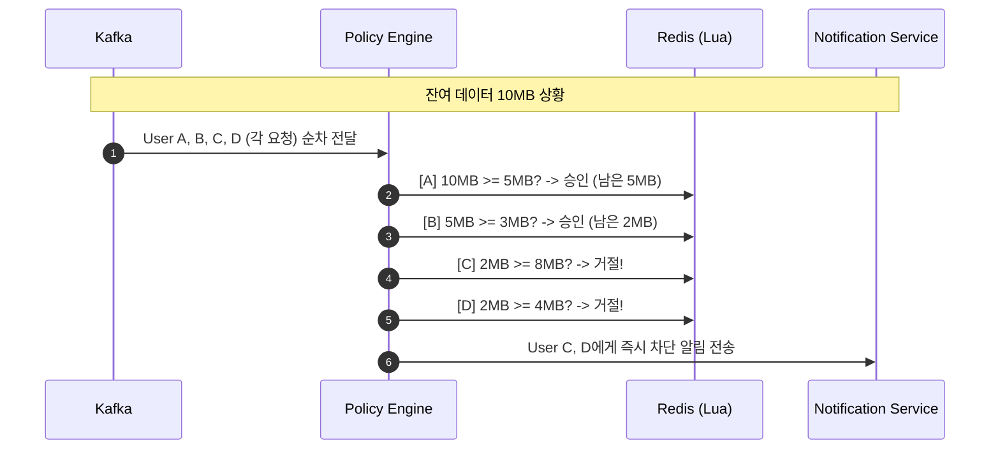
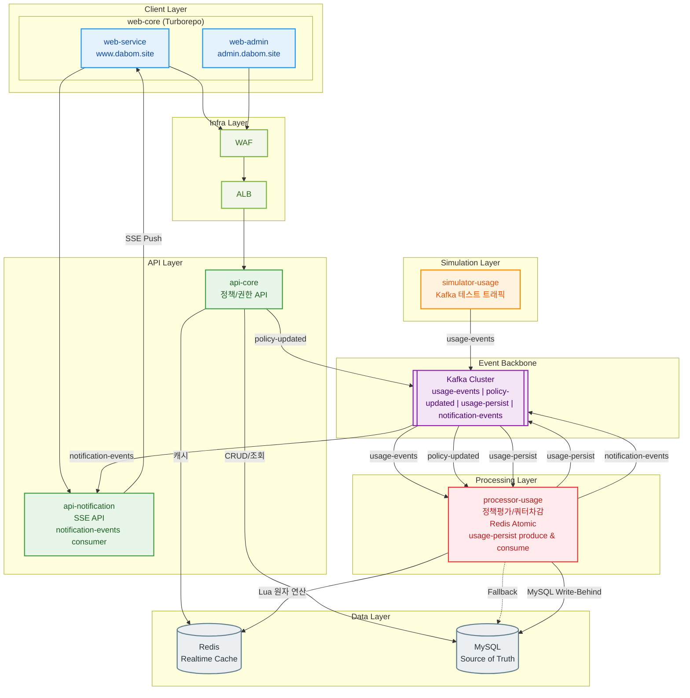
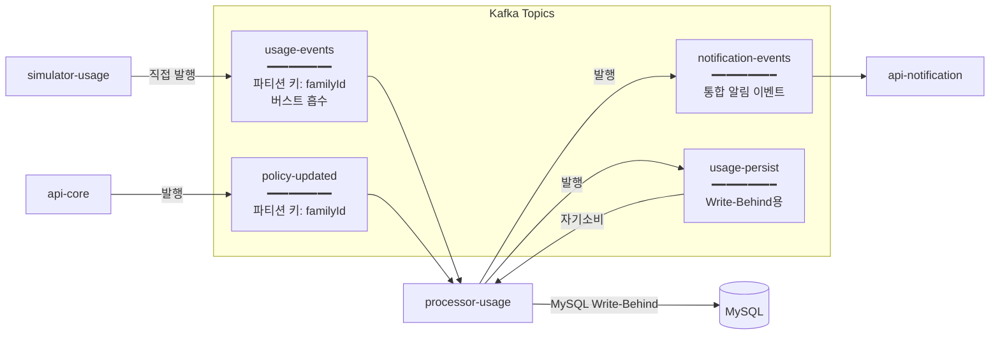
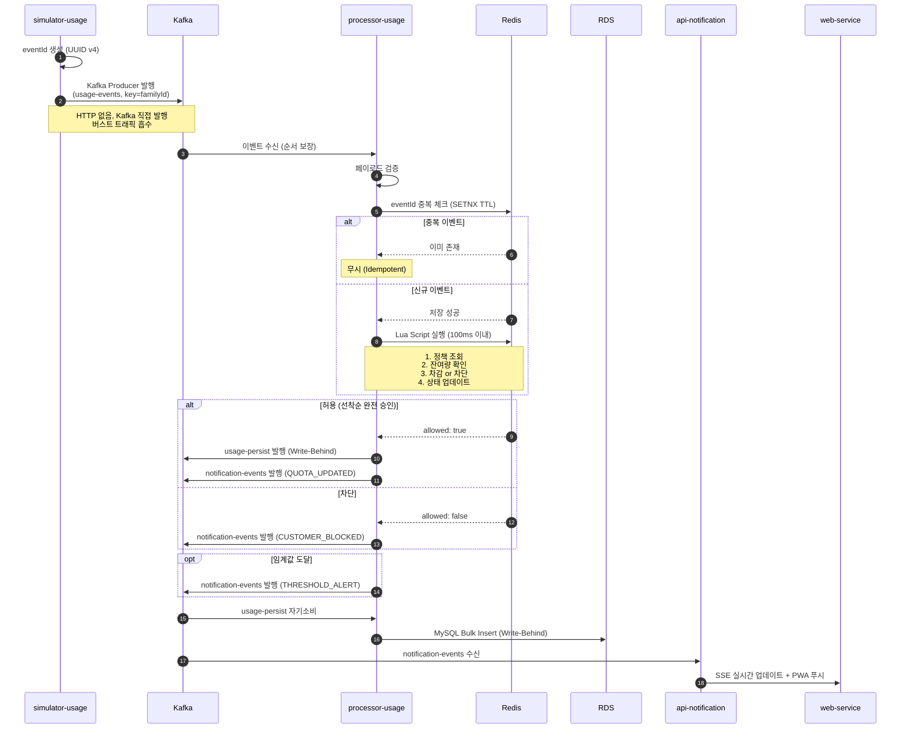
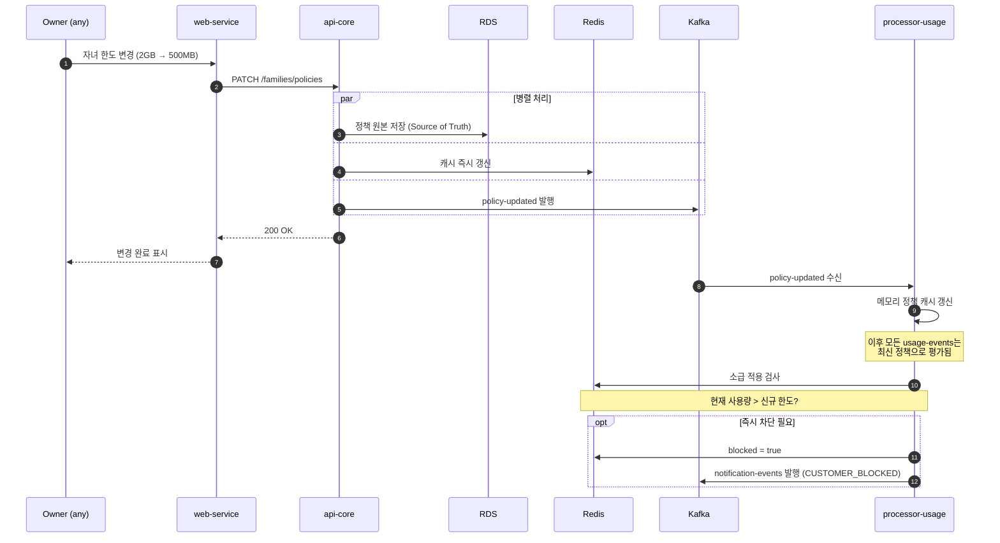
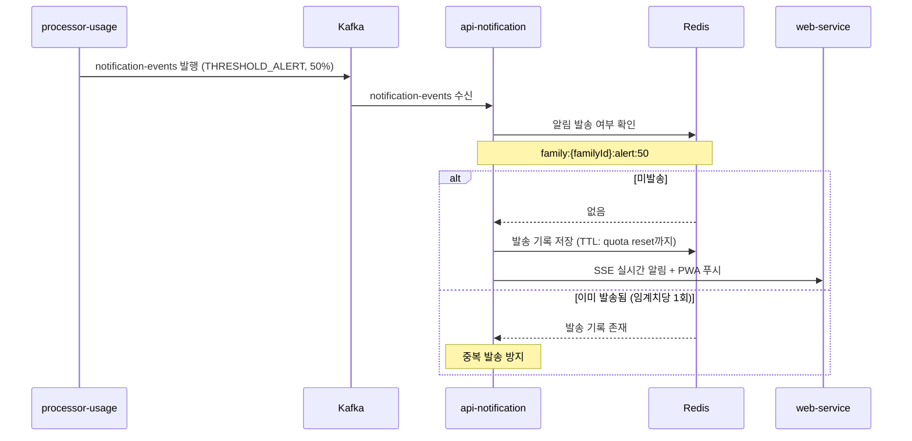
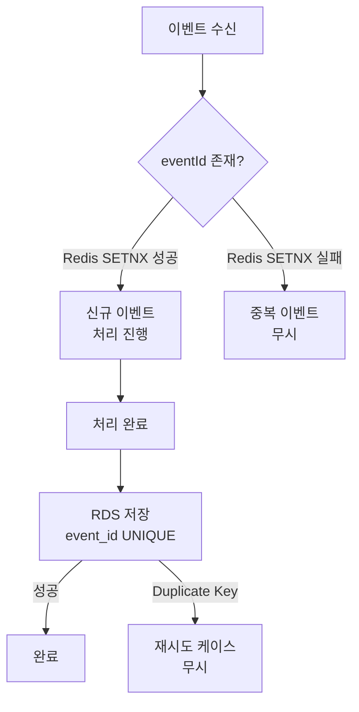

# 실시간 가족 데이터 통합 관리 및 스마트 제약 시스템 (DPCS)

> **DABOM 팀** | URECA 프로젝트 | 2026

**한 줄 요약**: 100만 가족 구성원의 공유 데이터를 실시간으로 집계하고, 부모/관리자가 설정한 정책(차단/한도/시간대 제한)을 **100ms 이내에 즉시 반영**하는 이벤트 기반 데이터 제어 시스템

**팀 구성**: DABOM 팀 7인 (BE 5 + FE 2) — 김동혁, 나원빈, 박예진, 임지우, 백승우, 장예찬, 최승언

---

## 목차

1. [프로젝트 소개](#1-프로젝트-소개)
2. [프로젝트 규모 및 목표 수치](#2-프로젝트-규모-및-목표-수치)
3. [사용자 정의 및 권한 모델](#3-사용자-정의-및-권한-모델)
4. [핵심 시나리오](#4-핵심-시나리오)
5. [정책 유형 정의](#5-정책-유형-정의)
6. [기능 요구사항](#6-기능-요구사항)
7. [시스템 아키텍처](#7-시스템-아키텍처)
8. [핵심 컴포넌트 상세 설계](#8-핵심-컴포넌트-상세-설계)
9. [이벤트 백본 설계 (Kafka)](#9-이벤트-백본-설계-kafka)
10. [데이터 플로우 (E2E)](#10-데이터-플로우-e2e)
11. [동시성 제어 전략](#11-동시성-제어-전략)
12. [데이터 모델](#12-데이터-모델)
13. [API 명세](#13-api-명세)
14. [프론트엔드 아키텍처](#14-프론트엔드-아키텍처)
15. [비기능 요구사항](#15-비기능-요구사항)
16. [인프라 아키텍처](#16-인프라-아키텍처)
17. [테스트 전략](#17-테스트-전략)
18. [알림 정책](#18-알림-정책)
19. [구현 로드맵 (7주)](#19-구현-로드맵-7주)
20. [R&R (역할 분담)](#20-rr-역할-분담)
21. [용어집](#21-용어집)

---

## 1. 프로젝트 소개

### 1.1 프로젝트명

**실시간 가족 데이터 통합 관리 및 스마트 제약 시스템 (Data Policy Control System, DPCS)**

### 1.2 프로젝트 배경

- 가족 구성원 간의 데이터를 실시간으로 공유하고, 부모가 자녀의 데이터 사용을 제어하는 니즈 증가
- 통신사의 가족 데이터 공유 서비스(SKT 데이터 공유, KT 패밀리 박스, LG U+ 데이터 공유) 벤치마킹
- 대규모 트래픽 처리, 동시성 제어, 실시간 정책 반영 기술 학습

### 1.3 학습 목표

| 영역 | 학습 목표 |
|------|----------|
| **백엔드** | 대용량 이벤트 스트리밍 파이프라인, 동시성 제어(정합성), 분산락/원자 연산, 장애 및 재처리(Idempotency) 설계 경험 |
| **프론트엔드** | 실시간 UI(대시보드), 실시간 알림/상태 반영(SSE) 경험, PWA 푸시 알림 |

---

## 2. 프로젝트 규모 및 목표 수치

| 항목 | 값 | 비고 |
|------|-----|------|
| 가상 사용자 수 | **1,000,000명** | 시뮬레이션 대상 |
| 가족 그룹 수 | **250,000개** | 그룹당 평균 4인, 최대 10명 |
| 이벤트 처리량 | **5,000 TPS** | 초당 Usage Event |
| 차단 판정 지연 | **100ms 이하** | P99 기준 |
| 테스트 커버리지 | **70%** | 필수: 동시성 Lua Script, 정책 엔진, Idempotency |
| 이벤트 발생 방식 | simulator-usage | Go 기반 시뮬레이터 |

---

## 3. 사용자 정의 및 권한 모델

### 3.1 Family Member (일반 가족 구성원)

- 본인의 실시간 데이터 사용량 조회
- 가족 전체 잔여 데이터 조회
- 가족 구성원별 사용 비중 시각화 조회
- 알림 수신 (잔여량 경고, 차단 알림 등)
- Owner가 설정한 정책의 적용을 받음

### 3.2 Owner (복수 Owner 가능)

일반 구성원 기능 **포함** + 관리 권한:

- 구성원별 데이터 한도 설정 (슬라이더 UI)
- 특정 사용자 실시간 차단/해제
- 시간대별 데이터 사용 차단 정책 설정 (예: 야간 22시~07시)
- 알림 임계값 설정 (50%, 30%, 10%)
- 가족 구성원 추가/삭제/권한 변경
- 다른 구성원을 OWNER로 승격 가능

> **왜 복수 Owner?** 실제 가정에서 부모 양쪽 모두 자녀 데이터를 제어할 수 있어야 한다. 단일 Owner 제약은 "아빠가 설정했는데 엄마가 변경할 수 없다"는 비현실적 상황을 만든다.

> **왜 Last Write Wins?** 복수 Owner 간 충돌 해결을 위해 분산 합의(Paxos/Raft) 수준은 과도하다. `audit_log`로 모든 변경 이력을 추적할 수 있으므로 단순한 LWW가 적절하다.

### 3.3 Backoffice Admin (운영자)

- 정책 템플릿 CRUD (생성/조회/수정/삭제)
- 개별 가족 정책 직접 수정 (고객 요청 시)
- 가족 그룹별 데이터 사용량 조회 및 리포트
- 사용자/그룹 검색 및 상세 조회
- 가족 구성원 권한 관리 (Owner 계정 지정/해제)
- 시스템 모니터링 및 감사 로그(Audit Log) 조회

---

## 4. 핵심 시나리오

### 4.1 "Last 10MB" 동시성 제어

**상황**: 김씨 가족(부모 2명, 자녀 2명)이 공유 데이터 잔여량 **10MB**인 상태에서 4명이 **동시에** 데이터를 사용하려 함

```
[T0] 초기 상태
├─ 가족 잔여량: 10MB
└─ 동시 요청 발생:
   ├─ 아빠: 5MB 사용 요청 (뉴스 앱)
   ├─ 엄마: 3MB 사용 요청 (메시지)
   ├─ 자녀1: 8MB 사용 요청 (유튜브)
   └─ 자녀2: 4MB 사용 요청 (게임)

[T1] simulator-usage → Kafka (직접 발행)
├─ 4개의 Usage Event 동시 발행
├─ simulator-usage가 eventId 부여 (UUID v4, 중복 처리 대비)
└─ Kafka 토픽(usage-events)으로 직접 발행
    └─ 파티션 키: familyId (가족 단위 순서 보장)

[T2] processor-usage 처리 (검증 + 정책 평가 + 쿼터 차감)
├─ usage-events 소비 (동일 파티션 → 순차 처리)
├─ 이벤트 검증 + 중복 체크 (Redis SETNX)
├─ Redis 원자 연산 (Lua 스크립트)
│   ├─ 잔여량 확인: 10MB
│   ├─ 아빠 5MB 차감 → 잔여 5MB ✅ (선착순 완전 승인)
│   ├─ 엄마 3MB 차감 → 잔여 2MB ✅
│   ├─ 자녀1 8MB 요청 > 잔여 2MB → 차단 ❌
│   └─ 자녀2 4MB 요청 > 잔여 2MB → 차단 ❌
└─ notification-events 토픽으로 통합 발행

[T3] 실시간 반영
├─ Redis 상태 업데이트 (즉시)
├─ RDS 이력 저장 (Write-Behind 비동기)
├─ 알림 발송 (PWA 푸시)
└─ SSE를 통해 대시보드 실시간 업데이트
```



> **왜 선착순 완전 승인(부분 승인 안 함)?** 부분 승인은 "3MB만 허용"처럼 요청을 잘라야 하므로 앱 레벨에서 중간 상태 처리가 복잡해진다. 통신사 실제 정책도 잔여량 부족 시 전체 거부 방식이다.

### 4.2 Owner의 실시간 정책 변경

**상황**: Owner가 자녀1의 월별 한도를 **2GB → 500MB**로 축소. 자녀1은 이미 이번 달 **1.2GB** 사용 중

```
[T0] Owner가 web-service(Owner 모드)에서 한도 변경
├─ UI: 자녀1 한도 슬라이더 → 500MB
└─ API 호출: PATCH /families/policies

[T1] api-core 처리
├─ RDS에 정책 원본 저장 (Source of Truth)
├─ Redis constraints Hash 즉시 갱신
│   └─ HSET family:{id}:customer:{cid}:constraints LIMIT:DATA:MONTHLY 536870912
├─ policy-updated 이벤트 발행 (Kafka)
└─ 응답: 200 OK

[T2] processor-usage 정책 즉시 반영
├─ policy-updated 이벤트 수신
├─ 현재 사용량(1.2GB) vs 신규 한도(500MB) 비교
├─ 사용량 > 한도 → 즉시 차단
│   └─ HSET family:{id}:customer:{cid}:constraints BLOCK:ACCESS "1"
└─ notification-events 발행 (CUSTOMER_BLOCKED)

[T3] 실시간 반영
├─ 자녀1 앱: 즉시 차단 화면 표시 (차단 사유 + 부모 연락처)
├─ 가족 대시보드: 자녀1 상태 "차단됨"으로 변경
└─ 자녀1에게 PWA 푸시: "데이터 한도 초과로 차단되었습니다"
```

> **왜 소급 적용 + 즉시 차단?** 정책 변경 후 "다음 이벤트부터"만 적용하면, 이미 한도를 초과한 사용자가 차단되지 않는 허점이 발생한다. 부모의 제어 의도를 즉시 반영하기 위해 소급 적용이 필수이다.

### 4.3 시간대별 차단 정책

**상황**: 부모가 자녀들에게 **밤 22시 ~ 아침 07시** 데이터 사용 차단 정책 설정

```
[T0] 정책 설정
├─ 부모 → web-service에서 시간대 차단 정책 등록
├─ 대상: 자녀1, 자녀2
├─ 차단 시간: 22:00 ~ 07:00 (서버 시간 KST 기준)
└─ api-core → RDS 저장 + Redis 캐시 + policy-updated 발행

[T1] 22:00 도달 (정책 활성화)
├─ Lua Script가 constraints의 BLOCK:TIME:START/END 확인
├─ 현재 시각(2200) >= 시작(2200) → 시간대 차단 활성
└─ 알림: "야간 차단 정책이 활성화되었습니다"

[T2] 차단 중 데이터 요청
├─ 자녀1 → simulator-usage → Kafka (usage-events)
├─ processor-usage → Lua Script 실행
│   └─ constraints BLOCK:TIME:START/END 확인 → "BLOCKED_TIME" 반환
└─ 결과: 차단 (해제 예정: 07:00)

[T3] 07:00 도달 (정책 비활성화)
├─ Lua Script가 현재 시각(0700) >= END(0700) 확인 → 차단 해제
└─ 알림: "야간 차단이 해제되었습니다"
```

> **왜 KST 고정?** 사용자별 타임존 처리는 Lua Script 복잡도를 높이고, 국내 서비스 대상이므로 KST 단일 기준으로 통일한다.

### 4.4 단계별 소진 알림 (50%/30%/10%)

| 임계치 | 알림 대상 | 중복 방지 |
|--------|----------|----------|
| 50% | 전체 가족 | Redis `family:{fid}:alert:threshold:50` |
| 30% | 전체 가족 | Redis `family:{fid}:alert:threshold:30` |
| 10% | 전체 가족 | Redis `family:{fid}:alert:threshold:10` |

> **왜 임계치당 1회만?** 잔여량이 경계 근처에서 오르내릴 때 알림 폭풍을 방지한다. Redis TTL 기반 발송 기록으로 간단하게 구현한다.

---

## 5. 정책 유형 정의

### 5.1 MVP 구현 대상

| 정책 유형 | 설명 | 우선순위 |
|----------|------|---------|
| **월별 한도 정책** (MONTHLY_LIMIT) | 구성원별 월별 데이터 한도 설정 | 높음 |
| **즉시 차단 정책** (MANUAL_BLOCK) | Owner가 특정 구성원을 즉시 차단/해제 | 높음 |
| **시간대 차단 정책** (TIME_BLOCK) | 특정 시간대(야간 등) 자동 차단 (KST 기준) | 중간 |
| **임계값 알림 정책** | 잔여량 기준(50/30/10%) 알림 발송, 임계치당 1회 | 높음 |

### 5.2 설계만 진행 (MVP 제외)

| 정책 유형 | 설명 |
|----------|------|
| **앱별 차단 정책** (APP_BLOCK) | 특정 앱/서비스 사용 차단 (유튜브, 게임 등) |
| **앱별 가속 정책** | 특정 앱 우선순위 상향 (QoS) |
| **속도 제한 정책** | 한도 초과 시 속도 제한 (차단 대신) |

### 5.3 정책 템플릿 구조

| 필드 | DB 컬럼 | 설명 |
|------|---------|------|
| 정책 설명 | `description` | 정책 템플릿의 상세 설명. 프론트엔드 툴팁 표시용 |
| 최소 요구 역할 | `require_role` | `MEMBER`이면 모든 구성원에게 적용 가능, `OWNER`이면 OWNER만 대상 |
| 기본 규칙 | `default_rules` | 정책 타입별 기본 규칙 JSON |
| 활성화 여부 | `is_activate` | FALSE이면 정책 목록에서 제외되며 신규 적용 불가 |

**default_rules vs rules 관계**:
- `POLICY.default_rules`: 템플릿 수준의 기본값 (운영자가 설정)
- `POLICY_ASSIGNMENT.rules`: 실제 적용된 규칙 (Owner가 커스터마이즈 가능)
- 적용 흐름: Owner가 정책을 적용하면 `default_rules`가 `rules`로 복사되고, 이후 독립적으로 수정 가능

> **왜 default_rules와 rules를 분리?** 관리자가 템플릿(default_rules)을 수정해도, 이미 적용된 정책(rules)에 영향을 주지 않도록 설계했다. 템플릿 변경이 기존 사용자의 설정을 의도치 않게 바꾸는 것을 방지한다.

---

## 6. 기능 요구사항

### 6.1 web-service (가족 앱, www.dabom.site) — PWA

#### 공통 기능 (모든 구성원)

| 기능 | 설명 | 실시간 여부 |
|------|------|------------|
| 가족 통합 대시보드 | 가족 잔여 데이터량, 구성원별 사용 비중 시각화 | SSE |
| 개인 사용량 상세 | 시간대별/앱별/구성원별 상세 분석 리포트 | SSE |
| 알림 센터 | 잔여량 경고, 차단 알림, 정책 변경 알림 | PWA Push |
| 차단 상태 표시 | 즉시 차단 화면 (차단 사유, 부모 연락처) | SSE |

#### Owner 전용 기능

| 기능 | 설명 | 실시간 여부 |
|------|------|------------|
| 구성원별 한도 설정 | 슬라이더 UI로 월별 데이터 한도 조절 | 즉시 적용 |
| 실시간 차단/해제 | 특정 구성원의 데이터 사용 즉시 차단 또는 해제 | 즉시 적용 |
| 시간대 정책 설정 | 야간 등 특정 시간대 차단 정책 설정 | 즉시 적용 |
| 알림 임계값 설정 | 50%, 30%, 10% 등 잔여량 알림 기준 설정 | - |
| 상세 분석 리포트 | 시간대별, 앱별, 구성원별 사용량 분석 | - |
| 구성원 관리 | 추가/삭제, 탈퇴 시 할당량 수동 재배치 | - |

### 6.2 web-admin (백오피스, admin.dabom.site)

| 기능 | 설명 |
|------|------|
| 정책 관리 | 정책 템플릿 CRUD (시간대 차단, 한도 유형 등) |
| 개별 가족 정책 수정 | 고객 요청 시 관리자가 직접 정책 수정 가능 |
| 정책 즉시 적용 | 정책 변경 시 다음 이벤트부터 즉시 반영 보장 |
| 가족 그룹 검색/조회 | 그룹 ID, 사용자 이름, 전화번호 등으로 검색 |
| 사용량 모니터링 | 그룹별/사용자별 실시간 사용량 및 이력 조회 |
| 권한 관리 | Owner 계정 지정/해제 (복수 Owner 허용) |
| 감사 로그 | 정책 변경, 차단/해제 이력 등 감사 로그 조회 |

### 6.3 simulator-usage

| 기능 | 설명 |
|------|------|
| 이벤트 생성 | familyId, userId, appId, bytesUsed, timestamp 포함 |
| RPS 제어 | 초당 이벤트 발생률 조절 (고정 RPS + 런타임 변경) |
| 랜덤 이벤트 | 무작위 사용자에 대한 데이터 사용 이벤트 생성 |

---

## 7. 시스템 아키텍처

### 7.1 설계 목표 및 원칙

| 목표 | 설명 |
|------|------|
| 대규모 트래픽 처리 | 100만 유저, 25만 가족, 5,000 TPS 안정적 처리 |
| 실시간 이벤트 처리 | 이벤트 기반 실시간 처리 중심 |
| 동시성 제어 | "마지막 10MB" 케이스에서 정합성 보장 (100ms 이내) |
| 정책 즉시 반영 | 정책 변경 시 다음 이벤트부터 즉시 적용 |
| Idempotency | 중복/재처리 상황에서 일관된 결과 보장 |
| 장애 내성 | Redis 장애 시 DB Fallback, Circuit Breaker 전체 적용 |

> **왜 이벤트 기반 우선?** API 동기 호출 중심이면 5,000 TPS에서 api-core가 병목이 된다. Kafka를 이벤트 백본으로 두면 버스트 트래픽을 디스크 버퍼링으로 흡수하고, processor-usage가 자신의 속도로 소비할 수 있다.

> **왜 이중 저장(Redis + RDS)?** Redis만 쓰면 장애 시 데이터 유실, RDS만 쓰면 100ms 이내 응답 불가. Redis로 실시간 판정, RDS로 영속 보관을 분리하여 성능과 신뢰성을 동시에 확보한다.

> **왜 Write-Behind(자기소비 패턴)?** Write-Through는 매 이벤트마다 DB 동기 쓰기로 지연이 증가한다. processor-usage가 `usage-persist` 토픽에 발행 후 자체 소비하여 배치(5초/100건) 단위로 MySQL Bulk Insert하면 DB 부하를 1/100로 줄일 수 있다.

> **왜 Soft Delete?** 물리 삭제 시 감사 추적이 불가하다. `deleted_at` 컬럼으로 논리 삭제하면 데이터 복구 가능성과 감사 로그 일관성을 보장한다.

### 7.2 기술 스택 요약

| 영역 | 기술 | 선정 사유 |
|------|------|----------|
| **simulator-usage** | Go | 고성능 이벤트 펌프, goroutine 동시성, 단일 바이너리 ~20MB |
| **processor-usage** | Spring Boot / Go | 복잡한 비즈니스 로직 + Kafka Consumer, Redis Atomic |
| **api-core** | Spring Boot | 풍부한 생태계, JPA, JWT 인증 |
| **api-notification** | Node.js / Spring Boot | SSE 비동기 처리, notification-events consumer |
| **Kafka** | Apache Kafka | 대용량 이벤트 스트림, familyId 순서 보장, 버스트 흡수 |
| **Redis** | Redis Cluster | 원자 연산(Lua Script), 저지연 캐시 |
| **MySQL** | Amazon RDS | JSON 지원, Read 성능, 팀 숙련도 |
| **web-core** | Next.js + Turborepo | SSR, 모노레포 코드 공유 (web-service + web-admin) |
| **Container** | Docker + ECS Fargate | 오케스트레이션, 오토스케일링 |
| **Observability** | Prometheus + Grafana + Jaeger | 로그/메트릭/트레이싱 통합 |

### 7.3 전체 아키텍처 다이어그램



### 7.4 컴포넌트 책임 분리

| 컴포넌트 | 역할 | 기술 스택 |
|---------|------|----------|
| **simulator-usage** | 데이터 사용 이벤트 시뮬레이션, eventId 생성, Kafka 직접 발행 | Go |
| **processor-usage** | Kafka 소비, 검증, 중복 체크, 정책평가/쿼터차감, Write-Behind 자기소비, 알림 발행 | Spring Boot / Go |
| **api-core** | 5개 도메인 REST API, JWT familyId 추론, 정책 즉시 반영 트리거 | Spring Boot |
| **api-notification** | notification-events consumer, SSE + REST 알림 API, PWA Push | Node.js / Spring Boot |
| **web-service** | 가족 사용자 PWA (www.dabom.site) | Next.js + PWA |
| **web-admin** | 백오피스 관리 UI (admin.dabom.site) | Next.js |

### 7.5 계층별 구조

```
┌─────────────────────────────────────────────────────────────┐
│                     Client Layer                            │
│  ┌─────────────── web-core (Turborepo) ─────────────────┐  │
│  │ ┌─────────────────────┐  ┌─────────────────────────┐ │  │
│  │ │ web-service          │  │ web-admin               │ │  │
│  │ │ www.dabom.site (PWA) │  │ admin.dabom.site        │ │  │
│  │ └─────────────────────┘  └─────────────────────────┘ │  │
│  └──────────────────────────────────────────────────────┘  │
└─────────────────────────────────────────────────────────────┘
          │                              ┌──────────────────┐
   ┌──────┴──────┐                       │ Simulation Layer │
   │ WAF + ALB   │                       │ simulator-usage  │
   └──────┬──────┘                       └────────┬─────────┘
          │                                       │
┌─────────────────────────────────────────────────────────────┐
│                      API Layer                              │
│  ┌────────────────────────┐  ┌────────────────────────┐    │
│  │      api-core          │  │  api-notification      │    │
│  │   (Command/Query)      │  │    (SSE API)           │    │
│  └────────────────────────┘  └────────────────────────┘    │
└─────────────────────────────────────────────────────────────┘
                           │                │
┌─────────────────────────────────────────────────────────────┐
│              Event Backbone (버스트 흡수)                    │
│     Kafka: usage-events | policy-updated | usage-persist    │
│                    | notification-events                    │
└─────────────────────────────────────────────────────────────┘
                           │
┌─────────────────────────────────────────────────────────────┐
│                  Processing Layer                           │
│        processor-usage (정책평가 + Write-Behind)            │
└─────────────────────────────────────────────────────────────┘
                           │
┌─────────────────────────────────────────────────────────────┐
│                     Data Layer                              │
│       Redis (Realtime)          MySQL (Persist)             │
└─────────────────────────────────────────────────────────────┘
```

---

## 8. 핵심 컴포넌트 상세 설계

### 8.1 simulator-usage (Go)

**역할**: 데이터 사용 이벤트 시뮬레이션 — Kafka `usage-events` 토픽에 직접 발행 (HTTP 엔드포인트 없음)

**기능**:
- 고정 RPS로 랜덤 이벤트 생성 (정상 5,000 TPS, 버스트 최대 100만 동시)
- eventId 생성 (UUID v4) — 멱등성 보장을 위한 고유 식별자
- familyId, customerId, appId, bytesUsed, timestamp, metadata 포함
- 런타임 TPS 조절 HTTP API 제공
- 현실적 데이터 분포: 가족 규모(2~10명), 사용자 유형(Heavy/Normal/Light), 앱 카테고리(6종), 시간대별 트래픽 패턴

**Kafka Producer 설정**:
```properties
buffer.memory=67108864       # 64MB 버퍼
batch.size=65536             # 64KB 배치
linger.ms=5                  # 5ms 대기 후 발송
max.block.ms=60000           # 60초 블로킹 허용
acks=1                       # Leader 응답만 대기 (처리량 우선)
compression.type=lz4         # 압축으로 네트워크 효율화
```

> **왜 Go를 선택했는가? (vs Python)**
> - simulator-usage의 본질은 "고성능 이벤트 펌프"로, 비즈니스 로직이 거의 없고 빠른 Kafka 발행이 핵심
> - Go의 goroutine으로 수만 개 동시 실행 가능, Python은 GIL 제약으로 버스트(100만 동시) 구간에서 한계
> - 단일 바이너리 ~20MB vs Python 런타임 ~200MB+
> - `golang.org/x/time/rate`로 TPS 조절이 자연스럽고 런타임 변경도 채널 통신으로 깔끔

| 항목 | Go | Python |
|------|-----|--------|
| Kafka Producer 성능 | confluent-kafka-go (librdkafka), 5,000+ TPS 여유 | GIL로 콜백 병목 가능 |
| 동시성 모델 | goroutine 수만 개, 채널 통신 | asyncio/threading, GIL 제약 |
| 메모리 | 바이너리 ~10MB | 인터프리터 + 의존성 수십~수백MB |
| 배포 | 단일 바이너리, Docker ~20MB | Docker ~200MB+ |
| 버스트 대응 | goroutine + channel로 100만 동시 가능 | multiprocessing 필요, 프로세스 간 통신 복잡 |

> **왜 커스텀 개발? (vs k6, JMeter, kafka-producer-perf-test 등)**
> - 범용 도구로는 familyId 기반 파티션 분포, 도메인 JSON 페이로드, eventId UUID 생성, E2E 파이프라인 검증 불가
> - simulator-usage는 부하 도구가 아니라 "시스템 컴포넌트"로서 운영 환경 트래픽 패턴을 재현
> - 단, kafka-producer-perf-test는 인프라 검증 단계에서 병행 활용

**부하 테스트 도구 계층 전략**:

```
┌─────────────────────────────────────────────────────┐
│              Kafka 파이프라인 테스트                   │
│                                                       │
│  1단계: kafka-producer-perf-test                      │
│         → MSK 인프라가 5,000 TPS 버티는가?            │
│                                                       │
│  2단계: simulator-usage (Go)                          │
│         → 실제 페이로드 E2E 파이프라인 테스트          │
│         → "Last 10MB" 동시성 시나리오 재현             │
├───────────────────────────────────────────────────────┤
│              HTTP API 테스트                           │
│                                                       │
│  3단계: k6 → api-core/api-notification HTTP 부하      │
└───────────────────────────────────────────────────────┘
```

### 8.2 processor-usage

**역할**: 이벤트 검증, 중복 체크, 정책평가/쿼터차감, Redis Atomic, Write-Behind 자기소비

**9가지 책임**:
1. **Kafka Consumer**: `usage-events`, `policy-updated`, `usage-persist` 토픽 소비
2. **페이로드 검증**: 필수 필드 확인, 형식 검증
3. **중복 체크**: Redis `SETNX event:processed:{eventId}` (TTL 24시간)
4. **Redis Lua Script**: 원자적 정책 평가/차감 (100ms 이내)
5. **선착순 완전 승인**: 잔여량 부족 시 요청 전체 거부
6. **정책 변경 즉시 반영**: 메모리 캐시 갱신 + 소급 적용 검사
7. **DB Fallback**: Redis 장애 시 MySQL 전환 (Circuit Breaker)
8. **알림 이벤트 발행**: `notification-events` 토픽으로 통합 발행
9. **Write-Behind (자기소비)**: `usage-persist` 토픽으로 발행 후, 동일 토픽을 소비하여 MySQL Bulk Insert

**처리 흐름**:
```
Kafka(usage-events) → 검증 → 중복체크(Redis) → Lua Script(쿼터 평가)
    → notification-events 발행 → usage-persist 발행
Kafka(usage-persist) → processor-usage 자기소비 → MySQL Bulk Insert
```

> **왜 processor-usage가 usage-persist를 자기소비(Self-Consumption)?** 별도 서비스로 분리하면 운영 복잡도가 증가한다. processor-usage가 이미 처리 컨텍스트를 갖고 있으므로, 같은 프로세스에서 배치 수집(5초/100건) 후 Bulk Insert하는 것이 가장 효율적이다.

### 8.3 api-core (Command/Query API)

**역할**: 정책/권한 CRUD, 대시보드 조회, 인증

**책임**:
1. JWT 인증/인가 처리 (Access 30분 / Refresh 7일)
2. 가족/구성원 관리 API
3. 정책 CRUD API
4. 정책 변경 시 **RDS + Redis + Kafka 동시 갱신** (즉시 반영)
5. API 버전 관리 (Accept-Version 헤더)

**기술 스택**: Spring Boot

### 8.4 api-notification (SSE API)

**역할**: notification-events 소비, SSE 실시간 알림 전달, PWA Push

**책임**:
1. Kafka `notification-events` 토픽 소비 (subType: QUOTA_UPDATED, CUSTOMER_BLOCKED, THRESHOLD_ALERT)
2. 중복 알림 방지 (임계치당 1회)
3. SSE API 실시간 스트림 전송
4. PWA Push 알림 발송
5. 3회 실패 시 DLQ 이동

> **왜 3개 알림 토픽을 notification-events 단일 토픽으로 통합?** Consumer 관리 단순화. `subType`으로 구분하면 토픽 수를 줄이면서도 이벤트 타입별 처리가 가능하다. Kafka 파티션 설정도 1개 토픽으로 관리할 수 있다.

---

## 9. 이벤트 백본 설계 (Kafka)

### 9.1 토픽 설계 및 파티셔닝 전략



**파티셔닝 전략**:
- `usage-events`, `policy-updated`: familyId 기반 파티셔닝
- 파티션 수: **10개** (processor-usage 인스턴스 수와 동일)

> **왜 familyId를 파티션 키로?** 동일 가족의 이벤트가 같은 파티션에 들어가야 순서가 보장된다. "Last 10MB" 시나리오에서 아빠→엄마→자녀 순서가 뒤바뀌면 동시성 제어가 깨진다.

> **왜 파티션 10개?** processor-usage 인스턴스 수와 동일하게 맞춰 1:1 매핑. 파티션 > Consumer면 유휴 Consumer, Consumer > 파티션이면 유휴 인스턴스가 발생한다.

**버스트 처리**: Kafka가 100만 동시 요청도 디스크 버퍼링으로 흡수. Consumer는 자신의 처리 속도로 소비 (Lag 허용)

**재시도 정책**: 3회 실패 시 DLQ로 이동, 지수 백오프 (1초, 5초, 30초)

### 9.2 이벤트 스키마

#### 공통 봉투 (EventEnvelope)

모든 이벤트는 `EventEnvelope<T>` 래퍼 구조로 전송. `eventType` 필드 값에 따라 `payload` 타입이 자동 매핑.

```json
{
  "eventId": "evt_550e8400-...",
  "eventType": "DATA_USAGE | POLICY_UPDATED | USAGE_PERSIST | NOTIFICATION",
  "subType": null,
  "timestamp": "2026-02-06T14:30:00Z",
  "payload": { }
}
```

> **왜 EventEnvelope 래퍼 패턴?** 모든 이벤트를 단일 구조로 감싸면 직렬화/역직렬화를 통일할 수 있고, Jackson `@JsonTypeInfo`로 eventType에 따라 payload 타입을 자동 매핑한다. 새로운 이벤트 타입 추가 시 `@JsonSubTypes`에 한 줄만 추가하면 된다.

**Java Record 구현**:

```java
@JsonInclude(JsonInclude.Include.NON_NULL)
@JsonIgnoreProperties(ignoreUnknown = true)
public record EventEnvelope<T>(
    String eventId,
    String eventType,
    String subType,
    String timestamp,
    @JsonTypeInfo(use = JsonTypeInfo.Id.NAME, include = JsonTypeInfo.As.EXTERNAL_PROPERTY, property = "eventType")
    @JsonSubTypes({
        @JsonSubTypes.Type(value = UsagePayload.class, name = "DATA_USAGE"),
        @JsonSubTypes.Type(value = PolicyUpdatedPayload.class, name = "POLICY_UPDATED"),
        @JsonSubTypes.Type(value = UsagePersistPayload.class, name = "USAGE_PERSIST"),
        @JsonSubTypes.Type(value = NotificationPayload.class, name = "NOTIFICATION")
    })
    T payload
) {}
```

#### usage-events (데이터 사용 이벤트)

```json
{
  "eventId": "evt_550e8400-e29b-41d4-a716-446655440000",
  "eventType": "DATA_USAGE",
  "subType": null,
  "timestamp": "2026-02-06T14:30:00Z",
  "payload": {
    "familyId": 100,
    "customerId": 12345,
    "appId": "com.youtube.app",
    "bytesUsed": 5242880,
    "metadata": { "deviceId": "device_pixel_9", "networkType": "5G" }
  }
}
```

```java
public record UsagePayload(
    Long familyId, Long customerId, String appId, Long bytesUsed, Map<String, Object> metadata
) {}
```

#### policy-updated (정책 변경 이벤트)

```json
{
  "eventId": "pol_7a3d2e1f-...",
  "eventType": "POLICY_UPDATED",
  "timestamp": "2026-02-06T14:35:00Z",
  "payload": {
    "familyId": 100,
    "targetCustomerId": 12345,
    "policyKey": "LIMIT:DATA:DAILY",
    "oldValue": "2147483648",
    "newValue": "536870912",
    "changedBy": 99999
  }
}
```

> **왜 policyKey(String)를 policyType(Enum) 대신?** Enum은 새 정책 추가마다 코드 수정+배포가 필요하다. String 기반 `ACTION:TYPE:TARGET` 패턴(예: `LIMIT:DATA:DAILY`, `BLOCK:APP:com.youtube`)이면 코드 변경 없이 정책 확장이 가능하다.

```java
public record PolicyUpdatedPayload(
    Long familyId, Long targetCustomerId,
    String policyKey, // "LIMIT:DATA:DAILY", "BLOCK:APP:com.youtube", "THROTTLE:SPEED"
    String oldValue, String newValue, Long changedBy
) {}
```

#### usage-persist (DB 저장용 이벤트)

```json
{
  "eventId": "persist_8c9d0e1f-...",
  "eventType": "USAGE_PERSIST",
  "timestamp": "2026-02-06T14:30:01Z",
  "payload": {
    "originEventId": "evt_550e8400-...",
    "familyId": 100, "customerId": 12345,
    "bytesUsed": 5242880, "appId": "com.youtube.app",
    "processResult": "ALLOWED", "remainingAfter": 4823449,
    "eventTime": "2026-02-06T14:30:00Z"
  }
}
```

#### notification-events (통합 알림 이벤트)

`eventType`은 `NOTIFICATION`으로 고정, `subType`으로 구분:

**QUOTA_UPDATED** (잔여량 갱신):
```json
{ "subType": "QUOTA_UPDATED", "payload": {
    "familyId": 100, "customerId": 12345,
    "familyRemainingBytes": 53681848320, "familyUsedPercent": 50.5,
    "customerUsedBytesToday": 10485760
} }
```

**CUSTOMER_BLOCKED** (사용자 차단):
```json
{ "subType": "CUSTOMER_BLOCKED", "payload": {
    "familyId": 100, "customerId": 12346,
    "blockReason": "LIMIT:DATA:DAILY", "blockedAt": "2026-02-06T14:32:00Z"
} }
```

**THRESHOLD_ALERT** (임계치 알림):
```json
{ "subType": "THRESHOLD_ALERT", "payload": {
    "familyId": 100, "thresholdPercent": 10,
    "message": "가족 데이터가 10% 미만입니다! 데이터를 충전해주세요."
} }
```

**Notification Sealed Interface + Java 21 Pattern Matching**:

```java
public sealed interface NotificationPayload
    permits QuotaUpdatedPayload, CustomerBlockedPayload, ThresholdAlertPayload {}

public record QuotaUpdatedPayload(Long familyId, Long customerId,
    Long familyRemainingBytes, Double familyUsedPercent, Long customerUsedBytesToday
) implements NotificationPayload {}

public record CustomerBlockedPayload(Long familyId, Long customerId,
    String blockReason, String blockedAt
) implements NotificationPayload {}

public record ThresholdAlertPayload(Long familyId, Integer thresholdPercent,
    String message
) implements NotificationPayload {}

// Java 21 Consumer 예시
@KafkaListener(topics = "notification-events")
public void handleNotification(EventEnvelope<NotificationPayload> event) {
    switch (event.payload()) {
        case QuotaUpdatedPayload(var fid, var uid, var rem, var pct, var today) ->
            sendQuotaPush(uid, pct);
        case CustomerBlockedPayload(var fid, var uid, var reason, var at) ->
            sendBlockPush(uid, reason);
        case ThresholdAlertPayload(var fid, var pct, var msg) ->
            sendAlertPush(fid, msg);
    }
}
```

### 9.3 Consumer Group 전략

| Consumer Group | 토픽 | 인스턴스 수 | 처리 방식 |
|---------------|------|-----------|----------|
| `processor-usage-group` | usage-events, policy-updated, usage-persist | 10 (파티션 수) | 순차 처리 + Write-Behind |
| `notification-group` | notification-events | 2 | 병렬 처리 |

---

## 10. 데이터 플로우 (E2E)

### 10.1 데이터 사용 이벤트 처리 흐름



### 10.2 정책 변경 즉시 반영 흐름



> **왜 api-core가 RDS + Redis + Kafka를 병렬로 갱신?** RDS는 Source of Truth(영속), Redis는 실시간 판정용 캐시, Kafka는 processor-usage에 정책 변경을 전파한다. 3곳을 동시에 갱신해야 "다음 이벤트부터 즉시 적용"이 보장된다.

### 10.3 알림 발송 흐름



---

## 11. 동시성 제어 전략

### 11.1 "Last 10MB" 문제 해결

**3단계 해결 전략**:

1. **Kafka 파티셔닝**: familyId를 파티션 키로 사용 → 동일 가족 이벤트 순서 보장
2. **단일 Consumer**: 파티션당 하나의 processor-usage Consumer가 순차 처리
3. **Redis Lua Script**: 원자적 "확인 → 차감 → 상태 변경"

```
┌─────────────────────────────────────────────────────────────┐
│                    동시 요청 (4명)                          │
│  아빠: 5MB  │  엄마: 3MB  │  자녀1: 8MB  │  자녀2: 4MB     │
└─────────────────────────────────────────────────────────────┘
                           │
            simulator-usage가 Kafka로 직접 발행
                           │
┌─────────────────────────────────────────────────────────────┐
│               Kafka (familyId 파티션) — 순서 보장           │
└─────────────────────────────────────────────────────────────┘
                           │
┌─────────────────────────────────────────────────────────────┐
│              processor-usage (순차 처리)                    │
│                                                             │
│  아빠 5MB ✅ (잔여 5MB) → 엄마 3MB ✅ (잔여 2MB)           │
│  자녀1 8MB ❌ (차단)    → 자녀2 4MB ❌ (차단)              │
└─────────────────────────────────────────────────────────────┘
```

### 11.2 Redis Lua Script (Poly-Policy Engine)

constraints Hash를 순회하며 BLOCK/LIMIT/THROTTLE 등 다양한 정책을 **코드 수정 없이** 평가한다.

**Input/Output 명세**:

| 구분 | Key/Arg | 설명 |
|------|---------|------|
| `KEYS[1]` | `family:{fid}:remaining` | 가족 잔여 데이터량 |
| `KEYS[2]` | `family:{fid}:customer:{cid}:usage` | 기간별 사용량 Key Prefix |
| `KEYS[3]` | `family:{fid}:customer:{cid}:constraints` | 제약 조건 Hash |
| `ARGV[1]` | `request_bytes` | 요청 데이터량 |
| `ARGV[2]` | `app_id` | 현재 실행 앱 패키지명 |
| `ARGV[3]` | `current_hhmm` | 현재 시각 (예: "2230") |

```lua
-- 1. 제약 조건 로딩
local constraints_array = redis.call('HGETALL', KEYS[3])
local request_bytes = tonumber(ARGV[1])
local app_id = ARGV[2]
local current_time = tonumber(ARGV[3] or "0000")

local constraints = {}
for i = 1, #constraints_array, 2 do
    constraints[constraints_array[i]] = constraints_array[i+1]
end

-- 2. [Block] 무조건 차단 체크 (Priority 1)
if constraints['BLOCK:ACCESS'] == "1" then
    return "BLOCKED_ACCESS"
end
if app_id and constraints['BLOCK:APP:' .. app_id] == "1" then
    return "BLOCKED_APP"
end

-- 시간대 차단 (자정 넘기는 케이스 포함)
local start_time = tonumber(constraints['BLOCK:TIME:START'])
local end_time = tonumber(constraints['BLOCK:TIME:END'])
if start_time and end_time then
    if start_time < end_time then
        if current_time >= start_time and current_time < end_time then
            return "BLOCKED_TIME"
        end
    else
        if current_time >= start_time or current_time < end_time then
            return "BLOCKED_TIME"
        end
    end
end

-- 3. [Limit] 데이터 한도 체크 (Priority 2)
for field, value in pairs(constraints) do
    if string.sub(field, 1, 11) == "LIMIT:DATA:" then
        local period = string.sub(field, 12)
        local usage_key = KEYS[2] .. ":" .. string.lower(period)
        local current = tonumber(redis.call('GET', usage_key) or 0)
        if (current + request_bytes) > tonumber(value) then
            return "BLOCKED_LIMIT_" .. period
        end
    end
end

-- 4. [Family] 가족 공용 잔여량 체크 (Priority 3)
local family_rem = tonumber(redis.call('GET', KEYS[1]) or 0)
if family_rem < request_bytes then
    return "BLOCKED_FAMILY_QUOTA"
end

-- 5. [Apply] 사용 처리 (여기까지 왔으면 통과)
redis.call('DECRBY', KEYS[1], request_bytes)
for field, _ in pairs(constraints) do
    if string.sub(field, 1, 11) == "LIMIT:DATA:" then
        local period = string.sub(field, 12)
        local usage_key = KEYS[2] .. ":" .. string.lower(period)
        redis.call('INCRBY', usage_key, request_bytes)
    end
end

-- 6. [Result] 최종 결과 (QoS 속도 제한 포함)
local throttle = constraints['THROTTLE:SPEED'] or 0
return { "ALLOWED", family_rem, throttle }
```

> **왜 Redis Lua Script?** Redis의 Lua 실행은 단일 스레드에서 원자적으로 처리된다. "잔여량 확인→정책 평가→차감→상태 변경"을 하나의 트랜잭션처럼 실행하여 Race Condition을 원천 차단한다. 분산 락(Redlock)보다 단순하고 빠르다.

> **왜 Poly-Policy Engine(constraints Hash 동적 순회)?** 하드코딩된 if-else 대신 constraints Hash의 필드를 패턴 매칭으로 순회하면, 관리자가 새 정책(예: `BLOCK:APP:com.tiktok`)을 추가해도 Lua Script 수정 없이 즉시 동작한다. 정책 확장의 핵심 설계이다.

### 11.3 Kafka 파티션 기반 순서 보장

| 계층 | 전략 | 효과 |
|------|------|------|
| **Kafka** | 파티션 키 = familyId | 동일 가족 이벤트는 같은 파티션 → 순서 보장 |
| **Consumer** | 단일 스레드 처리 (파티션당) | 파티션 내 이벤트 순차 처리 |
| **Redis** | Lua Script 원자 실행 | 확인-차감-상태변경 단일 트랜잭션 |

### 11.4 Idempotency 보장 (이중 방어)



**이중 방어**:
1. **Redis**: `SETNX event:processed:{eventId}` (TTL 24시간) — 1차 필터
2. **RDS**: `usage_record.event_id` UNIQUE 제약 — 최종 안전망

> **왜 이중 방어(Redis SETNX + RDS UNIQUE)?** Redis는 TTL 만료 후 키가 사라지므로, 장시간 후 재처리되는 이벤트는 Redis만으로 걸러낼 수 없다. RDS의 event_id UNIQUE 제약이 최종 안전망 역할을 한다.

<!-- SECTION_BOUNDARY_12 -->
