# 실시간 가족 데이터 통합 관리 및 스마트 제약 시스템 (DPCS)

> **DABOM 팀** | URECA 프로젝트 | 2026

**한 줄 요약**: 100만 가족 구성원의 공유 데이터를 실시간으로 집계하고, 부모/관리자가 설정한 정책(차단/한도/시간대 제한)을 **100ms 이내에 즉시 반영**하는 이벤트 기반 데이터 제어 시스템

**팀 구성**: DABOM 팀 7인 (BE 5 + FE 2) — 김동혁, 나원빈, 박예진, 백승우, 임지우, 장예찬, 최승언

---

## 목차

1. [프로젝트 소개](#1-프로젝트-소개)
2. [프로젝트 규모 및 목표 수치](#2-프로젝트-규모-및-목표-수치)
3. [사용자 정의 및 권한 모델](#3-사용자-정의-및-권한-모델)
4. [핵심 시나리오](#4-핵심-시나리오)
5. [정책 유형 정의](#5-정책-유형-정의)
6. [기능 요구사항](#6-기능-요구사항)
7. [시스템 아키텍처](#7-시스템-아키텍처)
8. [핵심 컴포넌트 상세 설계](#8-핵심-컴포넌트-상세-설계)
9. [이벤트 백본 설계 (Kafka)](#9-이벤트-백본-설계-kafka)
10. [데이터 플로우 (E2E)](#10-데이터-플로우-e2e)
11. [동시성 제어 전략](#11-동시성-제어-전략)
12. [데이터 모델](#12-데이터-모델)
13. [API 명세](#13-api-명세)
14. [프론트엔드 아키텍처](#14-프론트엔드-아키텍처)
15. [비기능 요구사항](#15-비기능-요구사항)
16. [인프라 아키텍처](#16-인프라-아키텍처)
17. [테스트 전략](#17-테스트-전략)
18. [알림 정책](#18-알림-정책)
19. [구현 로드맵 (7주)](#19-구현-로드맵-7주)
20. [R&R (역할 분담)](#20-rr-역할-분담)
21. [용어집](#21-용어집)

---

## 1. 프로젝트 소개

### 1.1 프로젝트명

**실시간 가족 데이터 통합 관리 및 스마트 제약 시스템 (Data Policy Control System, DPCS)**

### 1.2 프로젝트 배경

- 가족 구성원 간의 데이터를 실시간으로 공유하고, 부모가 자녀의 데이터 사용을 제어하는 니즈 증가
- 통신사의 가족 데이터 공유 서비스(SKT 데이터 공유, KT 패밀리 박스, LG U+ 데이터 공유) 벤치마킹
- 대규모 트래픽 처리, 동시성 제어, 실시간 정책 반영 기술 학습

### 1.3 학습 목표

| 영역 | 학습 목표 |
|------|----------|
| **백엔드** | 대용량 이벤트 스트리밍 파이프라인, 동시성 제어(정합성), 분산락/원자 연산, 장애 및 재처리(Idempotency) 설계 경험 |
| **프론트엔드** | 실시간 UI(대시보드), 실시간 알림/상태 반영(SSE) 경험, PWA 푸시 알림 |

---

## 2. 프로젝트 규모 및 목표 수치

| 항목 | 값 | 비고 |
|------|-----|------|
| 가상 사용자 수 | **1,000,000명** | 시뮬레이션 대상 |
| 가족 그룹 수 | **250,000개** | 그룹당 평균 4인, 최대 10명 |
| 이벤트 처리량 | **5,000 TPS** | 초당 Usage Event |
| 차단 판정 지연 | **100ms 이하** | P99 기준 |
| 테스트 커버리지 | **70%** | 필수: 동시성 Lua Script, 정책 엔진, Idempotency |
| 이벤트 발생 방식 | simulator-usage | Go 기반 시뮬레이터 |

---

## 3. 사용자 정의 및 권한 모델

### 3.1 Family Member (일반 가족 구성원)

- 본인의 실시간 데이터 사용량 조회
- 가족 전체 잔여 데이터 조회
- 가족 구성원별 사용 비중 시각화 조회
- 알림 수신 (잔여량 경고, 차단 알림 등)
- Owner가 설정한 정책의 적용을 받음

### 3.2 Owner (복수 Owner 가능)

일반 구성원 기능 **포함** + 관리 권한:

- 구성원별 데이터 한도 설정 (슬라이더 UI)
- 특정 사용자 실시간 차단/해제
- 시간대별 데이터 사용 차단 정책 설정 (예: 야간 22시~07시)
- 알림 임계값 설정 (50%, 30%, 10%)
- 가족 구성원 추가/삭제/권한 변경
- 다른 구성원을 OWNER로 승격 가능

> **왜 복수 Owner?** 실제 가정에서 부모 양쪽 모두 자녀 데이터를 제어할 수 있어야 한다. 단일 Owner 제약은 "아빠가 설정했는데 엄마가 변경할 수 없다"는 비현실적 상황을 만든다.

> **왜 Last Write Wins?** 복수 Owner 간 충돌 해결을 위해 분산 합의(Paxos/Raft) 수준은 과도하다. `audit_log`로 모든 변경 이력을 추적할 수 있으므로 단순한 LWW가 적절하다.

### 3.3 Backoffice Admin (운영자)

- 정책 템플릿 CRUD (생성/조회/수정/삭제)
- 개별 가족 정책 직접 수정 (고객 요청 시)
- 가족 그룹별 데이터 사용량 조회 및 리포트
- 사용자/그룹 검색 및 상세 조회
- 가족 구성원 권한 관리 (Owner 계정 지정/해제)
- 시스템 모니터링 및 감사 로그(Audit Log) 조회

---

## 4. 핵심 시나리오

### 4.1 "Last 10MB" 동시성 제어

**상황**: 김씨 가족(부모 2명, 자녀 2명)이 공유 데이터 잔여량 **10MB**인 상태에서 4명이 **동시에** 데이터를 사용하려 함

```
[T0] 초기 상태
├─ 가족 잔여량: 10MB
└─ 동시 요청 발생:
   ├─ 아빠: 5MB 사용 요청 (뉴스 앱)
   ├─ 엄마: 3MB 사용 요청 (메시지)
   ├─ 자녀1: 8MB 사용 요청 (유튜브)
   └─ 자녀2: 4MB 사용 요청 (게임)

[T1] simulator-usage → Kafka (직접 발행)
├─ 4개의 Usage Event 동시 발행
├─ simulator-usage가 eventId 부여 (UUID v4, 중복 처리 대비)
└─ Kafka 토픽(usage-events)으로 직접 발행
    └─ 파티션 키: familyId (가족 단위 순서 보장)

[T2] processor-usage 처리 (검증 + 정책 평가 + 쿼터 차감)
├─ usage-events 소비 (동일 파티션 → 순차 처리)
├─ 이벤트 검증 + 중복 체크 (Redis SETNX)
├─ Redis 원자 연산 (Lua 스크립트)
│   ├─ 잔여량 확인: 10MB
│   ├─ 아빠 5MB 차감 → 잔여 5MB ✅ (선착순 완전 승인)
│   ├─ 엄마 3MB 차감 → 잔여 2MB ✅
│   ├─ 자녀1 8MB 요청 > 잔여 2MB → 차단 ❌
│   └─ 자녀2 4MB 요청 > 잔여 2MB → 차단 ❌
└─ notification-events 토픽으로 통합 발행

[T3] 실시간 반영
├─ Redis 상태 업데이트 (즉시)
├─ RDS 이력 저장 (Write-Behind 비동기)
├─ 알림 발송 (PWA 푸시)
└─ SSE를 통해 대시보드 실시간 업데이트
```

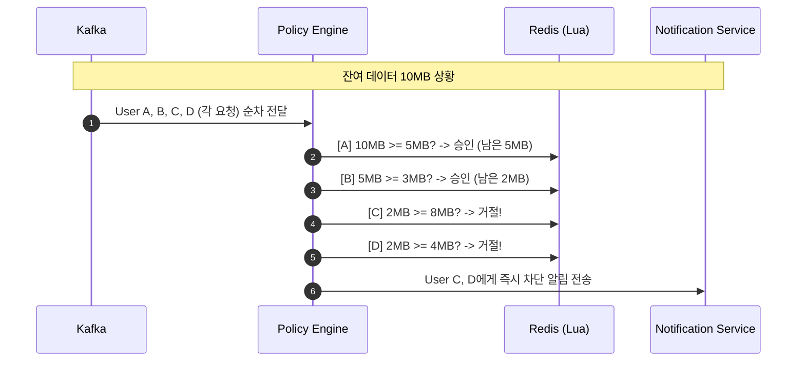

> **왜 선착순 완전 승인(부분 승인 안 함)?** 부분 승인은 "3MB만 허용"처럼 요청을 잘라야 하므로 앱 레벨에서 중간 상태 처리가 복잡해진다. 통신사 실제 정책도 잔여량 부족 시 전체 거부 방식이다.

### 4.2 Owner의 실시간 정책 변경

**상황**: Owner가 자녀1의 월별 한도를 **2GB → 500MB**로 축소. 자녀1은 이미 이번 달 **1.2GB** 사용 중

```
[T0] Owner가 web-service(Owner 모드)에서 한도 변경
├─ UI: 자녀1 한도 슬라이더 → 500MB
└─ API 호출: PATCH /families/policies

[T1] api-core 처리
├─ RDS에 정책 원본 저장 (Source of Truth)
├─ Redis constraints Hash 즉시 갱신
│   └─ HSET family:{id}:customer:{cid}:constraints LIMIT:DATA:MONTHLY 536870912
├─ policy-updated 이벤트 발행 (Kafka)
└─ 응답: 200 OK

[T2] processor-usage 정책 즉시 반영
├─ policy-updated 이벤트 수신
├─ 현재 사용량(1.2GB) vs 신규 한도(500MB) 비교
├─ 사용량 > 한도 → 즉시 차단
│   └─ HSET family:{id}:customer:{cid}:constraints BLOCK:ACCESS "1"
└─ notification-events 발행 (CUSTOMER_BLOCKED)

[T3] 실시간 반영
├─ 자녀1 앱: 즉시 차단 화면 표시 (차단 사유 + 부모 연락처)
├─ 가족 대시보드: 자녀1 상태 "차단됨"으로 변경
└─ 자녀1에게 PWA 푸시: "데이터 한도 초과로 차단되었습니다"
```

> **왜 소급 적용 + 즉시 차단?** 정책 변경 후 "다음 이벤트부터"만 적용하면, 이미 한도를 초과한 사용자가 차단되지 않는 허점이 발생한다. 부모의 제어 의도를 즉시 반영하기 위해 소급 적용이 필수이다.

### 4.3 시간대별 차단 정책

**상황**: 부모가 자녀들에게 **밤 22시 ~ 아침 07시** 데이터 사용 차단 정책 설정

```
[T0] 정책 설정
├─ 부모 → web-service에서 시간대 차단 정책 등록
├─ 대상: 자녀1, 자녀2
├─ 차단 시간: 22:00 ~ 07:00 (서버 시간 KST 기준)
└─ api-core → RDS 저장 + Redis 캐시 + policy-updated 발행

[T1] 22:00 도달 (정책 활성화)
├─ Lua Script가 constraints의 BLOCK:TIME:START/END 확인
├─ 현재 시각(2200) >= 시작(2200) → 시간대 차단 활성
└─ 알림: "야간 차단 정책이 활성화되었습니다"

[T2] 차단 중 데이터 요청
├─ 자녀1 → simulator-usage → Kafka (usage-events)
├─ processor-usage → Lua Script 실행
│   └─ constraints BLOCK:TIME:START/END 확인 → "BLOCKED_TIME" 반환
└─ 결과: 차단 (해제 예정: 07:00)

[T3] 07:00 도달 (정책 비활성화)
├─ Lua Script가 현재 시각(0700) >= END(0700) 확인 → 차단 해제
└─ 알림: "야간 차단이 해제되었습니다"
```

> **왜 KST 고정?** 사용자별 타임존 처리는 Lua Script 복잡도를 높이고, 국내 서비스 대상이므로 KST 단일 기준으로 통일한다.

### 4.4 단계별 소진 알림 (50%/30%/10%)

| 임계치 | 알림 대상 | 중복 방지 |
|--------|----------|----------|
| 50% | 전체 가족 | Redis `family:{fid}:alert:threshold:50` |
| 30% | 전체 가족 | Redis `family:{fid}:alert:threshold:30` |
| 10% | 전체 가족 | Redis `family:{fid}:alert:threshold:10` |

> **왜 임계치당 1회만?** 잔여량이 경계 근처에서 오르내릴 때 알림 폭풍을 방지한다. Redis TTL 기반 발송 기록으로 간단하게 구현한다.

---

## 5. 정책 유형 정의

### 5.1 MVP 구현 대상

| 정책 유형 | 설명 | 우선순위 |
|----------|------|---------|
| **월별 한도 정책** (MONTHLY_LIMIT) | 구성원별 월별 데이터 한도 설정 | 높음 |
| **즉시 차단 정책** (MANUAL_BLOCK) | Owner가 특정 구성원을 즉시 차단/해제 | 높음 |
| **시간대 차단 정책** (TIME_BLOCK) | 특정 시간대(야간 등) 자동 차단 (KST 기준) | 중간 |
| **임계값 알림 정책** | 잔여량 기준(50/30/10%) 알림 발송, 임계치당 1회 | 높음 |

### 5.2 설계만 진행 (MVP 제외)

| 정책 유형 | 설명 |
|----------|------|
| **앱별 차단 정책** (APP_BLOCK) | 특정 앱/서비스 사용 차단 (유튜브, 게임 등) |
| **앱별 가속 정책** | 특정 앱 우선순위 상향 (QoS) |
| **속도 제한 정책** | 한도 초과 시 속도 제한 (차단 대신) |

### 5.3 정책 템플릿 구조

| 필드 | DB 컬럼 | 설명 |
|------|---------|------|
| 정책 설명 | `description` | 정책 템플릿의 상세 설명. 프론트엔드 툴팁 표시용 |
| 최소 요구 역할 | `require_role` | `MEMBER`이면 모든 구성원에게 적용 가능, `OWNER`이면 OWNER만 대상 |
| 기본 규칙 | `default_rules` | 정책 타입별 기본 규칙 JSON |
| 활성화 여부 | `is_activate` | FALSE이면 정책 목록에서 제외되며 신규 적용 불가 |

**default_rules vs rules 관계**:
- `POLICY.default_rules`: 템플릿 수준의 기본값 (운영자가 설정)
- `POLICY_ASSIGNMENT.rules`: 실제 적용된 규칙 (Owner가 커스터마이즈 가능)
- 적용 흐름: Owner가 정책을 적용하면 `default_rules`가 `rules`로 복사되고, 이후 독립적으로 수정 가능

> **왜 default_rules와 rules를 분리?** 관리자가 템플릿(default_rules)을 수정해도, 이미 적용된 정책(rules)에 영향을 주지 않도록 설계했다. 템플릿 변경이 기존 사용자의 설정을 의도치 않게 바꾸는 것을 방지한다.

---

## 6. 기능 요구사항

### 6.1 web-service (가족 앱, www.dabom.site) — PWA

#### 공통 기능 (모든 구성원)

| 기능 | 설명 | 실시간 여부 |
|------|------|------------|
| 가족 통합 대시보드 | 가족 잔여 데이터량, 구성원별 사용 비중 시각화 | SSE |
| 개인 사용량 상세 | 시간대별/앱별/구성원별 상세 분석 리포트 | SSE |
| 알림 센터 | 잔여량 경고, 차단 알림, 정책 변경 알림 | PWA Push |
| 차단 상태 표시 | 즉시 차단 화면 (차단 사유, 부모 연락처) | SSE |

#### Owner 전용 기능

| 기능 | 설명 | 실시간 여부 |
|------|------|------------|
| 구성원별 한도 설정 | 슬라이더 UI로 월별 데이터 한도 조절 | 즉시 적용 |
| 실시간 차단/해제 | 특정 구성원의 데이터 사용 즉시 차단 또는 해제 | 즉시 적용 |
| 시간대 정책 설정 | 야간 등 특정 시간대 차단 정책 설정 | 즉시 적용 |
| 알림 임계값 설정 | 50%, 30%, 10% 등 잔여량 알림 기준 설정 | - |
| 상세 분석 리포트 | 시간대별, 앱별, 구성원별 사용량 분석 | - |
| 구성원 관리 | 추가/삭제, 탈퇴 시 할당량 수동 재배치 | - |

### 6.2 web-admin (백오피스, admin.dabom.site)

| 기능 | 설명 |
|------|------|
| 정책 관리 | 정책 템플릿 CRUD (시간대 차단, 한도 유형 등) |
| 개별 가족 정책 수정 | 고객 요청 시 관리자가 직접 정책 수정 가능 |
| 정책 즉시 적용 | 정책 변경 시 다음 이벤트부터 즉시 반영 보장 |
| 가족 그룹 검색/조회 | 그룹 ID, 사용자 이름, 전화번호 등으로 검색 |
| 사용량 모니터링 | 그룹별/사용자별 실시간 사용량 및 이력 조회 |
| 권한 관리 | Owner 계정 지정/해제 (복수 Owner 허용) |
| 감사 로그 | 정책 변경, 차단/해제 이력 등 감사 로그 조회 |

### 6.3 simulator-usage

| 기능 | 설명 |
|------|------|
| 이벤트 생성 | familyId, userId, appId, bytesUsed, timestamp 포함 |
| RPS 제어 | 초당 이벤트 발생률 조절 (고정 RPS + 런타임 변경) |
| 랜덤 이벤트 | 무작위 사용자에 대한 데이터 사용 이벤트 생성 |

---

## 7. 시스템 아키텍처

### 7.1 설계 목표 및 원칙

| 목표 | 설명 |
|------|------|
| 대규모 트래픽 처리 | 100만 유저, 25만 가족, 5,000 TPS 안정적 처리 |
| 실시간 이벤트 처리 | 이벤트 기반 실시간 처리 중심 |
| 동시성 제어 | "마지막 10MB" 케이스에서 정합성 보장 (100ms 이내) |
| 정책 즉시 반영 | 정책 변경 시 다음 이벤트부터 즉시 적용 |
| Idempotency | 중복/재처리 상황에서 일관된 결과 보장 |
| 장애 내성 | Redis 장애 시 DB Fallback, Circuit Breaker 전체 적용 |

> **왜 이벤트 기반 우선?** API 동기 호출 중심이면 5,000 TPS에서 api-core가 병목이 된다. Kafka를 이벤트 백본으로 두면 버스트 트래픽을 디스크 버퍼링으로 흡수하고, processor-usage가 자신의 속도로 소비할 수 있다.

> **왜 이중 저장(Redis + RDS)?** Redis만 쓰면 장애 시 데이터 유실, RDS만 쓰면 100ms 이내 응답 불가. Redis로 실시간 판정, RDS로 영속 보관을 분리하여 성능과 신뢰성을 동시에 확보한다.

> **왜 Write-Behind(자기소비 패턴)?** Write-Through는 매 이벤트마다 DB 동기 쓰기로 지연이 증가한다. processor-usage가 `usage-persist` 토픽에 발행 후 자체 소비하여 배치(5초/100건) 단위로 MySQL Bulk Insert하면 DB 부하를 1/100로 줄일 수 있다.

> **왜 Soft Delete?** 물리 삭제 시 감사 추적이 불가하다. `deleted_at` 컬럼으로 논리 삭제하면 데이터 복구 가능성과 감사 로그 일관성을 보장한다.

### 7.2 기술 스택 요약

| 영역 | 기술 | 선정 사유 |
|------|------|----------|
| **simulator-usage** | Go | 고성능 이벤트 펌프, goroutine 동시성, 단일 바이너리 ~20MB |
| **processor-usage** | Spring Boot | 복잡한 비즈니스 로직 + Kafka Consumer, Redis Atomic |
| **api-core** | Spring Boot | 풍부한 생태계, JPA, JWT 인증 |
| **api-notification** | Spring Boot | SSE 비동기 처리, notification-events consumer |
| **Kafka** | Apache Kafka | 대용량 이벤트 스트림, familyId 순서 보장, 버스트 흡수 |
| **Redis** | Redis Cluster | 원자 연산(Lua Script), 저지연 캐시 |
| **MySQL** | Amazon RDS | JSON 지원, Read 성능, 팀 숙련도 |
| **web-core** | Next.js + Turborepo | SSR, 모노레포 코드 공유 (web-service + web-admin) |
| **Container** | Docker + ECS Fargate | 오케스트레이션, 오토스케일링 |
| **Observability** | Prometheus + Grafana + Jaeger | 로그/메트릭/트레이싱 통합 |

### 7.3 전체 아키텍처 다이어그램

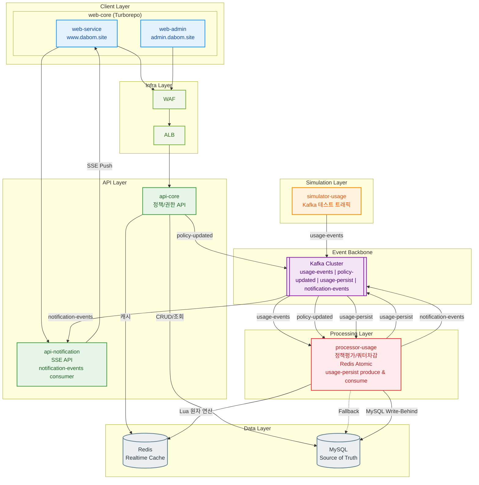

### 7.4 컴포넌트 책임 분리

| 컴포넌트 | 역할 | 기술 스택 |
|---------|------|----------|
| **simulator-usage** | 데이터 사용 이벤트 시뮬레이션, eventId 생성, Kafka 직접 발행 | Go |
| **processor-usage** | Kafka 소비, 검증, 중복 체크, 정책평가/쿼터차감, Write-Behind 자기소비, 알림 발행 | Spring Boot |
| **api-core** | 5개 도메인 REST API, JWT familyId 추론, 정책 즉시 반영 트리거 | Spring Boot |
| **api-notification** | notification-events consumer, SSE + REST 알림 API, PWA Push | Spring Boot |
| **web-service** | 가족 사용자 PWA (www.dabom.site) | Next.js + PWA |
| **web-admin** | 백오피스 관리 UI (admin.dabom.site) | Next.js |

### 7.5 계층별 구조

```
┌─────────────────────────────────────────────────────────────┐
│                     Client Layer                            │
│  ┌─────────────── web-core (Turborepo) ─────────────────┐  │
│  │ ┌─────────────────────┐  ┌─────────────────────────┐ │  │
│  │ │ web-service          │  │ web-admin               │ │  │
│  │ │ www.dabom.site (PWA) │  │ admin.dabom.site        │ │  │
│  │ └─────────────────────┘  └─────────────────────────┘ │  │
│  └──────────────────────────────────────────────────────┘  │
└─────────────────────────────────────────────────────────────┘
          │                              ┌──────────────────┐
   ┌──────┴──────┐                       │ Simulation Layer │
   │ WAF + ALB   │                       │ simulator-usage  │
   └──────┬──────┘                       └────────┬─────────┘
          │                                       │
┌─────────────────────────────────────────────────────────────┐
│                      API Layer                              │
│  ┌────────────────────────┐  ┌────────────────────────┐    │
│  │      api-core          │  │  api-notification      │    │
│  │   (Command/Query)      │  │    (SSE API)           │    │
│  └────────────────────────┘  └────────────────────────┘    │
└─────────────────────────────────────────────────────────────┘
                           │                │
┌─────────────────────────────────────────────────────────────┐
│              Event Backbone (버스트 흡수)                    │
│     Kafka: usage-events | policy-updated | usage-persist    │
│                    | notification-events                    │
└─────────────────────────────────────────────────────────────┘
                           │
┌─────────────────────────────────────────────────────────────┐
│                  Processing Layer                           │
│        processor-usage (정책평가 + Write-Behind)            │
└─────────────────────────────────────────────────────────────┘
                           │
┌─────────────────────────────────────────────────────────────┐
│                     Data Layer                              │
│       Redis (Realtime)          MySQL (Persist)             │
└─────────────────────────────────────────────────────────────┘
```

---

## 8. 핵심 컴포넌트 상세 설계

### 8.1 simulator-usage (Go)

**역할**: 데이터 사용 이벤트 시뮬레이션 — Kafka `usage-events` 토픽에 직접 발행 (HTTP 엔드포인트 없음)

**기능**:
- 고정 RPS로 랜덤 이벤트 생성 (정상 5,000 TPS, 버스트 최대 100만 동시)
- eventId 생성 (UUID v4) — 멱등성 보장을 위한 고유 식별자
- familyId, customerId, appId, bytesUsed, timestamp, metadata 포함
- 런타임 TPS 조절 HTTP API 제공
- 현실적 데이터 분포: 가족 규모(2~10명), 사용자 유형(Heavy/Normal/Light), 앱 카테고리(6종), 시간대별 트래픽 패턴

**Kafka Producer 설정**:
```properties
buffer.memory=67108864       # 64MB 버퍼
batch.size=65536             # 64KB 배치
linger.ms=5                  # 5ms 대기 후 발송
max.block.ms=60000           # 60초 블로킹 허용
acks=1                       # Leader 응답만 대기 (처리량 우선)
compression.type=lz4         # 압축으로 네트워크 효율화
```

> **왜 Go를 선택했는가? (vs Python)**
> - simulator-usage의 본질은 "고성능 이벤트 펌프"로, 비즈니스 로직이 거의 없고 빠른 Kafka 발행이 핵심
> - Go의 goroutine으로 수만 개 동시 실행 가능, Python은 GIL 제약으로 버스트(100만 동시) 구간에서 한계
> - 단일 바이너리 ~20MB vs Python 런타임 ~200MB+
> - `golang.org/x/time/rate`로 TPS 조절이 자연스럽고 런타임 변경도 채널 통신으로 깔끔

| 항목 | Go | Python |
|------|-----|--------|
| Kafka Producer 성능 | confluent-kafka-go (librdkafka), 5,000+ TPS 여유 | GIL로 콜백 병목 가능 |
| 동시성 모델 | goroutine 수만 개, 채널 통신 | asyncio/threading, GIL 제약 |
| 메모리 | 바이너리 ~10MB | 인터프리터 + 의존성 수십~수백MB |
| 배포 | 단일 바이너리, Docker ~20MB | Docker ~200MB+ |
| 버스트 대응 | goroutine + channel로 100만 동시 가능 | multiprocessing 필요, 프로세스 간 통신 복잡 |

> **왜 커스텀 개발? (vs k6, JMeter, kafka-producer-perf-test 등)**
> - 범용 도구로는 familyId 기반 파티션 분포, 도메인 JSON 페이로드, eventId UUID 생성, E2E 파이프라인 검증 불가
> - simulator-usage는 부하 도구가 아니라 "시스템 컴포넌트"로서 운영 환경 트래픽 패턴을 재현
> - 단, kafka-producer-perf-test는 인프라 검증 단계에서 병행 활용

**부하 테스트 도구 계층 전략**:

```
┌─────────────────────────────────────────────────────┐
│              Kafka 파이프라인 테스트                   │
│                                                       │
│  1단계: kafka-producer-perf-test                      │
│         → MSK 인프라가 5,000 TPS 버티는가?            │
│                                                       │
│  2단계: simulator-usage (Go)                          │
│         → 실제 페이로드 E2E 파이프라인 테스트          │
│         → "Last 10MB" 동시성 시나리오 재현             │
├───────────────────────────────────────────────────────┤
│              HTTP API 테스트                           │
│                                                       │
│  3단계: k6 → api-core/api-notification HTTP 부하      │
└───────────────────────────────────────────────────────┘
```

### 8.2 processor-usage

**역할**: 이벤트 검증, 중복 체크, 정책평가/쿼터차감, Redis Atomic, Write-Behind 자기소비

**9가지 책임**:
1. **Kafka Consumer**: `usage-events`, `policy-updated`, `usage-persist` 토픽 소비
2. **페이로드 검증**: 필수 필드 확인, 형식 검증
3. **중복 체크**: Redis `SETNX event:processed:{eventId}` (TTL 24시간)
4. **Redis Lua Script**: 원자적 정책 평가/차감 (100ms 이내)
5. **선착순 완전 승인**: 잔여량 부족 시 요청 전체 거부
6. **정책 변경 즉시 반영**: 메모리 캐시 갱신 + 소급 적용 검사
7. **DB Fallback**: Redis 장애 시 MySQL 전환 (Circuit Breaker)
8. **알림 이벤트 발행**: `notification-events` 토픽으로 통합 발행
9. **Write-Behind (자기소비)**: `usage-persist` 토픽으로 발행 후, 동일 토픽을 소비하여 MySQL Bulk Insert

**처리 흐름**:
```
Kafka(usage-events) → 검증 → 중복체크(Redis) → Lua Script(쿼터 평가)
    → notification-events 발행 → usage-persist 발행
Kafka(usage-persist) → processor-usage 자기소비 → MySQL Bulk Insert
```

> **왜 processor-usage가 usage-persist를 자기소비(Self-Consumption)?** 별도 서비스로 분리하면 운영 복잡도가 증가한다. processor-usage가 이미 처리 컨텍스트를 갖고 있으므로, 같은 프로세스에서 배치 수집(5초/100건) 후 Bulk Insert하는 것이 가장 효율적이다.

### 8.3 api-core (Command/Query API)

**역할**: 정책/권한 CRUD, 대시보드 조회, 인증

**책임**:
1. JWT 인증/인가 처리 (Access 30분 / Refresh 7일)
2. 가족/구성원 관리 API
3. 정책 CRUD API
4. 정책 변경 시 **RDS + Redis + Kafka 동시 갱신** (즉시 반영)
5. API 버전 관리 (Accept-Version 헤더)

**기술 스택**: Spring Boot

### 8.4 api-notification (SSE API)

**역할**: notification-events 소비, SSE 실시간 알림 전달, PWA Push

**책임**:
1. Kafka `notification-events` 토픽 소비 (subType: QUOTA_UPDATED, CUSTOMER_BLOCKED, THRESHOLD_ALERT)
2. 중복 알림 방지 (임계치당 1회)
3. SSE API 실시간 스트림 전송
4. PWA Push 알림 발송
5. 3회 실패 시 DLQ 이동

> **왜 3개 알림 토픽을 notification-events 단일 토픽으로 통합?** Consumer 관리 단순화. `subType`으로 구분하면 토픽 수를 줄이면서도 이벤트 타입별 처리가 가능하다. Kafka 파티션 설정도 1개 토픽으로 관리할 수 있다.

---

## 9. 이벤트 백본 설계 (Kafka)

### 9.1 토픽 설계 및 파티셔닝 전략

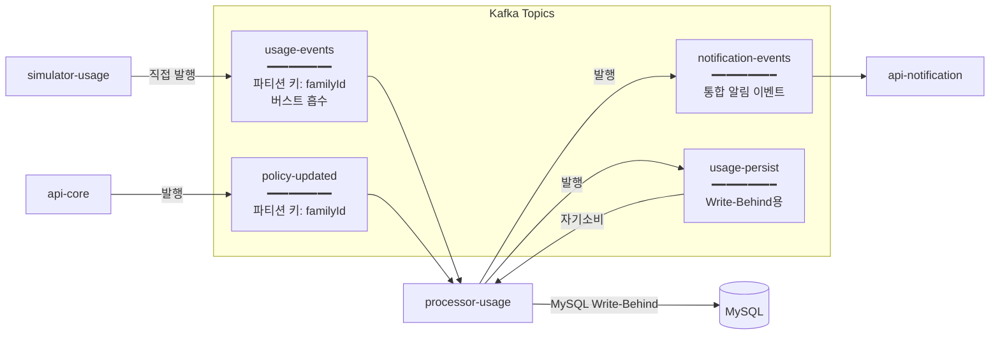

**파티셔닝 전략**:
- `usage-events`, `policy-updated`: familyId 기반 파티셔닝
- 파티션 수: **10개** (processor-usage 인스턴스 수와 동일)

> **왜 familyId를 파티션 키로?** 동일 가족의 이벤트가 같은 파티션에 들어가야 순서가 보장된다. "Last 10MB" 시나리오에서 아빠→엄마→자녀 순서가 뒤바뀌면 동시성 제어가 깨진다.

> **왜 파티션 10개?** processor-usage 인스턴스 수와 동일하게 맞춰 1:1 매핑. 파티션 > Consumer면 유휴 Consumer, Consumer > 파티션이면 유휴 인스턴스가 발생한다.

**버스트 처리**: Kafka가 100만 동시 요청도 디스크 버퍼링으로 흡수. Consumer는 자신의 처리 속도로 소비 (Lag 허용)

**재시도 정책**: 3회 실패 시 DLQ로 이동, 지수 백오프 (1초, 5초, 30초)

### 9.2 이벤트 스키마

#### 공통 봉투 (EventEnvelope)

모든 이벤트는 `EventEnvelope<T>` 래퍼 구조로 전송. `eventType` 필드 값에 따라 `payload` 타입이 자동 매핑.

```json
{
  "eventId": "evt_550e8400-...",
  "eventType": "DATA_USAGE | POLICY_UPDATED | USAGE_PERSIST | NOTIFICATION",
  "subType": null,
  "timestamp": "2026-02-06T14:30:00Z",
  "payload": { }
}
```

> **왜 EventEnvelope 래퍼 패턴?** 모든 이벤트를 단일 구조로 감싸면 직렬화/역직렬화를 통일할 수 있고, Jackson `@JsonTypeInfo`로 eventType에 따라 payload 타입을 자동 매핑한다. 새로운 이벤트 타입 추가 시 `@JsonSubTypes`에 한 줄만 추가하면 된다.

**Java Record 구현**:

```java
@JsonInclude(JsonInclude.Include.NON_NULL)
@JsonIgnoreProperties(ignoreUnknown = true)
public record EventEnvelope<T>(
    String eventId,
    String eventType,
    String subType,
    String timestamp,
    @JsonTypeInfo(use = JsonTypeInfo.Id.NAME, include = JsonTypeInfo.As.EXTERNAL_PROPERTY, property = "eventType")
    @JsonSubTypes({
        @JsonSubTypes.Type(value = UsagePayload.class, name = "DATA_USAGE"),
        @JsonSubTypes.Type(value = PolicyUpdatedPayload.class, name = "POLICY_UPDATED"),
        @JsonSubTypes.Type(value = UsagePersistPayload.class, name = "USAGE_PERSIST"),
        @JsonSubTypes.Type(value = NotificationPayload.class, name = "NOTIFICATION")
    })
    T payload
) {}
```

#### usage-events (데이터 사용 이벤트)

```json
{
  "eventId": "evt_550e8400-e29b-41d4-a716-446655440000",
  "eventType": "DATA_USAGE",
  "subType": null,
  "timestamp": "2026-02-06T14:30:00Z",
  "payload": {
    "familyId": 100,
    "customerId": 12345,
    "appId": "com.youtube.app",
    "bytesUsed": 5242880,
    "metadata": { "deviceId": "device_pixel_9", "networkType": "5G" }
  }
}
```

```java
public record UsagePayload(
    Long familyId, Long customerId, String appId, Long bytesUsed, Map<String, Object> metadata
) {}
```

#### policy-updated (정책 변경 이벤트)

```json
{
  "eventId": "pol_7a3d2e1f-...",
  "eventType": "POLICY_UPDATED",
  "timestamp": "2026-02-06T14:35:00Z",
  "payload": {
    "familyId": 100,
    "targetCustomerId": 12345,
    "policyKey": "LIMIT:DATA:DAILY",
    "oldValue": "2147483648",
    "newValue": "536870912",
    "changedBy": 99999
  }
}
```

> **왜 policyKey(String)를 policyType(Enum) 대신?** Enum은 새 정책 추가마다 코드 수정+배포가 필요하다. String 기반 `ACTION:TYPE:TARGET` 패턴(예: `LIMIT:DATA:DAILY`, `BLOCK:APP:com.youtube`)이면 코드 변경 없이 정책 확장이 가능하다.

```java
public record PolicyUpdatedPayload(
    Long familyId, Long targetCustomerId,
    String policyKey, // "LIMIT:DATA:DAILY", "BLOCK:APP:com.youtube", "THROTTLE:SPEED"
    String oldValue, String newValue, Long changedBy
) {}
```

#### usage-persist (DB 저장용 이벤트)

```json
{
  "eventId": "persist_8c9d0e1f-...",
  "eventType": "USAGE_PERSIST",
  "timestamp": "2026-02-06T14:30:01Z",
  "payload": {
    "originEventId": "evt_550e8400-...",
    "familyId": 100, "customerId": 12345,
    "bytesUsed": 5242880, "appId": "com.youtube.app",
    "processResult": "ALLOWED", "remainingAfter": 4823449,
    "eventTime": "2026-02-06T14:30:00Z"
  }
}
```

#### notification-events (통합 알림 이벤트)

`eventType`은 `NOTIFICATION`으로 고정, `subType`으로 구분:

**QUOTA_UPDATED** (잔여량 갱신):
```json
{ "subType": "QUOTA_UPDATED", "payload": {
    "familyId": 100, "customerId": 12345,
    "familyRemainingBytes": 53681848320, "familyUsedPercent": 50.5,
    "customerUsedBytesToday": 10485760
} }
```

**CUSTOMER_BLOCKED** (사용자 차단):
```json
{ "subType": "CUSTOMER_BLOCKED", "payload": {
    "familyId": 100, "customerId": 12346,
    "blockReason": "LIMIT:DATA:DAILY", "blockedAt": "2026-02-06T14:32:00Z"
} }
```

**THRESHOLD_ALERT** (임계치 알림):
```json
{ "subType": "THRESHOLD_ALERT", "payload": {
    "familyId": 100, "thresholdPercent": 10,
    "message": "가족 데이터가 10% 미만입니다! 데이터를 충전해주세요."
} }
```

**Notification Sealed Interface + Java 21 Pattern Matching**:

```java
public sealed interface NotificationPayload
    permits QuotaUpdatedPayload, CustomerBlockedPayload, ThresholdAlertPayload {}

public record QuotaUpdatedPayload(Long familyId, Long customerId,
    Long familyRemainingBytes, Double familyUsedPercent, Long customerUsedBytesToday
) implements NotificationPayload {}

public record CustomerBlockedPayload(Long familyId, Long customerId,
    String blockReason, String blockedAt
) implements NotificationPayload {}

public record ThresholdAlertPayload(Long familyId, Integer thresholdPercent,
    String message
) implements NotificationPayload {}

// Java 21 Consumer 예시
@KafkaListener(topics = "notification-events")
public void handleNotification(EventEnvelope<NotificationPayload> event) {
    switch (event.payload()) {
        case QuotaUpdatedPayload(var fid, var uid, var rem, var pct, var today) ->
            sendQuotaPush(uid, pct);
        case CustomerBlockedPayload(var fid, var uid, var reason, var at) ->
            sendBlockPush(uid, reason);
        case ThresholdAlertPayload(var fid, var pct, var msg) ->
            sendAlertPush(fid, msg);
    }
}
```

### 9.3 Consumer Group 전략

| Consumer Group | 토픽 | 인스턴스 수 | 처리 방식 |
|---------------|------|-----------|----------|
| `processor-usage-group` | usage-events, policy-updated, usage-persist | 10 (파티션 수) | 순차 처리 + Write-Behind |
| `notification-group` | notification-events | 2 | 병렬 처리 |

---

## 10. 데이터 플로우 (E2E)

### 10.1 데이터 사용 이벤트 처리 흐름

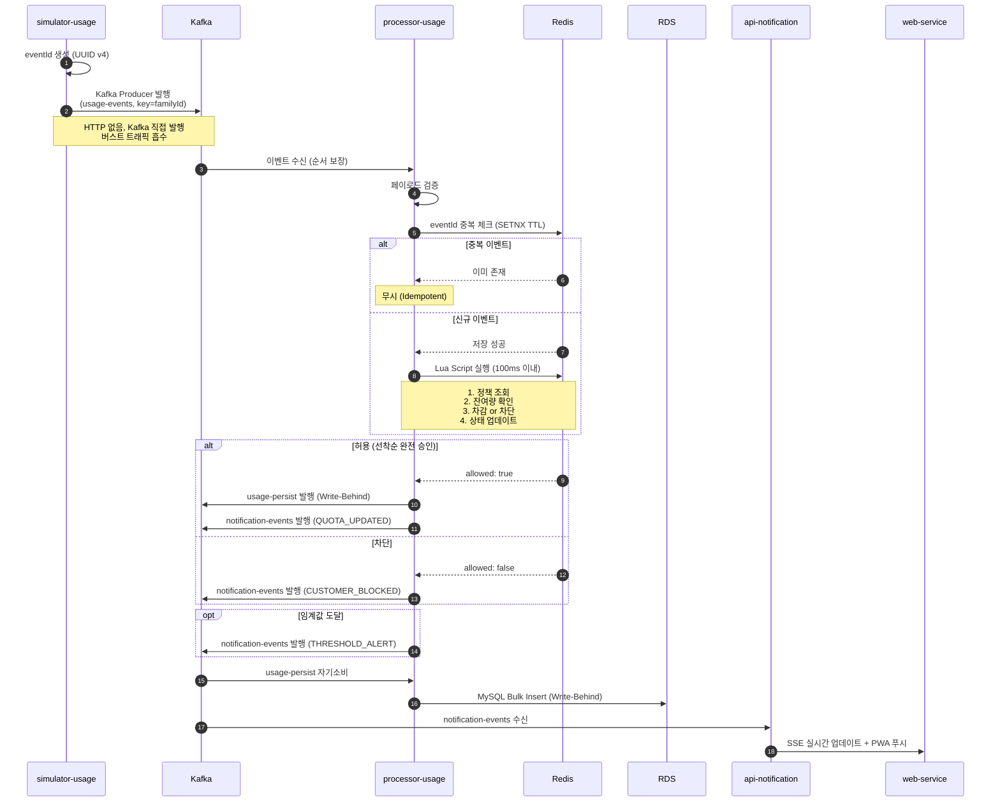

### 10.2 정책 변경 즉시 반영 흐름

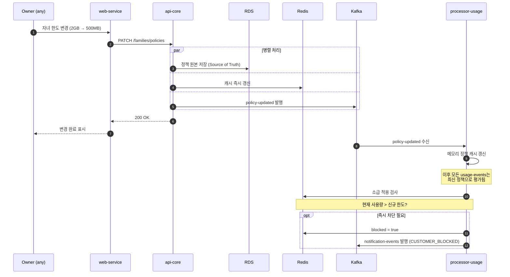

> **왜 api-core가 RDS + Redis + Kafka를 병렬로 갱신?** RDS는 Source of Truth(영속), Redis는 실시간 판정용 캐시, Kafka는 processor-usage에 정책 변경을 전파한다. 3곳을 동시에 갱신해야 "다음 이벤트부터 즉시 적용"이 보장된다.

### 10.3 알림 발송 흐름

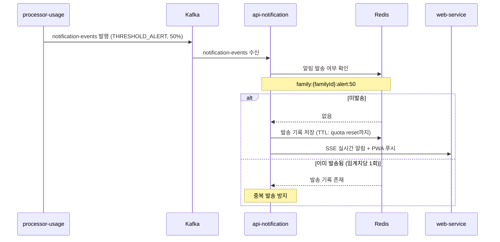

---

## 11. 동시성 제어 전략

### 11.1 "Last 10MB" 문제 해결

**3단계 해결 전략**:

1. **Kafka 파티셔닝**: familyId를 파티션 키로 사용 → 동일 가족 이벤트 순서 보장
2. **단일 Consumer**: 파티션당 하나의 processor-usage Consumer가 순차 처리
3. **Redis Lua Script**: 원자적 "확인 → 차감 → 상태 변경"

```
┌─────────────────────────────────────────────────────────────┐
│                    동시 요청 (4명)                          │
│  아빠: 5MB  │  엄마: 3MB  │  자녀1: 8MB  │  자녀2: 4MB     │
└─────────────────────────────────────────────────────────────┘
                           │
            simulator-usage가 Kafka로 직접 발행
                           │
┌─────────────────────────────────────────────────────────────┐
│               Kafka (familyId 파티션) — 순서 보장           │
└─────────────────────────────────────────────────────────────┘
                           │
┌─────────────────────────────────────────────────────────────┐
│              processor-usage (순차 처리)                    │
│                                                             │
│  아빠 5MB ✅ (잔여 5MB) → 엄마 3MB ✅ (잔여 2MB)           │
│  자녀1 8MB ❌ (차단)    → 자녀2 4MB ❌ (차단)              │
└─────────────────────────────────────────────────────────────┘
```

### 11.2 Redis Lua Script (Poly-Policy Engine)

constraints Hash를 순회하며 BLOCK/LIMIT/THROTTLE 등 다양한 정책을 **코드 수정 없이** 평가한다.

**Input/Output 명세**:

| 구분 | Key/Arg | 설명 |
|------|---------|------|
| `KEYS[1]` | `family:{fid}:remaining` | 가족 잔여 데이터량 |
| `KEYS[2]` | `family:{fid}:customer:{cid}:usage` | 기간별 사용량 Key Prefix |
| `KEYS[3]` | `family:{fid}:customer:{cid}:constraints` | 제약 조건 Hash |
| `ARGV[1]` | `request_bytes` | 요청 데이터량 |
| `ARGV[2]` | `app_id` | 현재 실행 앱 패키지명 |
| `ARGV[3]` | `current_hhmm` | 현재 시각 (예: "2230") |

```lua
-- 1. 제약 조건 로딩
local constraints_array = redis.call('HGETALL', KEYS[3])
local request_bytes = tonumber(ARGV[1])
local app_id = ARGV[2]
local current_time = tonumber(ARGV[3] or "0000")

local constraints = {}
for i = 1, #constraints_array, 2 do
    constraints[constraints_array[i]] = constraints_array[i+1]
end

-- 2. [Block] 무조건 차단 체크 (Priority 1)
if constraints['BLOCK:ACCESS'] == "1" then
    return "BLOCKED_ACCESS"
end
if app_id and constraints['BLOCK:APP:' .. app_id] == "1" then
    return "BLOCKED_APP"
end

-- 시간대 차단 (자정 넘기는 케이스 포함)
local start_time = tonumber(constraints['BLOCK:TIME:START'])
local end_time = tonumber(constraints['BLOCK:TIME:END'])
if start_time and end_time then
    if start_time < end_time then
        if current_time >= start_time and current_time < end_time then
            return "BLOCKED_TIME"
        end
    else
        if current_time >= start_time or current_time < end_time then
            return "BLOCKED_TIME"
        end
    end
end

-- 3. [Limit] 데이터 한도 체크 (Priority 2)
for field, value in pairs(constraints) do
    if string.sub(field, 1, 11) == "LIMIT:DATA:" then
        local period = string.sub(field, 12)
        local usage_key = KEYS[2] .. ":" .. string.lower(period)
        local current = tonumber(redis.call('GET', usage_key) or 0)
        if (current + request_bytes) > tonumber(value) then
            return "BLOCKED_LIMIT_" .. period
        end
    end
end

-- 4. [Family] 가족 공용 잔여량 체크 (Priority 3)
local family_rem = tonumber(redis.call('GET', KEYS[1]) or 0)
if family_rem < request_bytes then
    return "BLOCKED_FAMILY_QUOTA"
end

-- 5. [Apply] 사용 처리 (여기까지 왔으면 통과)
redis.call('DECRBY', KEYS[1], request_bytes)
for field, _ in pairs(constraints) do
    if string.sub(field, 1, 11) == "LIMIT:DATA:" then
        local period = string.sub(field, 12)
        local usage_key = KEYS[2] .. ":" .. string.lower(period)
        redis.call('INCRBY', usage_key, request_bytes)
    end
end

-- 6. [Result] 최종 결과 (QoS 속도 제한 포함)
local throttle = constraints['THROTTLE:SPEED'] or 0
return { "ALLOWED", family_rem, throttle }
```

> **왜 Redis Lua Script?** Redis의 Lua 실행은 단일 스레드에서 원자적으로 처리된다. "잔여량 확인→정책 평가→차감→상태 변경"을 하나의 트랜잭션처럼 실행하여 Race Condition을 원천 차단한다. 분산 락(Redlock)보다 단순하고 빠르다.

> **왜 Poly-Policy Engine(constraints Hash 동적 순회)?** 하드코딩된 if-else 대신 constraints Hash의 필드를 패턴 매칭으로 순회하면, 관리자가 새 정책(예: `BLOCK:APP:com.tiktok`)을 추가해도 Lua Script 수정 없이 즉시 동작한다. 정책 확장의 핵심 설계이다.

### 11.3 Kafka 파티션 기반 순서 보장

| 계층 | 전략 | 효과 |
|------|------|------|
| **Kafka** | 파티션 키 = familyId | 동일 가족 이벤트는 같은 파티션 → 순서 보장 |
| **Consumer** | 단일 스레드 처리 (파티션당) | 파티션 내 이벤트 순차 처리 |
| **Redis** | Lua Script 원자 실행 | 확인-차감-상태변경 단일 트랜잭션 |

### 11.4 Idempotency 보장 (이중 방어)

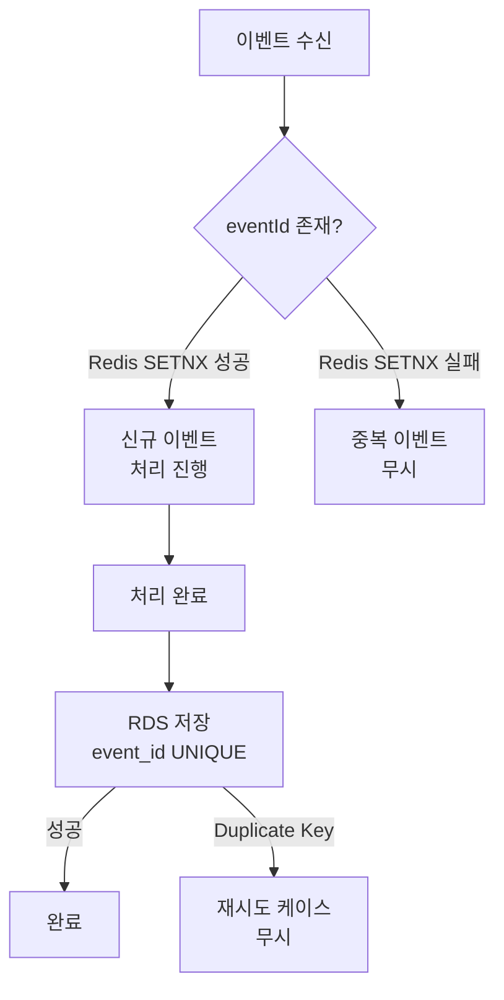

**이중 방어**:
1. **Redis**: `SETNX event:processed:{eventId}` (TTL 24시간) — 1차 필터
2. **RDS**: `usage_record.event_id` UNIQUE 제약 — 최종 안전망

> **왜 이중 방어(Redis SETNX + RDS UNIQUE)?** Redis는 TTL 만료 후 키가 사라지므로, 장시간 후 재처리되는 이벤트는 Redis만으로 걸러낼 수 없다. RDS의 event_id UNIQUE 제약이 최종 안전망 역할을 한다.

---

## 12. 데이터 모델

### 12.1 저장소 역할 분리

| 저장소 | 역할 | 특징 |
|--------|------|------|
| **Redis Cluster** | 실시간 캐시, 동시성 제어, 상태 관리 | 원자 연산(Lua Script), 저지연, 휘발성 |
| **MySQL** | 영속 데이터, 원본(Source of Truth), 감사 로그 | ACID 보장, 장기 보관, 복잡한 쿼리 |
| **Kafka** | 이벤트 백본, 비동기 메시징 | 순서 보장, 재처리 가능, 이력 보관 |
| **S3** | 콜드 데이터 아카이브 | 저비용 장기 보관 |

### 12.2 Redis 키 설계

#### 가족 데이터

| Key 패턴 | 타입 | 설명 | TTL |
|----------|------|------|-----|
| `family:{fid}:info` | Hash | 가족 기본 정보 (name, total_quota, created_at) | 영구 |
| `family:{fid}:remaining` | String | 가족 공용 실시간 잔여량 (DECRBY 대상) | 월초 리셋 |

```bash
HSET family:100:info name "HappyFamily" total_quota "107374182400" created_at "1707462000"
SET family:100:remaining "12884901888"
```

#### 사용자 사용량 (기간별 집계)

| Key 패턴 | 타입 | 설명 | TTL |
|----------|------|------|-----|
| `family:{fid}:customer:{cid}:usage:{period}` | String | 기간별 누적 사용량 | 해당 기간 만료 시 |

```bash
SET family:100:customer:1:usage:monthly "5368709120"   # 월별 5GB
SET family:100:customer:1:usage:daily "524288000"       # 일별 500MB
```

> **왜 사용량을 기간별(daily/monthly/weekly)로 분리 저장?** 정책이 "일일 한도", "월별 한도" 등 다양한 기간을 지원해야 하므로, Lua Script가 constraints의 `LIMIT:DATA:{PERIOD}`에서 기간을 추출하여 동적으로 해당 키를 참조한다. 새 기간(weekly) 추가 시 키만 추가하면 된다.

#### 런타임 제약 (Runtime Constraints) — 핵심 설계

| Key 패턴 | 타입 | 설명 |
|----------|------|------|
| `family:{fid}:customer:{cid}:constraints` | Hash | 사용자의 현재 유효 제약 조건 모음 |

**Field 표준 (ACTION:TYPE 패턴)**:

| Category | Field Name | Value | 설명 |
|----------|-----------|-------|------|
| 차단 | `BLOCK:ACCESS` | `'1'` | 전체 데이터 차단 |
| | `BLOCK:APP:{APP_ID}` | `'1'` | 특정 앱 차단 |
| | `BLOCK:TIME:START` | `"HHMM"` | 차단 시작 시간 |
| | `BLOCK:TIME:END` | `"HHMM"` | 차단 종료 시간 |
| 한도 | `LIMIT:DATA:{PERIOD}` | Bytes (Long) | 기간별 데이터 한도 |
| 속도 | `THROTTLE:SPEED` | bps (Int) | 전송 속도 제한 |

```bash
# 일일 1GB 한도 + 유튜브 차단
HMSET family:100:customer:1:constraints \
  LIMIT:DATA:DAILY "1073741824" \
  BLOCK:APP:com.google.youtube "1"

# 야간 시간대 접속 차단 (22:00 ~ 07:00)
HMSET family:100:customer:4:constraints \
  BLOCK:TIME:START "2200" \
  BLOCK:TIME:END "0700"
```

#### 시스템 안정성 및 중복 방지

| Key 패턴 | 타입 | 설명 | TTL |
|----------|------|------|-----|
| `event:dedup:{uuid}` | String | Kafka 이벤트 중복 처리 방지 | 1시간 |
| `family:{fid}:alert:{type}:{value}` | String | 알림 중복 발송 방지 | 월초 리셋 |

#### 정책 메타데이터 (API용)

| Key 패턴 | 타입 | 설명 |
|----------|------|------|
| `policy:def:{code}` | Hash | 관리자 정의 정책 템플릿 |
| `family:{fid}:policy:{code}` | Hash | 가족에게 적용된 정책 설정값 |

### 12.3 MySQL ERD

```mermaid
erDiagram
    CUSTOMER ||--|{ FAMILY_MEMBER : "belongs to"
    FAMILY ||--|{ FAMILY_MEMBER : "contains"
    CUSTOMER ||--o{ CUSTOMER_QUOTA : "has monthly quota"
    FAMILY ||--o{ CUSTOMER_QUOTA : "scoped to"
    CUSTOMER ||--o{ USAGE_RECORD : "generates"
    FAMILY ||--o{ USAGE_RECORD : "belongs to"
    POLICY ||--o{ POLICY_ASSIGNMENT : "applied as"
    FAMILY ||--o{ POLICY_ASSIGNMENT : "receives"
    CUSTOMER ||--o{ POLICY_ASSIGNMENT : "targeted by"
    CUSTOMER ||--o{ NOTIFICATION_LOG : "receives"
    FAMILY ||--o{ NOTIFICATION_LOG : "scoped to"
    FAMILY ||--o{ INVITE : "has"
    CUSTOMER ||--o{ AUDIT_LOG : "performs"

    CUSTOMER {
        bigint id PK "AUTO_INCREMENT"
        varchar phone_number UK "NOT NULL, 숫자만 11자리 (로그인 ID)"
        varchar password_hash "NOT NULL, BCrypt"
        varchar name "NOT NULL"
        varchar email "NULL"
        datetime created_at "DEFAULT CURRENT_TIMESTAMP"
        datetime updated_at "DEFAULT CURRENT_TIMESTAMP"
        datetime deleted_at "NULL, Soft Delete"
    }

    ADMIN {
        bigint id PK "AUTO_INCREMENT"
        varchar email UK "NOT NULL (로그인 ID)"
        varchar password_hash "NOT NULL, BCrypt"
        varchar name "NOT NULL"
        datetime created_at "DEFAULT CURRENT_TIMESTAMP"
        datetime deleted_at "NULL, Soft Delete"
    }

    FAMILY {
        bigint id PK "AUTO_INCREMENT"
        varchar name "NOT NULL, 가족 그룹명"
        bigint created_by_id FK "NOT NULL, 최초 생성자 (이력 전용)"
        bigint total_quota_bytes "NOT NULL, DEFAULT 100GB"
        bigint used_bytes "NOT NULL DEFAULT 0"
        date current_month "NOT NULL, 현재 과금 월"
        datetime deleted_at "NULL, Soft Delete"
    }

    FAMILY_MEMBER {
        bigint id PK "AUTO_INCREMENT"
        bigint family_id FK "NOT NULL"
        bigint customer_id FK "NOT NULL"
        enum role "MEMBER or OWNER"
        datetime joined_at "DEFAULT CURRENT_TIMESTAMP"
        datetime deleted_at "NULL, Soft Delete"
    }

    CUSTOMER_QUOTA {
        bigint id PK "AUTO_INCREMENT"
        bigint customer_id FK "NOT NULL"
        bigint family_id FK "NOT NULL"
        bigint monthly_limit_bytes "NULL = 무제한"
        bigint monthly_used_bytes "NOT NULL DEFAULT 0"
        date current_month "NOT NULL"
        boolean is_blocked "NOT NULL DEFAULT FALSE"
        varchar block_reason "NULL"
        datetime deleted_at "NULL, Soft Delete"
    }

    USAGE_RECORD {
        bigint id PK "AUTO_INCREMENT"
        varchar event_id UK "NOT NULL, Idempotency 키"
        bigint customer_id FK "NOT NULL"
        bigint family_id FK "NOT NULL"
        bigint bytes_used "NOT NULL"
        varchar app_id "NULL"
        datetime event_time "NOT NULL"
        datetime deleted_at "NULL, Soft Delete"
    }

    POLICY {
        bigint id PK "AUTO_INCREMENT"
        varchar name "NOT NULL"
        varchar description "NULL"
        enum require_role "DEFAULT MEMBER"
        enum type "MONTHLY_LIMIT or TIME_BLOCK or APP_BLOCK or MANUAL_BLOCK"
        json default_rules "NOT NULL"
        boolean is_system "DEFAULT FALSE"
        boolean is_activate "NOT NULL DEFAULT TRUE"
        datetime deleted_at "NULL, Soft Delete"
    }

    POLICY_ASSIGNMENT {
        bigint id PK "AUTO_INCREMENT"
        bigint policy_id FK "NOT NULL"
        bigint family_id FK "NOT NULL"
        bigint target_customer_id FK "NULL = 가족 전체"
        json rules "NOT NULL"
        boolean is_active "NOT NULL DEFAULT TRUE"
        datetime applied_at "DEFAULT CURRENT_TIMESTAMP"
        bigint applied_by_id FK "NOT NULL"
        datetime deleted_at "NULL, Soft Delete"
    }

    NOTIFICATION_LOG {
        bigint id PK "AUTO_INCREMENT"
        bigint customer_id FK "NOT NULL"
        bigint family_id FK "NOT NULL"
        enum type "THRESHOLD_ALERT or BLOCKED or UNBLOCKED or POLICY_CHANGED"
        text message "NOT NULL"
        json payload "NULL"
        boolean is_read "NOT NULL DEFAULT FALSE"
        datetime sent_at "DEFAULT CURRENT_TIMESTAMP"
        datetime deleted_at "NULL, Soft Delete"
    }

    AUDIT_LOG {
        bigint id PK "AUTO_INCREMENT"
        bigint actor_id FK "NULL"
        varchar action "NOT NULL"
        varchar entity_type "NOT NULL"
        bigint entity_id "NOT NULL"
        json old_value "NULL"
        json new_value "NULL"
        varchar ip_address "NULL"
        datetime created_at "DEFAULT CURRENT_TIMESTAMP"
    }

    INVITE {
        bigint id PK "AUTO_INCREMENT"
        bigint family_id FK "NOT NULL"
        varchar phone_number "NOT NULL, 숫자만 11자리"
        enum role "MEMBER or OWNER"
        enum status "PENDING or ACCEPTED or EXPIRED or CANCELLED"
        datetime expires_at "NOT NULL"
        datetime deleted_at "NULL, Soft Delete"
    }
```

> **왜 CUSTOMER와 ADMIN을 분리?** CUSTOMER(전화번호 로그인)와 ADMIN(이메일 로그인)은 인증 방식 자체가 다르다. 단일 USER 테이블에서 role로 구분하면 인증 로직에서 항상 role 체크가 필요하고 테이블이 비대해진다.

> **왜 family.created_by_id는 이력 전용?** OWNER 권한 판단은 `family_member.role='OWNER'`로만 수행한다. `created_by_id`를 권한에 사용하면 "최초 생성자가 항상 OWNER"라는 제약이 생겨 유연성이 저하된다.

### 12.4 핵심 테이블 DDL

```sql
CREATE TABLE customer (
    id              BIGINT AUTO_INCREMENT PRIMARY KEY,
    phone_number    VARCHAR(11) NOT NULL COMMENT '숫자만 11자리',
    password_hash   VARCHAR(255) NOT NULL,
    name            VARCHAR(100) NOT NULL,
    email           VARCHAR(255),
    created_at      DATETIME DEFAULT CURRENT_TIMESTAMP,
    updated_at      DATETIME DEFAULT CURRENT_TIMESTAMP,
    deleted_at      DATETIME NULL,
    UNIQUE (phone_number, deleted_at)
);

CREATE TABLE admin (
    id              BIGINT AUTO_INCREMENT PRIMARY KEY,
    email           VARCHAR(255) NOT NULL,
    password_hash   VARCHAR(255) NOT NULL,
    name            VARCHAR(100) NOT NULL,
    created_at      DATETIME DEFAULT CURRENT_TIMESTAMP,
    updated_at      DATETIME DEFAULT CURRENT_TIMESTAMP,
    deleted_at      DATETIME NULL,
    UNIQUE (email, deleted_at)
);

CREATE TABLE family (
    id                  BIGINT AUTO_INCREMENT PRIMARY KEY,
    name                VARCHAR(100) NOT NULL,
    created_by_id       BIGINT NOT NULL REFERENCES customer(id),
    total_quota_bytes   BIGINT NOT NULL DEFAULT 107374182400,
    used_bytes          BIGINT NOT NULL DEFAULT 0,
    current_month       DATE NOT NULL,
    created_at          DATETIME DEFAULT CURRENT_TIMESTAMP,
    updated_at          DATETIME DEFAULT CURRENT_TIMESTAMP,
    deleted_at          DATETIME NULL
);

CREATE TABLE family_member (
    id          BIGINT AUTO_INCREMENT PRIMARY KEY,
    family_id   BIGINT NOT NULL REFERENCES family(id),
    customer_id BIGINT NOT NULL REFERENCES customer(id),
    role        ENUM('MEMBER', 'OWNER') NOT NULL DEFAULT 'MEMBER',
    joined_at   DATETIME DEFAULT CURRENT_TIMESTAMP,
    deleted_at  DATETIME NULL,
    UNIQUE (family_id, customer_id, deleted_at)
);

CREATE TABLE customer_quota (
    id                      BIGINT AUTO_INCREMENT PRIMARY KEY,
    customer_id             BIGINT NOT NULL REFERENCES customer(id),
    family_id               BIGINT NOT NULL REFERENCES family(id),
    monthly_limit_bytes     BIGINT,
    monthly_used_bytes      BIGINT NOT NULL DEFAULT 0,
    current_month           DATE NOT NULL,
    is_blocked              BOOLEAN NOT NULL DEFAULT FALSE,
    block_reason            VARCHAR(50),
    updated_at              DATETIME DEFAULT CURRENT_TIMESTAMP,
    deleted_at              DATETIME NULL,
    UNIQUE (customer_id, family_id, current_month, deleted_at)
);

CREATE TABLE usage_record (
    id          BIGINT AUTO_INCREMENT PRIMARY KEY,
    event_id    VARCHAR(50) NOT NULL UNIQUE,
    customer_id BIGINT NOT NULL REFERENCES customer(id),
    family_id   BIGINT NOT NULL REFERENCES family(id),
    bytes_used  BIGINT NOT NULL,
    app_id      VARCHAR(100),
    event_time  DATETIME NOT NULL,
    created_at  DATETIME DEFAULT CURRENT_TIMESTAMP,
    deleted_at  DATETIME NULL
);

CREATE TABLE policy (
    id              BIGINT AUTO_INCREMENT PRIMARY KEY,
    name            VARCHAR(100) NOT NULL,
    description     VARCHAR(255),
    require_role    ENUM('MEMBER', 'OWNER') NOT NULL DEFAULT 'MEMBER',
    type            ENUM('MONTHLY_LIMIT', 'TIME_BLOCK', 'APP_BLOCK', 'MANUAL_BLOCK') NOT NULL,
    default_rules   JSON NOT NULL,
    is_system       BOOLEAN DEFAULT FALSE,
    is_activate     BOOLEAN NOT NULL DEFAULT TRUE,
    created_at      DATETIME DEFAULT CURRENT_TIMESTAMP,
    updated_at      DATETIME DEFAULT CURRENT_TIMESTAMP,
    deleted_at      DATETIME NULL
);

CREATE TABLE policy_assignment (
    id                  BIGINT AUTO_INCREMENT PRIMARY KEY,
    policy_id           BIGINT NOT NULL REFERENCES policy(id),
    family_id           BIGINT NOT NULL REFERENCES family(id),
    target_customer_id  BIGINT REFERENCES customer(id),
    rules               JSON NOT NULL,
    is_active           BOOLEAN NOT NULL DEFAULT TRUE,
    applied_at          DATETIME DEFAULT CURRENT_TIMESTAMP,
    applied_by_id       BIGINT NOT NULL REFERENCES customer(id),
    deleted_at          DATETIME NULL
);

CREATE TABLE notification_log (
    id          BIGINT AUTO_INCREMENT PRIMARY KEY,
    customer_id BIGINT NOT NULL REFERENCES customer(id),
    family_id   BIGINT NOT NULL REFERENCES family(id),
    type        ENUM('THRESHOLD_ALERT', 'BLOCKED', 'UNBLOCKED', 'POLICY_CHANGED') NOT NULL,
    message     TEXT NOT NULL,
    payload     JSON,
    is_read     BOOLEAN NOT NULL DEFAULT FALSE,
    sent_at     DATETIME DEFAULT CURRENT_TIMESTAMP,
    deleted_at  DATETIME NULL
);

CREATE TABLE audit_log (
    id          BIGINT AUTO_INCREMENT PRIMARY KEY,
    actor_id    BIGINT REFERENCES customer(id),
    action      VARCHAR(50) NOT NULL,
    entity_type VARCHAR(50) NOT NULL,
    entity_id   BIGINT NOT NULL,
    old_value   JSON,
    new_value   JSON,
    ip_address  VARCHAR(45),
    created_at  DATETIME DEFAULT CURRENT_TIMESTAMP,
    deleted_at  DATETIME NULL
);

CREATE TABLE invite (
    id              BIGINT AUTO_INCREMENT PRIMARY KEY,
    family_id       BIGINT NOT NULL REFERENCES family(id),
    phone_number    VARCHAR(11) NOT NULL,
    role            ENUM('MEMBER', 'OWNER') NOT NULL DEFAULT 'MEMBER',
    status          ENUM('PENDING', 'ACCEPTED', 'EXPIRED', 'CANCELLED') NOT NULL DEFAULT 'PENDING',
    expires_at      DATETIME NOT NULL,
    created_at      DATETIME DEFAULT CURRENT_TIMESTAMP,
    deleted_at      DATETIME NULL
);
```

### 12.5 데이터 동기화 전략

#### Write-Behind (자기소비 패턴)

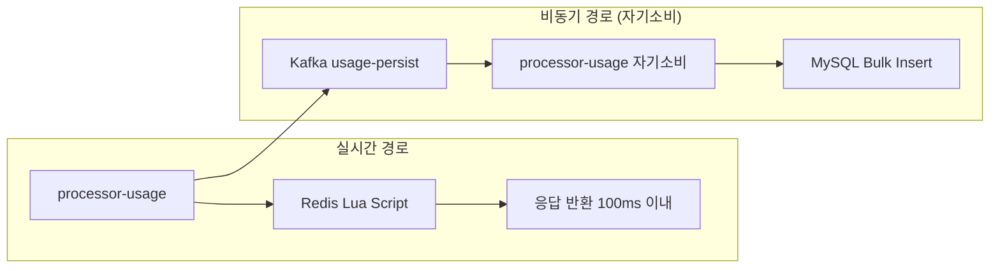

1. processor-usage가 Redis Lua Script 실행 (실시간)
2. 처리 결과를 Kafka `usage-persist` 토픽으로 발행
3. 동일 processor-usage가 `usage-persist`를 소비하여 배치 수집 (5초/100건)
4. MySQL에 Bulk Insert

#### Batch 정산 (Reconciliation)

매일 새벽 3시 Redis-RDS 불일치 보정:

```sql
SELECT family_id, SUM(bytes_used) as total_used
FROM usage_record
WHERE event_time >= DATE_FORMAT(CURRENT_DATE, '%Y-%m-01')
  AND deleted_at IS NULL
GROUP BY family_id;
```

#### DB Fallback

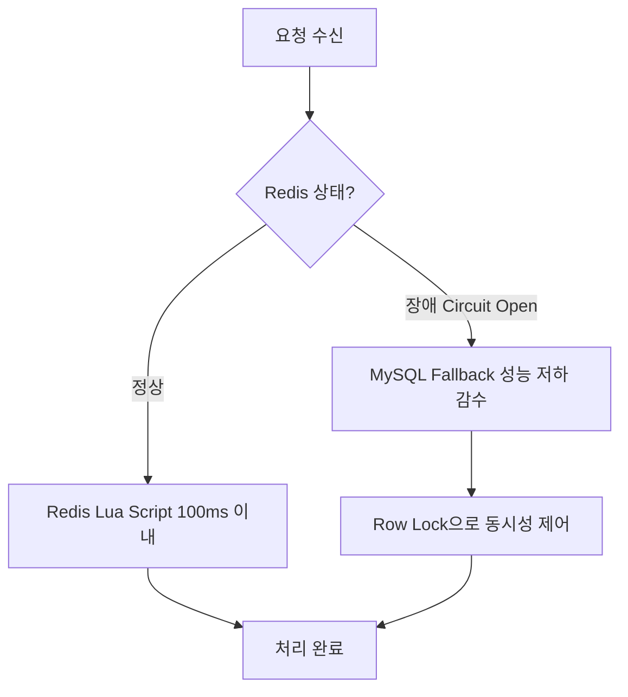

```sql
-- Row Lock 기반 Fallback
SELECT * FROM customer_quota
WHERE customer_id = ? AND family_id = ? AND current_month = ? AND deleted_at IS NULL
FOR UPDATE;

UPDATE customer_quota
SET monthly_used_bytes = monthly_used_bytes + ?
WHERE customer_id = ? AND family_id = ? AND current_month = ? AND deleted_at IS NULL
  AND (monthly_limit_bytes IS NULL OR monthly_used_bytes + ? <= monthly_limit_bytes);
```

### 12.6 데이터 보관 정책 (Hot/Warm/Cold)

| 계층 | 기간 | 저장소 | 용도 |
|------|------|--------|------|
| **Hot** | 7일 | Redis + RDS | 실시간 조회, 대시보드 |
| **Warm** | 90일 | RDS | 리포트, 분석 |
| **Cold** | 90일+ | S3 (Parquet) | 장기 보관, 감사 |

### 12.7 인덱스 설계 + 파티셔닝

**주요 인덱스**:

| 테이블 | 인덱스 | 용도 |
|--------|--------|------|
| customer | (phone_number) | 로그인 조회 |
| admin | (email) | 로그인 조회 |
| family_member | (family_id), (customer_id) | 가족/사용자 목록 |
| customer_quota | (customer_id, current_month) | 월별 한도 조회 |
| usage_record | (family_id, event_time), (customer_id, event_time), (event_id) | 사용량 조회, Idempotency |
| policy_assignment | (family_id), (target_customer_id) | 정책 조회 |
| notification_log | (customer_id, sent_at DESC), (customer_id, type, sent_at DESC) | 알림 목록/타입별 필터 |
| audit_log | (actor_id, created_at DESC), (entity_type, entity_id, created_at DESC) | 감사 이력 |

**usage_record 월별 파티셔닝**:

```sql
CREATE TABLE usage_record (
    ...
) PARTITION BY RANGE (YEAR(event_time) * 100 + MONTH(event_time)) (
    PARTITION p2025_01 VALUES LESS THAN (202502),
    PARTITION p2025_02 VALUES LESS THAN (202503),
    PARTITION p_future VALUES LESS THAN MAXVALUE
);
```

> **왜 usage_record를 월별 파티셔닝?** 일일 4억 건(5,000 TPS x 86,400초) 규모에서 단일 테이블은 쿼리 성능이 급락한다. 월별 파티셔닝으로 조회 범위를 제한하고, 90일+ 데이터는 파티션 단위로 S3에 아카이브한다.

### 12.8 마이그레이션 전략 (Flyway)

```
db/migration/
├── V1__create_user_table.sql
├── V2__create_family_tables.sql
├── V3__create_usage_tables.sql
├── V4__create_policy_tables.sql
├── V5__create_notification_tables.sql
├── V6__add_primary_parent.sql
├── V7__add_notification_type_index.sql
├── V8__add_soft_delete_columns.sql
├── V9__unify_role_system.sql
├── V10__rename_owner_id_to_created_by_id.sql
├── V11__split_user_to_customer_admin.sql      ← USER→CUSTOMER/ADMIN 분리
├── V12__daily_to_monthly_quota.sql             ← daily→monthly 전환
├── V13__move_policy_rules_to_assignment.sql    ← rules→assignment 이동
├── V14__rename_family_group_to_family.sql      ← FAMILY_GROUP→FAMILY
├── V15__add_policy_description_role_rules.sql  ← POLICY 필드 추가
└── V16__add_policy_is_activate.sql             ← is_activate 추가
```

---

## 13. API 명세

### 13.1 API 개요

| 항목 | 값 |
|------|-----|
| Base URL | `https://api.dabom.site` |
| 인증 | JWT (Access 30분, Refresh 7일) |
| 버전 관리 | `Accept-Version: 1.0` 헤더 |

> **왜 Accept-Version 헤더 방식? (vs URL /v1/)** URL 버전은 경로가 변경되어 클라이언트 수정 범위가 크다. Accept-Version 헤더는 URL을 깔끔하게 유지하면서 서버에서 버전별 라우팅이 가능하다.

> **왜 JWT 자체 구현? (vs OAuth 2.0 / 소셜 로그인)** 가족 데이터 제어 시스템에서 외부 인증 의존은 장애 전파 위험이 있다. 자체 JWT로 `familyId`, `role`을 토큰에 포함하면 매 요청마다 DB 조회 없이 권한 판단이 가능하다.

**JWT Payload**:
```json
{ "customerId": 12345, "familyId": 100, "role": "OWNER", "exp": 1705312200 }
```

**공통 응답 형식**:
```json
// 성공
{ "success": true, "data": { ... }, "timestamp": "2024-01-15T10:30:00Z" }
// 에러
{ "success": false, "error": { "code": "ERROR_CODE", "message": "...", "details": {} }, "timestamp": "..." }
```

**권한 모델**: member (모든 인증된 구성원) / owner (정책 수정, 복수 가능) / admin (시스템 전체 관리)

### 13.2 CUSTOMERS 도메인 (6개)

| 메서드 | 경로 | 권한 | 설명 |
|--------|------|------|------|
| POST | `/customers/login` | - | 전화번호 로그인 |
| POST | `/customers/refresh` | member | 토큰 갱신 |
| POST | `/customers/logout` | member | 로그아웃 |
| POST | `/customers/signup` | - | 회원가입 |
| GET | `/customers/usage` | member | 내 사용량 조회 |
| GET | `/customers/policies` | member | 내 정책 조회 |

### 13.3 FAMILIES 도메인 (9개)

| 메서드 | 경로 | 권한 | 설명 |
|--------|------|------|------|
| GET | `/families/dashboard/usage?year=&month=` | member | 대시보드 사용량 |
| GET | `/families/reports/usage?year=&month=` | member | 사용량 상세 리포트 |
| GET | `/families/usage/current` | member | 실시간 가족 사용량 (SSE) |
| GET | `/families/usage/customers` | member | 구성원별 실시간 사용량 |
| POST | `/families/{familyId}/invite` | owner | 가족 초대 (전화번호) |
| POST | `/families` | admin | 가족 그룹 검색 |
| GET | `/families/{familyId}` | admin | 가족 상세 조회 |
| GET | `/families/policies` | owner | 가족 구성원 정책 조회 |
| PATCH | `/families/policies` | owner | 가족 구성원 정책 수정 |

### 13.4 POLICIES 도메인 (5개)

| 메서드 | 경로 | 권한 | 설명 |
|--------|------|------|------|
| GET | `/policies` | admin | 정책 목록 조회 |
| POST | `/policies` | admin | 정책 생성 |
| DELETE | `/policies/{policyId}` | admin | 정책 삭제 |
| GET | `/policies/{policyId}` | admin | 정책 상세 조회 |
| PATCH | `/policies/{policyId}` | admin | 정책 수정 |

### 13.5 NOTIFICATIONS 도메인 (3개)

| 메서드 | 경로 | 권한 | 설명 |
|--------|------|------|------|
| GET | `/notifications` | member | 누적 알림 조회 |
| GET | `/notifications/alert` | member | 잔여량 경고 알림 (THRESHOLD_ALERT) |
| GET | `/notifications/block` | member | 차단 알림 (BLOCKED, UNBLOCKED) |

### 13.6 ADMIN 도메인 (5개)

| 메서드 | 경로 | 권한 | 설명 |
|--------|------|------|------|
| POST | `/admin/login` | - | 관리자 로그인 (이메일) |
| POST | `/admin/refresh` | admin | 관리자 토큰 갱신 |
| POST | `/admin/logout` | admin | 관리자 로그아웃 |
| GET | `/admin/audit-log` | admin | 감사 로그 조회 |
| GET | `/admin/dashboard` | admin | 관리자 대시보드 |

### 13.7 SSE 명세

**연결**: `GET /families/{familyId}/stream` (Accept: text/event-stream)

**Event Types**:

| Event | Data 형식 |
|-------|----------|
| QUOTA_UPDATED | `{"remainingBytes":..., "usedPercent":...}` |
| CUSTOMER_BLOCKED | `{"customerId":..., "blockReason":..., "blockedAt":...}` |
| THRESHOLD_ALERT | `{"threshold":50, "remainingPercent":48.5, "message":...}` |
| CUSTOMER_UNBLOCKED | `{"customerId":..., "reason":..., "unblockedAt":...}` |
| policy-updated | `{"policyKey":..., "targetCustomerId":..., "oldValue":..., "newValue":...}` |

- **Heartbeat**: 30초마다 `:heartbeat` 전송
- **재연결**: Last-Event-ID 헤더 활용

> **왜 SSE? (vs WebSocket)** 서버→클라이언트 단방향 푸시만 필요(사용량 갱신, 차단 알림)하다. WebSocket의 양방향은 불필요한 복잡도를 추가한다. SSE는 HTTP/2 위에서 자동 멀티플렉싱되고, 재연결(Last-Event-ID)이 프로토콜 수준에서 지원된다.

### 13.8 에러 코드

| 카테고리 | 코드 | HTTP | 설명 |
|---------|------|------|------|
| 인증 | AUTH_INVALID_CREDENTIALS | 401 | 잘못된 인증 정보 |
| | AUTH_TOKEN_EXPIRED | 401 | 토큰 만료 |
| | AUTH_TOKEN_INVALID | 401 | 유효하지 않은 토큰 |
| | AUTH_INSUFFICIENT_PERMISSION | 403 | 권한 부족 |
| 데이터 | DATA_FAMILY_NOT_FOUND | 404 | 가족 그룹 없음 |
| | DATA_USER_NOT_FOUND | 404 | 사용자 없음 |
| | DATA_MEMBER_LIMIT_EXCEEDED | 400 | 최대 구성원 수 초과 (10명) |
| 정책 | POLICY_USER_BLOCKED | 403 | 사용자 차단됨 |
| | POLICY_QUOTA_EXCEEDED | 403 | 할당량 초과 |
| | POLICY_TIME_BLOCKED | 403 | 시간대 차단 중 |
| | POLICY_ALREADY_BLOCKED | 409 | 이미 차단됨 |
| | POLICY_TEMPLATE_NOT_FOUND | 404 | 정책 템플릿 없음 |
| | POLICY_TEMPLATE_IN_USE | 409 | 사용 중인 정책 템플릿 |
| 시스템 | SYS_INTERNAL_ERROR | 500 | 내부 서버 오류 |
| | SYS_REDIS_UNAVAILABLE | 503 | Redis 장애 (DB Fallback) |
| | SYS_RATE_LIMIT_EXCEEDED | 429 | API 호출 제한 초과 |

---

## 14. 프론트엔드 아키텍처

### 14.1 기술 스택 및 선택 배경

| 기술 | 선택 사유 |
|------|----------|
| **Next.js** | SSR/SSG/ISR로 초기 로딩 성능 최적화, 파일 기반 라우팅으로 생산성 향상 |
| **TypeScript** | 정적 타이핑으로 컴파일 단계 오류 검출, IDE 자동 완성 강화 |
| **Tailwind CSS** | Utility-First로 빠르고 일관된 UI 구축, CSS 비대화 방지 |
| **TanStack Query** | 서버 상태 캐싱/동기화 핵심. SSE 실시간 데이터로 캐시 갱신, 낙관적 업데이트 |
| **React Hook Form + Zod** | 비제어 컴포넌트로 리렌더링 최소화 + Zod 스키마로 런타임 타입 검증 |
| **PWA** | 네이티브 앱 없이 설치 가능한 앱 + Service Worker 기반 푸시 알림 |

> **왜 Next.js?** SSR/SSG/ISR로 초기 로딩 성능을 최적화하고, 파일 기반 라우팅으로 생산성을 높인다. React 생태계를 그대로 활용할 수 있다.

> **왜 Turborepo 모노레포?** web-service(사용자)와 web-admin(관리자)이 공통 컴포넌트/타입/유틸을 공유해야 한다. 모노레포로 `packages/shared`를 두면 코드 중복 제거 + UI 일관성 보장. Turborepo의 캐싱으로 빌드 시간도 단축된다.

> **왜 PWA?** 네이티브 앱 개발 리소스 없이 설치 가능한 앱 + 푸시 알림을 제공한다. Service Worker 기반 PWA Push로 차단/임계치 알림을 즉시 전달한다.

> **왜 TanStack Query?** 서버 상태(사용량, 정책)의 캐싱/동기화가 핵심이다. SSE로 실시간 데이터를 받아 캐시를 갱신하고, 낙관적 업데이트로 슬라이더 조작의 체감 속도를 향상시킨다.

> **왜 React Hook Form + Zod?** 비제어 컴포넌트로 리렌더링을 최소화하고, Zod 스키마로 TypeScript 타입과 런타임 검증을 하나의 스키마로 통일한다.

### 14.2 프로젝트 구조

```
.
├── apps
│   ├── admin          (admin.dabom.site)
│   │   └── src
│   └── service        (www.dabom.site)
│       └── src
├── packages
│   └── shared         (@repo/shared)
│       └── src
├── package.json
├── pnpm-workspace.yaml
├── tsconfig.json
└── turbo.json
```

| 워크스페이스 | 서브도메인 | 설명 |
|------------|-----------|------|
| `apps/service` | `www.dabom.site` | 가족 사용자 서비스 (PWA) |
| `apps/admin` | `admin.dabom.site` | 백오피스 관리 |

### 14.3 워크스페이스 상세

- **apps/admin**: 관리자 기능 (정책 CRUD, 가족 관리, 감사 로그). `@tanstack/react-query`, `dayjs`
- **apps/service**: 사용자 서비스 (대시보드, 마이페이지, 알림). `chart.js`, `recharts`, `react-hot-toast`
- **packages/shared**: 공용 UI Components (`Button`, `Badge`, `InputField`), Utils (`cn`, `http`), Types (`familyType`, `policyType`), Assets (SVG → React via `svgr`). `tsup`으로 CJS/ESM 번들링

### 14.4 디자인 시스템

**Color System**:

| 토큰 | Hex | 용도 |
|------|-----|------|
| `primary-400` | `#fd3e97` | 브랜드 메인 (분홍) |
| `primary-500` | `#e42068` | 브랜드 강조 |
| `gray-100`~`gray-800` | `#eaeaea`~`#565656` | 무채색 스케일 |
| `brand-white` | `#fdfdfe` | 배경 흰색 |
| `brand-black` | `#101010` | 텍스트 검정 |
| `bg-base` | `#f0f0f3` | 기본 배경 |

**Typography**: Pretendard 폰트, Mobile/Desktop 별도 스케일 (display~caption, 0.75rem~3rem)

### 14.5 백오피스 기능 명세

| 도메인 | 기능 | 동작 |
|--------|------|------|
| 유저 | 로그인 | 이메일/비밀번호로 백오피스 접근 |
| 정책 | 조회/생성/수정/삭제 | 활성화/비활성화 상태 관리, 정책 템플릿 CRUD |
| 가족 | 리스트 조회 | 전체 가족 리스트, 대표자 1명 표시 |
| | 상세 조회 | 가족 총 사용량, 구성원별 {이름, 권한, 사용량, 한도} |
| | 권한 수정 | owner/member 전환, 19세 이상 자녀 권한 승격 |
| | 한도 수정 | 구성원별 데이터 한도 강제 수정 (CS 목적) |
| | 검색/필터 | 가족ID, 전화번호, 이름 + 최대 2가지 필터 조합 |

### 14.6 유저 서비스 기능 명세

| 도메인 | 기능 | 동작 |
|--------|------|------|
| 유저 | 로그인/로그아웃/탈퇴 | 전화번호+비밀번호, 토큰 삭제, 정보 영구 삭제 |
| 대시보드 | 구성원별 사용량 | 현재 달: SSE 실시간, 과거 달: HTTP 분기 처리 |
| 알림 | 누적 알림 | 지금까지 누적된 알림 확인 |
| | 사용 경고 | 임계값(50/30/10%)에 따른 잔여량 경고 |
| | 차단 알림 | 잔여량 소진 또는 강제 차단 시 알림 |
| 마이페이지 | 내 사용량/정책 | 가로 막대그래프, 적용 정책 확인 |
| 정책 관리 | 구성원 정책 조회/수정 | Owner 전용: 정책 변경 |
| | 시간대 차단 | 휠 피커로 차단 시간 설정 |
| | 데이터 한도 | 슬라이더 + 디바운싱, 실패 시 롤백 |
| | 차단 토글 | 즉시 차단/해제 |
| 차단 | 글로벌 차단 | SSE 차단 이벤트 수신 → 즉시 toast 표시 |

---

## 15. 비기능 요구사항

### 15.1 확장성

| 지표 | 예상 값 | 대응 전략 |
|------|--------|----------|
| 동시 접속자 | ~100,000 | SSE 서버 수평 확장 |
| 초당 Usage Event | ~5,000 TPS | Kafka 파티션 확장 |
| processor-usage 처리 | ~5,000 TPS | Consumer 인스턴스 = 파티션 수 (10개) |
| 버스트 트래픽 | ~1,000,000 동시 | Kafka 버퍼링으로 흡수 |
| 일일 이벤트 | ~4억 건 | RDS 파티셔닝, 콜드 아카이빙 |

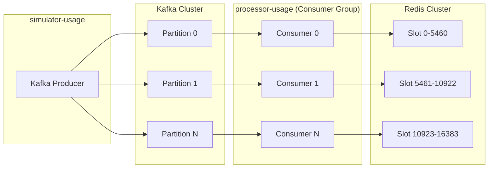

### 15.2 장애 대응

**Circuit Breaker 전체 적용**:

| 대상 | 장애 감지 | Fallback |
|------|----------|----------|
| Redis | 연결 실패 3회 | MySQL Fallback |
| Kafka | Producer 실패 3회 | 로컬 버퍼 + 재시도 |
| MySQL | 쿼리 타임아웃 | Redis 캐시 조회 |
| 외부 알림 | 발송 실패 3회 | DLQ + 수동 처리 |

> **왜 Redis 장애 시 MySQL Fallback?** Redis Cluster 전체 장애는 극히 드물지만, 발생 시 서비스 중단 대신 MySQL Row Lock으로 동시성 제어하여 성능은 저하되지만 서비스를 유지한다. Fail-Open(무제한 허용)보다 정합성이 중요한 데이터 제어 시스템이므로 "Graceful Degradation"을 선택했다.

> **왜 DLQ(Dead Letter Queue)?** 3회 실패한 이벤트를 무한 재시도하면 Consumer가 블로킹된다. DLQ에 격리하여 정상 이벤트 처리를 계속하고, 운영자가 수동으로 DLQ를 점검/재처리한다.

**장애 시나리오별 대응**:

| 장애 시나리오 | 대응 전략 |
|--------------|----------|
| Kafka 브로커 장애 | 3개 이상 브로커, replication.factor=3 |
| processor-usage 장애 | Consumer Group 리밸런싱, 자동 복구 |
| Redis 노드 장애 | Cluster 모드, MySQL Fallback |
| RDS 장애 | 읽기 전용 Replica, Redis 캐시로 서비스 유지 |

### 15.3 데이터 정합성

| 시나리오 | 대응 |
|----------|------|
| 이벤트 유실 | 유실 허용, Batch 정산으로 보정 |
| Redis-RDS 불일치 | Write-Behind 비동기, 주기적 Reconciliation |
| 중복 이벤트 | eventId 기반 Idempotency (Redis + RDS) |

> **왜 이벤트 유실을 허용하고 Batch 정산?** Kafka `acks=1`(Leader만)으로 처리량을 우선한다. 극소수 유실 이벤트는 매일 새벽 3시 Redis-RDS Reconciliation으로 보정한다. 100% 무손실보다 처리량과 지연시간이 중요한 트레이드오프이다.

### 15.4 보안 및 권한

| 항목 | 구현 |
|------|------|
| 인증 | JWT 자체 구현 (Access + Refresh Token) |
| 인가 | RBAC (Member, Owner — 복수 가능, Admin). Last Write Wins, audit_log 이력 |
| DDoS 방어 | AWS WAF 자동 차단 |
| Rate Limiting | 동적 제한 (시스템 부하에 따라 조정) |
| 감사 로그 | 모든 정책 변경 이력 기록 |

---

## 16. 인프라 아키텍처

### 16.1 AWS 기반 배포 구성

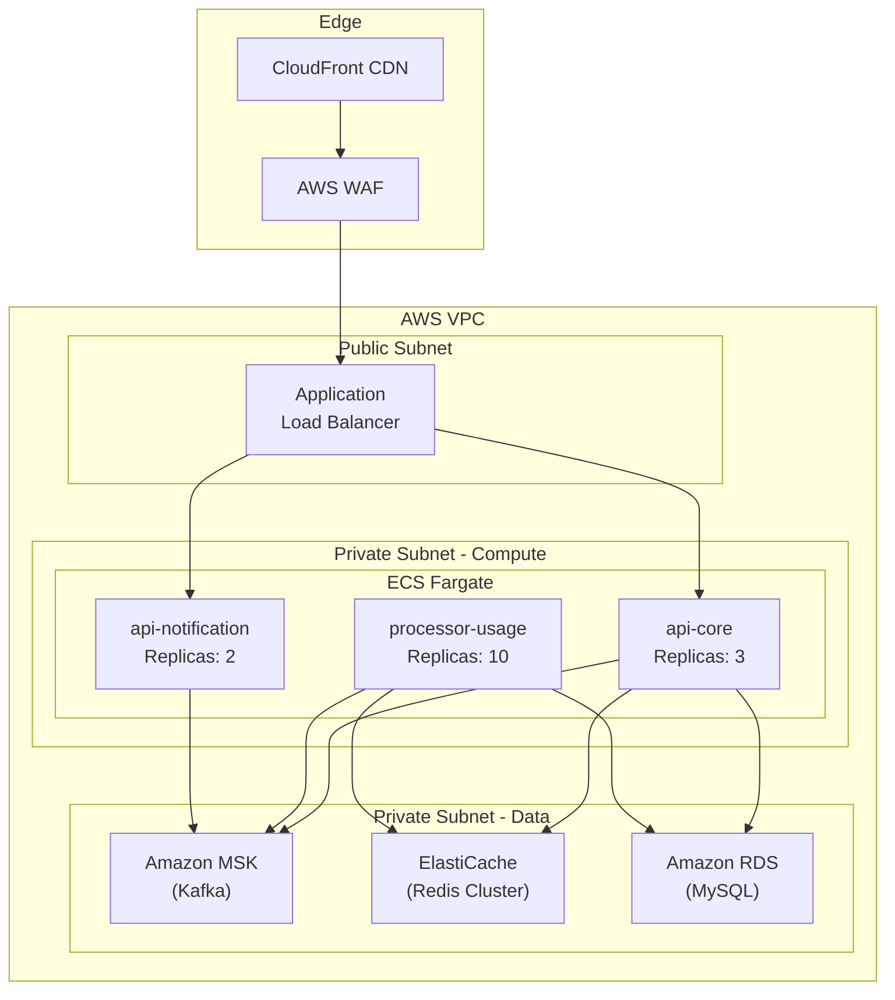

> **Note**: simulator-usage는 별도 환경(온프레미스/EC2)에서 실행되며, MSK로 직접 이벤트 발행

### 16.2 서비스별 배포 구성

| 서비스 | 배포 환경 | Replicas | 리소스 |
|--------|----------|----------|--------|
| api-core | ECS Fargate | 3 | 2 vCPU, 4GB |
| processor-usage | ECS Fargate | 10 | 2 vCPU, 4GB |
| api-notification | ECS Fargate | 2 | 1 vCPU, 2GB |
| simulator-usage | EC2 / 온프레미스 | 1-3 | 가변 |
| web-service | CloudFront + S3 | - | Static (www.dabom.site) |
| web-admin | CloudFront + S3 | - | Static (admin.dabom.site) |

> **왜 ECS Fargate?**: 서버리스 컨테이너로 인프라 관리 부담 최소화. 트래픽에 따라 Auto Scaling이 자동 동작하며, Kubernetes 대비 운영 복잡도가 낮아 7인 팀에 적합

> **왜 web-core를 서브도메인 분리 배포?**: `www.dabom.site`(사용자)와 `admin.dabom.site`(관리자)를 분리하면 독립 배포가 가능하고, CloudFront 캐시 정책도 역할별로 최적화 가능

### 16.3 모니터링 및 관측성 (Observability)

| 영역 | 도구 | 용도 |
|------|------|------|
| **로그** | CloudWatch Logs / ELK | 애플리케이션 로그 수집 |
| **메트릭** | Prometheus + Grafana | 시스템 메트릭 시각화 |
| **트레이싱** | Jaeger / X-Ray | 분산 추적 |
| **알림** | PagerDuty / Slack | 장애 알림 |

> **왜 Prometheus + Grafana?**: 오픈소스 기반으로 비용 부담 없이 메트릭 수집/시각화 가능. Grafana 대시보드로 Kafka Consumer Lag, Redis 응답시간, TPS 등을 실시간 모니터링

#### 핵심 메트릭 및 임계값

| 메트릭 | 임계값 | 알림 채널 |
|--------|--------|----------|
| processor-usage 처리 지연 | > 100ms (P99) | Slack 알림 |
| Kafka Consumer Lag | > 10,000 | PagerDuty |
| Redis 응답 시간 | > 5ms (P99) | Slack 알림 |
| 차단 비율 급증 | > 10% (1분간) | Slack 알림 |
| 에러율 | > 1% | PagerDuty |

---

## 17. 테스트 전략

### 17.1 simulator-usage 시나리오

| 시나리오 | 설정 | 검증 포인트 |
|----------|------|------------|
| 기본 부하 | 고정 RPS 5,000 | 처리량, 지연 시간 |
| 랜덤 이벤트 | 무작위 familyId/customerId | 순서 보장, 정합성 |

### 17.2 부하 테스트 계획

| 단계 | TPS | 지속 시간 | 목표 |
|------|-----|----------|------|
| Warm-up | 1,000 | 5분 | 시스템 안정화 |
| Normal | 5,000 | 30분 | 정상 운영 확인 |
| Peak | 10,000 | 10분 | 피크 대응 확인 |
| Stress | 15,000 | 5분 | 한계점 파악 |

> **왜 3단계 부하 테스트 도구 전략?**:
> - **1단계 kafka-producer-perf-test**: MSK 인프라 자체의 한계점을 먼저 확인 (인프라 병목 분리)
> - **2단계 simulator-usage (Go)**: 실제 도메인 페이로드로 E2E 파이프라인 검증 (도메인 시나리오)
> - **3단계 k6**: api-core/api-notification HTTP API 부하 테스트 (API 레벨)
>
> 각 계층을 분리하여 병목 구간을 정확히 식별할 수 있음

### 17.3 장애 테스트 시나리오

| 시나리오 | 테스트 방법 | 예상 결과 |
|----------|-----------|----------|
| Redis 장애 | 노드 강제 종료 | MySQL Fallback 전환 |
| Kafka 브로커 장애 | 브로커 1개 종료 | 자동 리밸런싱 |
| processor-usage 장애 | 인스턴스 강제 종료 | Consumer Group 리밸런싱 |
| 네트워크 지연 | tc를 통한 지연 주입 | 타임아웃 처리 확인 |
| 버스트 트래픽 | 100만 동시 이벤트 발행 | Kafka 버퍼링, Lag 증가 후 정상 처리 |
| usage-persist 자기소비 지연 | Consumer Lag 인위 증가 | Write-Behind 지연 허용, 최종 정합성 확인 |

### 17.4 테스트 커버리지 목표

- **목표**: 70%
- **필수 테스트 영역**: 동시성 제어 Lua Script, 정책 엔진, Idempotency

---

## 18. 알림 정책

### 18.1 알림 트리거 조건

| 트리거 | 알림 대상 | 알림 내용 | 이벤트 |
|--------|----------|----------|--------|
| 잔여 50% 도달 | 전체 가족 | "가족 데이터가 50% 남았습니다" | notification-events (THRESHOLD_ALERT) |
| 잔여 30% 도달 | 전체 가족 | "가족 데이터가 30% 남았습니다" | notification-events (THRESHOLD_ALERT) |
| 잔여 10% 도달 | 전체 가족 | "가족 데이터가 10% 미만입니다!" | notification-events (THRESHOLD_ALERT) |
| 개인 한도 초과 | 해당 구성원 + Owner | "데이터 한도 초과로 차단됩니다" | notification-events (CUSTOMER_BLOCKED) |
| 시간대 차단 시작 | 차단 대상 | "야간 차단이 활성화되었습니다" | notification-events (CUSTOMER_BLOCKED) |
| 시간대 차단 종료 | 차단 대상 | "야간 차단이 해제되었습니다" | notification-events (CUSTOMER_UNBLOCKED) |
| 정책 변경 | 영향받는 구성원 | "데이터 정책이 변경되었습니다" | policy-updated |

### 18.2 알림 채널

| 채널 | 전달 방식 | 지연 |
|------|----------|------|
| **인앱 알림** | SSE 기반 실시간 스트림 | 즉시 |
| **PWA 푸시 알림** | Service Worker 기반 | 즉시 |

### 18.3 중복 발송 방지

- **임계치당 1회**: 50%, 30%, 10% 각 임계치별로 한 번만 발송
- **Redis 기록**: `family:{familyId}:alert:threshold:{value}` 키로 발송 기록 (TTL: quota reset까지)

> **왜 임계치당 1회만?**: 잔여량이 경계 근처에서 오르내릴 때 알림 폭풍(Notification Storm) 방지. Redis TTL 기반 발송 기록으로 간단하게 구현하며, 월간 리셋 시점에 TTL이 자동 만료되어 다음 월에는 다시 알림 가능

---

## 19. 구현 로드맵 (7주)

### Phase 1: Core Engine & Pipeline (1-3주차) — "흐르게 하라"

가장 리스크가 큰 트래픽 처리와 **동시성 제어**(최우선 기능)를 먼저 검증합니다.

**W1 (설계 및 세팅)**
- Kafka 토픽 설계 (`usage-events`, `policy-updated`, `notification-events`, `usage-persist`)
- Redis Cluster 구성 및 Lua Script 프로토타이핑
- simulator-usage 제작: 고정 RPS 랜덤 이벤트 생성

**W2 (수집 및 제어)**
- simulator-usage 구현 (eventId 생성, Kafka 직접 발행)
- processor-usage 핵심 로직 (Kafka Consumer, 검증, Redis Lua Script, 선착순 완전 승인)
- "Last 10MB" 동시성 테스트 수행

**W3 (시각화 및 연동)**
- SSE 서버 구현
- 기본 프론트엔드 연동 (실시간 대시보드)

### Phase 2: Business Logic & Admin (4-5주차) — "제어하라"

**W4 (정책 고도화)**
- 동적 정책 적용 (Owner가 한도 변경 시 Redis 값 즉시 갱신)
- 시간대별 차단 정책 (KST 기준)
- 가족 구성원 권한 관리 (RBAC)
- JWT 인증 시스템 구현

**W5 (백오피스 & 정산)**
- Admin API 개발 (정책 CRUD, 개별 가족 수정)
- Write-Behind 패턴: Kafka를 통한 RDS 비동기 저장
- 상세 분석 리포트 구현

### Phase 3: Reliability & Optimization (6-7주차) — "견고하게 하라"

**W6 (안정성)**
- Circuit Breaker 전체 적용 (Redis, Kafka 포함)
- DB Fallback: Redis 장애 시 MySQL 전환
- Dead Letter Queue(DLQ) 처리: 3회 실패 시 DLQ
- Flyway 자동 마이그레이션

**W7 (최종 검증)**
- 부하 테스트 (simulator-usage)
- 전체 Observability 구성 (로그 + 메트릭 + 트레이싱)
- 테스트 커버리지 70% 달성
- 최종 발표 자료 및 데모 준비

> **왜 Phase 1에서 동시성 제어를 최우선?**: 가장 리스크가 큰 기술적 난제(Redis Lua Script, Kafka 순서 보장, "Last 10MB")를 먼저 검증해야 이후 비즈니스 로직 구현의 기반이 됨. 실패 시 아키텍처 전면 재설계가 필요하므로 조기 검증이 핵심. "가장 어려운 것을 먼저, 가장 확실하지 않은 것을 먼저"

---

## 20. R&R (역할 분담)

### 20.1 Backend 역할 분담 (5인)

| 역할 | 담당 영역 | 주요 기술 스택 & 책임 |
|------|----------|----------------------|
| **BE 1 (Core)** | Policy Engine & Concurrency | Redis(Lua), Kafka Consumer, 동시성 제어 (최우선) |
| **BE 2 (Ingest)** | Traffic Gateway & Simulator | Kafka Producer, simulator-usage 개발 (Go) |
| **BE 3 (Biz)** | Family Service & API | Spring Boot, JPA, JWT 인증, SSE |
| **BE 4 (Data)** | Settlement & Persistence | Write-Behind, MySQL, Flyway |
| **BE 5 (Ops)** | Backoffice & DevOps | Admin API, Docker/K8s, Observability |

### 20.2 Frontend 역할 분담 (2인)

| 역할 | 담당 영역 | 주요 기술 스택 |
|------|----------|---------------|
| **FE 1** | web-service (가족 앱, www.dabom.site) | Next.js, TypeScript, Tailwind, SSE, PWA |
| **FE 2** | web-admin (백오피스, admin.dabom.site) | Next.js, TypeScript, Tailwind |

---

## 21. 용어집 (Glossary)

### 21.1 도메인 용어

#### 사용자 관련

| 용어 (한글) | 용어 (영문) | 정의 |
|------------|------------|------|
| 가족 그룹 | Family Group | 데이터를 공유하는 사용자들의 집합. 최대 10명까지 구성 가능 |
| 가족 구성원 | Family Member | 가족 그룹에 속한 일반 사용자. 데이터 조회만 가능 |
| Owner 계정 | Owner | 가족 그룹 내 정책 수정 권한을 가진 관리 사용자. 복수 Owner 가능 (`family_member.role='OWNER'` 기준) |
| 운영자 | Backoffice Admin | 시스템 전체를 관리하는 내부 관리자 |

#### 데이터 관련

| 용어 (한글) | 용어 (영문) | 정의 |
|------------|------------|------|
| 할당량 | Quota | 사용자 또는 그룹에 할당된 데이터 한도 (바이트 단위) |
| 잔여량 | Remaining | 사용 가능한 남은 데이터량 |
| 사용량 | Usage | 실제로 사용한 데이터량 |
| 월별 한도 | Monthly Limit | 한 달 동안 사용할 수 있는 최대 데이터량 |
| 임계치 | Threshold | 알림을 발송하는 기준점 (50%, 30%, 10%) |

#### 정책 관련

| 용어 (한글) | 용어 (영문) | 정의 |
|------------|------------|------|
| 정책 | Policy | 데이터 사용에 적용되는 규칙 (한도, 시간대 차단 등) |
| 시간대 차단 | Time Block | 특정 시간대(예: 22:00~07:00)에 데이터 사용을 차단하는 정책 |
| 즉시 차단 | Manual Block | Owner가 특정 구성원의 데이터 사용을 즉시 차단하는 기능 |
| 앱별 차단 | App Block | 특정 앱/서비스의 데이터 사용을 차단하는 정책 (MVP 제외) |
| 선착순 완전 승인 | First-Come-First-Served | 동시 요청 시 먼저 도착한 요청만 전체 승인, 나머지는 즉시 차단 |
| 기본 규칙 | Default Rules | 정책 템플릿에 정의된 기본 규칙 JSON (`default_rules`). 적용 시 `POLICY_ASSIGNMENT.rules`로 복사 |
| 최소 역할 | Require Role | 정책 적용을 받을 수 있는 최소 역할 (`require_role`). MEMBER 또는 OWNER |
| 정책 활성화 | Is Active | 정책 템플릿의 활성/비활성 상태 (DB: `is_activate`, API: `isActive`). FALSE이면 신규 적용 불가 |

#### 알림 관련

| 용어 (한글) | 용어 (영문) | 정의 |
|------------|------------|------|
| 임계치 알림 | Threshold Alert | 잔여량이 특정 임계치(50/30/10%)에 도달했을 때 발송되는 알림 |
| 차단 알림 | Block Notification | 사용자가 차단되었을 때 발송되는 알림 |
| 정책 변경 알림 | Policy Update Notification | 정책이 변경되었을 때 영향받는 사용자에게 발송되는 알림 |
| 임계치당 1회 | Once Per Threshold | 각 임계치별로 한 번만 알림을 발송하는 정책 |

#### API 도메인 관련

| 용어 (한글) | 용어 (영문) | 정의 |
|------------|------------|------|
| 마이페이지 | MyPage | 로그인한 사용자 본인의 사용량 및 적용 정책을 조회하는 개인 영역 |
| 데이터 차단/허용 | Data Block | Owner가 특정 구성원의 데이터 사용을 즉시 차단 또는 허용하는 통합 기능 |
| 정책 템플릿 | Policy Template | 관리자(admin)가 생성/관리하는 재사용 가능한 정책 정의 |
| REST 알림 조회 | REST Notification | SSE 실시간 알림과 병행하여 알림 이력을 REST API로 조회하는 기능 |
| 고객 | Customer | 시스템의 일반 사용자 (가족 구성원). 기존 USER 테이블에서 CUSTOMER로 분리 |
| 구성원 월별 할당량 | Customer Quota | 구성원별 월별 데이터 한도와 사용량, 차단 상태를 관리하는 엔티티 |

### 21.2 기술 용어

#### 아키텍처 패턴

| 용어 (한글) | 용어 (영문) | 정의 |
|------------|------------|------|
| 이벤트 기반 아키텍처 | Event-Driven Architecture (EDA) | 이벤트의 발생, 감지, 처리를 중심으로 설계된 아키텍처 패턴 |
| Write-Behind | Write-Behind Pattern | 먼저 캐시(Redis)에 기록하고, 나중에 비동기로 DB에 반영하는 패턴 |
| 자기소비 패턴 | Self-Consumption Pattern | 동일 서비스가 Kafka 토픽에 발행한 뒤 같은 토픽을 직접 소비하는 패턴 |
| Soft Delete | Soft Delete | 물리적 삭제 대신 `deleted_at` 컬럼에 삭제 시각을 기록하는 논리 삭제 방식 |
| 멱등성 | Idempotency | 동일 요청을 여러 번 처리해도 결과가 같은 성질 |

#### 데이터 처리

| 용어 (한글) | 용어 (영문) | 정의 |
|------------|------------|------|
| 원자 연산 | Atomic Operation | 분리할 수 없는 단일 단위로 실행되는 연산. 전부 성공하거나 전부 실패 |
| 파티션 키 | Partition Key | Kafka에서 메시지를 파티션에 분배하는 기준이 되는 키 (familyId) |
| 컨슈머 그룹 | Consumer Group | 동일한 토픽을 구독하는 컨슈머들의 집합 |
| 컨슈머 랙 | Consumer Lag | 메시지 발행 속도와 처리 속도의 차이로 발생하는 지연 |
| DLQ | Dead Letter Queue | 처리에 실패한 메시지를 저장하는 별도의 큐 |

#### Redis 데이터 설계

| 용어 (한글) | 용어 (영문) | 정의 |
|------------|------------|------|
| 런타임 제약 | Runtime Constraints | 다양한 정책이 계산되어 실제 적용될 제약 조건의 모음. Redis Hash에 `ACTION:TYPE` 형태의 Field로 저장 |
| 이벤트 봉투 | Event Envelope | 모든 Kafka 이벤트를 감싸는 공통 래퍼 구조. Jackson `@JsonTypeInfo` 활용 다형성 역직렬화 지원 |
| 정책 키 | Policy Key | 런타임 제약의 Field Name 표준. `ACTION:TYPE:TARGET` 형태 (예: `LIMIT:DATA:DAILY`, `BLOCK:APP:com.youtube`) |
| Poly-Policy Engine | Poly-Policy Engine | Redis Lua Script 기반의 다중 정책 평가 엔진. constraints Hash를 동적으로 순회하며 코드 수정 없이 정책 평가 |

#### 동시성 제어

| 용어 (한글) | 용어 (영문) | 정의 |
|------------|------------|------|
| 분산 락 | Distributed Lock | 여러 서버에서 동시에 같은 리소스에 접근하는 것을 방지하는 잠금 메커니즘 |
| Lua 스크립트 | Lua Script | Redis에서 여러 명령을 원자적으로 실행하기 위해 사용하는 스크립트 |
| CAS | Compare-And-Set | 현재 값을 비교하고 일치할 때만 새 값으로 설정하는 원자 연산 |

#### 장애 대응

| 용어 (한글) | 용어 (영문) | 정의 |
|------------|------------|------|
| 서킷 브레이커 | Circuit Breaker | 장애가 발생한 서비스에 대한 호출을 일시적으로 차단하는 패턴 |
| 폴백 | Fallback | 주 시스템 장애 시 대체 시스템으로 전환하는 것 |
| Fail-Open | Fail-Open | 장애 시 제한 없이 허용하는 정책 (사용성 우선) |
| Fail-Closed | Fail-Closed | 장애 시 모든 요청을 차단하는 정책 (안전 우선) |
| 지수 백오프 | Exponential Backoff | 재시도 간격을 점진적으로 늘리는 전략 (1초, 5초, 30초 등) |

#### 데이터 보관

| 용어 (한글) | 용어 (영문) | 정의 |
|------------|------------|------|
| Batch 정산 | Reconciliation | Redis와 RDS 간 데이터 불일치를 주기적으로 보정하는 작업. 매일 새벽 3시 실행 |
| 계층형 보관 | Tiered Storage (Hot/Warm/Cold) | 데이터 접근 빈도에 따라 저장소를 분리. Hot(7일: Redis+RDS), Warm(90일: RDS), Cold(90일+: S3) |

#### 실시간 통신

| 용어 (한글) | 용어 (영문) | 정의 |
|------------|------------|------|
| SSE | Server-Sent Events | 서버에서 클라이언트로 단방향 실시간 스트림을 전송하는 기술 |
| WebSocket | WebSocket | 서버와 클라이언트 간 양방향 실시간 통신을 지원하는 프로토콜 |
| PWA | Progressive Web App | 웹 기술로 구현된 네이티브 앱 같은 웹 애플리케이션 |

### 21.3 시스템 컴포넌트

| 컴포넌트 | 역할 |
|----------|------|
| **simulator-usage** | 실시간 데이터 소모 이벤트 시뮬레이터. eventId 생성 후 Kafka로 직접 발행 |
| **processor-usage** | 이벤트 검증, 중복 체크, 정책평가/쿼터차감, Redis Atomic, usage-persist 자기소비(Write-Behind), notification-events 발행 |
| **api-core** | 5개 도메인 REST API, JWT familyId 추론, 정책 즉시 반영 트리거 |
| **api-notification** | notification-events consumer, SSE API + REST 알림 조회 API, 실시간 알림 Push |
| **web-core** | Turborepo 기반 프론트엔드 모노레포 (web-service + web-admin + shared) |
| **web-service** | 가족 사용자 PWA (www.dabom.site) |
| **web-admin** | 백오피스 관리 UI (admin.dabom.site) |

### 21.4 이벤트 타입

| 이벤트 | 설명 |
|--------|------|
| `usage-events` | 데이터 사용 이벤트 (simulator-usage → Kafka → processor-usage) |
| `policy-updated` | 정책 변경 이벤트 (api-core → processor-usage) |
| `notification-events` | 통합 알림 이벤트 (processor-usage → api-notification). subType: QUOTA_UPDATED, CUSTOMER_BLOCKED, THRESHOLD_ALERT |
| `usage-persist` | DB 저장용 이벤트 (processor-usage → Kafka → processor-usage 자기소비 → MySQL) |

### 21.5 약어 정의

| 약어 | 전체 표현 | 의미 |
|------|----------|------|
| TPS | Transactions Per Second | 초당 트랜잭션 수 |
| SSE | Server-Sent Events | 서버에서 클라이언트로의 단방향 스트림 |
| PWA | Progressive Web App | 설치 가능한 웹 앱 |
| JWT | JSON Web Token | JSON 기반 인증 토큰 |
| RBAC | Role-Based Access Control | 역할 기반 접근 제어 |
| DLQ | Dead Letter Queue | 실패 메시지 저장 큐 |
| TTL | Time To Live | 데이터 유효 기간 |
| RDS | Relational Database Service | 관계형 데이터베이스 서비스 |
| MSK | Managed Streaming for Apache Kafka | AWS 관리형 Kafka |
| ECS | Elastic Container Service | AWS 컨테이너 서비스 |
| ALB | Application Load Balancer | 애플리케이션 로드 밸런서 |
| WAF | Web Application Firewall | 웹 애플리케이션 방화벽 |
| CDN | Content Delivery Network | 콘텐츠 전송 네트워크 |
| KST | Korea Standard Time | 한국 표준시 |
| P99 | 99th Percentile | 상위 99% 기준값 |
| ADR | Architecture Decision Record | 아키텍처 결정 기록 |

### 21.6 다중 Owner 관련

| 용어 (한글) | 용어 (영문) | 정의 |
|------------|------------|------|
| 다중 Owner | Multiple Owners | 한 가족 그룹 내에 복수의 OWNER 역할 구성원이 존재하는 구조 |
| Last Write Wins | LWW | 복수 OWNER가 동일 정책을 동시에 수정할 경우, 마지막으로 수정한 값이 적용. 모든 변경은 `audit_log`에 기록 |
| 그룹 생성자 | Created By | 가족 그룹을 최초로 생성한 사용자. 이력/감사 전용으로 OWNER 권한 판단에는 사용하지 않음 |

### 21.7 차단 사유 코드

| 코드 | 설명 |
|------|------|
| `MONTHLY_LIMIT_EXCEEDED` | 월별 한도 초과 |
| `FAMILY_QUOTA_EXCEEDED` | 가족 할당량 소진 |
| `TIME_BLOCK` | 시간대 차단 정책 |
| `MANUAL` | Owner에 의한 수동 차단 |
| `APP_BLOCK` | 앱별 차단 정책 (MVP 제외) |

---

> **DABOM 팀** | URECA 프로젝트 | 2026
