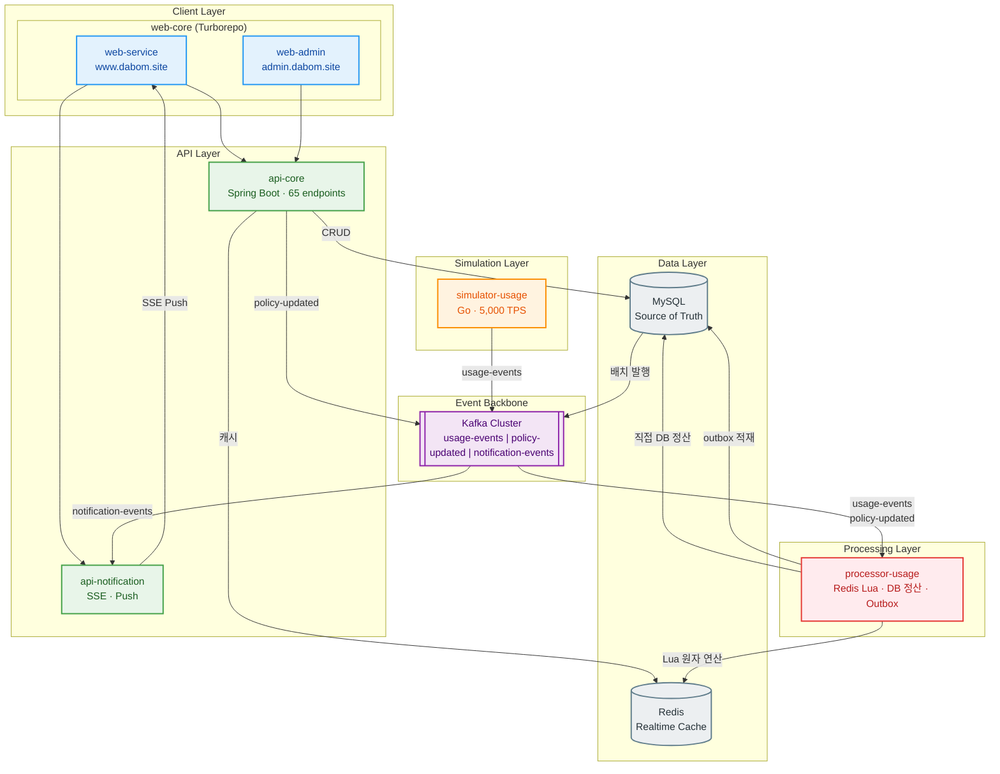
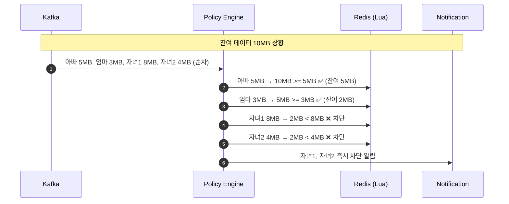

# 다봄 (DABOM)

### 실시간 가족 데이터 통합 관리 및 스마트 제약 시스템

> **Data Policy Control System (DPCS)** — 가족 단위 공유 데이터를 실시간으로 집계·시각화하고, 정책 변경이 즉시 반영되는 이벤트 기반 데이터 관리 플랫폼

`1,000,000 Users` · `250,000 Families` · `5,000 TPS` · `< 100ms P99`

---

## 프로젝트 소개

**다봄**은 통신사의 가족 데이터 공유 서비스(SKT 데이터 공유, KT 패밀리 박스, LG U+ 데이터 공유)를 벤치마킹하여 설계한 **실시간 데이터 관리 플랫폼**입니다.

가족(그룹) 단위로 공유되는 데이터 총량을 실시간으로 집계·시각화하고, 부모/관리자가 정책(차단/개인 한도/시간대 제한 등)을 변경하면 즉시 반영되도록 하는 시스템을 구축합니다.

### 핵심 가치

| | 가치 | 설명 |
|---|------|------|
| **실시간 시각화** | 가족 데이터 사용량 실시간 집계 | SSE 기반 대시보드로 가족 구성원별 사용량을 실시간 모니터링 |
| **즉시 정책 반영** | 정책 변경 → 다음 이벤트부터 즉시 적용 | 한도 변경 시 이미 초과한 사용자도 소급 차단 처리 |
| **가족 소통 촉진** | 이의제기·미션·보상·리캡 | 데이터 사용을 매개로 한 건강한 가족 간 소통 구조 설계 |

---

## 프로젝트 배경 & 학습 목표

가족 구성원 간 데이터를 실시간으로 공유하고, 부모가 자녀의 데이터 사용을 제어하려는 니즈가 증가하고 있습니다. 이 프로젝트는 단순히 기능을 구현하는 것을 넘어, **대규모 트래픽 처리와 동시성 제어라는 기술적 도전**을 학습하기 위해 설계되었습니다.

| 영역 | 학습 목표 |
|------|----------|
| **백엔드** | 대용량 이벤트 스트리밍 파이프라인, 동시성 제어(정합성), 분산락/원자 연산, 장애 및 재처리(Idempotency) 설계 |
| **프론트엔드** | 실시간 UI(대시보드), 실시간 알림/상태 반영(SSE), PWA 푸시 알림 |

### 왜 이 규모인가?

| 항목 | 값 | 설계 의도 |
|------|-----|----------|
| 가상 사용자 수 | **1,000,000명** | 대규모 트래픽 환경에서의 시스템 안정성 검증 |
| 가족 그룹 수 | **250,000개** | 그룹당 평균 4인, 최대 10명 — 가족 단위 동시성 제어 학습 |
| 이벤트 처리량 | **5,000 TPS** | 초당 이벤트 처리 파이프라인의 병목 식별과 최적화 |
| 차단 판정 지연 | **100ms 이하** | P99 기준 실시간 정책 판정의 엄격한 성능 요구사항 |

---

## 핵심 기능

| 기능 | 설명 | 실시간 |
|------|------|--------|
| **가족 통합 대시보드** | 가족 잔여 데이터량, 구성원별 사용 비중 시각화 | SSE |
| **구성원별 한도 설정** | 슬라이더 UI로 월별 데이터 한도 조절, 즉시 반영 | 즉시 적용 |
| **즉시 차단/해제** | Owner가 특정 구성원의 데이터 사용을 즉시 차단 또는 해제 | 즉시 적용 |
| **시간대별 차단 정책** | 야간 등 특정 시간대 자동 차단 (KST 기준) | 즉시 적용 |
| **단계별 소진 알림** | 잔여량 50%/30%/10% 도달 시 임계치당 1회 알림 발송 | PWA Push |
| **이의제기 시스템** | 조르기(부모 승인 필요) + 긴급 요청(월 1회, 자동 승인) | — |
| **미션 & 보상** | 부모가 미션 생성, 자녀가 달성 시 보상(쿠폰/기프티콘) 지급 | — |
| **월간 리캡** | 배치 기반 월간 리포트 + 소통 지수 정량화 | — |
| **백오피스 관리** | 정책 템플릿 CRUD, 가족/구성원 관리, 감사 로그 조회 | — |

---

## 사용자 역할

시스템은 3가지 사용자 역할로 구분됩니다.

### Family Member (일반 구성원)

가족 공유 데이터를 사용하는 일반 사용자입니다. 본인의 실시간 사용량 조회, 가족 전체 잔여 데이터 조회, 알림 수신, 이의제기/보상 요청, 월간 리포트 조회가 가능합니다.

### Owner (관리 사용자)

가족 그룹 내 **수정 권한**을 가진 관리 사용자로, **복수 Owner가 가능**합니다. 일반 구성원 기능에 더해 구성원별 한도 설정, 실시간 차단/해제, 시간대 정책 설정, 미션 생성/삭제, 보상·이의제기 승인/거절을 수행합니다. 복수 Owner가 동시에 정책을 수정할 경우 **Last Write Wins** 방식으로 충돌을 해결하며, 모든 변경은 감사 로그에 기록됩니다.

### Backoffice Admin (운영자)

시스템 전체를 관리하는 내부 관리자입니다. 정책 템플릿 CRUD, 개별 가족 정책 직접 수정, 사용자/그룹 검색·조회, 권한 관리, 감사 로그 조회를 담당하며, 정책 변경 시 **즉시 적용**을 보장합니다.

---

## 시스템 아키텍처


```mermaid
flowchart TB
    classDef client fill:#E3F2FD,stroke:#2196F3,stroke-width:2px,color:#0D47A1
    classDef sim fill:#FFF3E0,stroke:#FB8C00,stroke-width:2px,color:#E65100
    classDef api fill:#E8F5E9,stroke:#43A047,stroke-width:2px,color:#1B5E20
    classDef event fill:#F3E5F5,stroke:#8E24AA,stroke-width:2px,color:#4A0072
    classDef proc fill:#FFEBEE,stroke:#E53935,stroke-width:2px,color:#B71C1C
    classDef data fill:#ECEFF1,stroke:#607D8B,stroke-width:2px,color:#263238

    subgraph CLIENT["Client Layer"]
        subgraph WC["web-core (Turborepo)"]
            WS["web-service<br/>www.dabom.site"]
            WA["web-admin<br/>admin.dabom.site"]
        end
        class WS,WA client
    end

    subgraph SIM["Simulation Layer"]
        TG["simulator-usage<br/>Go · 5,000 TPS"]
        class TG sim
    end

    subgraph API["API Layer"]
        AC["api-core<br/>Spring Boot · 65 endpoints"]
        AN["api-notification<br/>SSE · Push"]
        class AC,AN api
    end

    subgraph EVENT["Event Backbone"]
        KF[["Kafka Cluster<br/>usage-events | policy-updated | notification-events"]]
        class KF event
    end

    subgraph PROC["Processing Layer"]
        UP["processor-usage<br/>Redis Lua · DB 정산 · Outbox"]
        class UP proc
    end

    subgraph DATA["Data Layer"]
        RD[("Redis<br/>Realtime Cache")]
        DB[("MySQL<br/>Source of Truth")]
        class RD,DB data
    end

    TG -->|usage-events| KF
    WS & WA --> AC
    WS --> AN

    AC -->|CRUD| DB
    AC -->|캐시| RD
    AC -->|policy-updated| KF

    KF -->|usage-events<br/>policy-updated| UP

    UP -->|Lua 원자 연산| RD
    UP -->|직접 DB 정산| DB
    UP -->|outbox 적재| DB

    DB -->|배치 발행| KF
    KF -->|notification-events| AN
    AN -->|SSE Push| WS
```

### 계층별 역할

| 계층 | 컴포넌트 | 역할 |
|------|---------|------|
| **Client** | web-service + web-admin | Turborepo 모노레포, Next.js PWA 기반 가족 앱 + 백오피스 |
| **Simulation** | simulator-usage | Go 기반 트래픽 시뮬레이터, Kafka로 사용량 이벤트 직접 발행 |
| **API** | api-core | 9개 도메인 REST API, JWT 인증, 정책 변경 트리거 |
| **API** | api-notification | notification-events 소비, SSE 실시간 알림 + PWA Push |
| **Event Backbone** | Kafka Cluster | 3개 토픽으로 이벤트 순서 보장 및 버스트 흡수 |
| **Processing** | processor-usage | 정책 평가·쿼터 차감(Redis Lua), 직접 DB 정산, Outbox 적재 |
| **Data** | Redis + MySQL | Redis(실시간 상태/원자 연산) + MySQL(영속 데이터/감사 로그) |

---

## 기술 스택

### Backend

| 기술 | 선정 사유 |
|------|----------|
| **Spring Boot 3.4 / Java 21** | 복잡한 비즈니스 로직 처리, 풍부한 생태계, JPA + QueryDSL 기반 데이터 접근 |
| **Go** | simulator-usage 고성능 이벤트 생성, Kafka 직접 발행에 적합한 경량 런타임 |
| **Apache Kafka** | 대용량 이벤트 스트림 순서 보장, familyId 파티셔닝으로 가족 단위 처리 순서 보장, 버스트 흡수 |
| **Redis Cluster** | Lua Script 기반 원자 연산("잔여량 확인 → 차감 → 상태 변경"), 실시간 캐시, 중복 처리 방지 |
| **MySQL** | JSON 지원, 안정적인 Read 성능, ACID 보장의 Source of Truth |
| **JWT** | 자체 구현 인증 (Access 30분 / Refresh 7일), familyId를 토큰에 포함하여 API 경로 단순화 |

### Frontend

| 기술 | 선정 사유 |
|------|----------|
| **Next.js + React** | SSR/SSG/ISR 지원, 파일 기반 라우팅으로 빠른 개발, SEO 최적화 |
| **TypeScript** | 대규모 프로젝트에서 정적 타이핑을 통한 컴파일 단계 오류 감지 및 IDE 지원 강화 |
| **Tailwind CSS** | Utility-First 접근으로 빠르고 일관된 UI 구축, 불필요한 CSS 증가 방지 |
| **TanStack Query** | 서버 상태 관리의 복잡한 로직(가져오기, 캐싱, 동기화) 단순화 |
| **Turborepo + pnpm** | admin/service 두 앱 + shared 패키지의 모노레포 관리, 캐싱 기반 빌드 최적화 |
| **PWA** | Service Worker 기반 푸시 알림, 크로스 플랫폼 지원 |
| **React Hook Form + Zod** | 비제어 컴포넌트 기반 폼 최적화 + 스키마 기반 런타임 유효성 검사 |

### Infrastructure & Observability

| 기술 | 선정 사유 |
|------|----------|
| **Docker + K8s / ECS Fargate** | 컨테이너 오케스트레이션, 오토스케일링 |
| **Cloudflare R2 + CDN** | S3 호환 API, 이그레스 무과금, 이미지 저장 (cdn.dabom.site) |
| **Prometheus + Grafana + Jaeger** | 로그 + 메트릭 + 분산 트레이싱 통합 Observability |

---

## 핵심 기술적 도전과 해결

이 프로젝트의 기술적 깊이를 보여주는 4가지 핵심 도전과 그 해결 방식입니다.

### 1. 동시성 제어: "Last 10MB" 문제

**문제**: 가족 잔여 데이터 10MB 상태에서 4명이 동시에 사용 요청 — 정합성을 어떻게 보장할 것인가?

**해결**: Kafka 파티션 키를 `familyId`로 설정하여 동일 가족의 이벤트를 **같은 파티션에서 순차 처리**하고, Redis Lua Script로 "잔여량 확인 → 차감 → 상태 변경"을 **단일 원자 연산**으로 처리합니다.


```mermaid
sequenceDiagram
    autonumber
    participant K as Kafka
    participant PE as Policy Engine
    participant R as Redis (Lua)
    participant NS as Notification

    Note over K, NS: 잔여 데이터 10MB 상황
    K->>PE: 아빠 5MB, 엄마 3MB, 자녀1 8MB, 자녀2 4MB (순차)

    PE->>R: 아빠 5MB → 10MB >= 5MB ✅ (잔여 5MB)
    PE->>R: 엄마 3MB → 5MB >= 3MB ✅ (잔여 2MB)
    PE->>R: 자녀1 8MB → 2MB < 8MB ❌ 차단
    PE->>R: 자녀2 4MB → 2MB < 4MB ❌ 차단

    PE->>NS: 자녀1, 자녀2 즉시 차단 알림
```

**설계 포인트**:
- **선착순 완전 승인**: 먼저 도착한 요청만 승인, 나머지 즉시 차단 (부분 승인 없음)
- **eventId 기반 Idempotency**: UUID v4로 중복 이벤트 무시 (Redis SETNX, TTL 24시간)
- **100ms 이내 판정**: P99 기준 실시간 차단 판정

### 2. 정책 즉시 반영 & 소급 차단

**문제**: Owner가 자녀의 한도를 2GB → 500MB로 축소했는데, 자녀는 이미 1.2GB를 사용 중 — 어떻게 처리할 것인가?

**해결**: 정책 변경 시 **이중 경로**로 일관성을 보장합니다.

```
Owner UI → api-core → RDS 저장 (Source of Truth)
                     → Redis constraints 즉시 갱신
                     → Kafka policy-updated 이벤트 발행
                                ↓
                     processor-usage → 현재 사용량 vs 신규 한도 비교
                                     → 이미 초과 시 즉시 차단 (소급 적용)
                                     → 차단 알림 발행
```

**설계 포인트**:
- **소급 적용**: 정책 변경 시점에 이미 초과한 사용자도 즉시 차단
- **진행 중 요청 즉시 중단**: 차단 시점 이후의 모든 요청 거부
- **감사 추적**: 모든 정책 변경은 `audit_log`에 기록

### 3. 이벤트 기반 아키텍처 & Outbox 패턴

**문제**: 초당 5,000건의 사용량 이벤트를 안정적으로 처리하면서, 알림 발행도 누락 없이 보장해야 합니다.

**해결**: processor-usage가 Redis/Lua 처리 후 **직접 DB 정산**을 수행하고, 알림 발행 의도를 `usage_event_outbox` 테이블에 적재합니다. 별도 배치 서버가 Outbox를 조회하여 `notification-events`로 후행 발행함으로써 **At-Least-Once 전달을 보장**합니다.

```
usage-events → processor-usage → Redis Lua (원자 연산)
                                → MySQL 직접 정산 (usage_record, customer_quota, family_quota)
                                → usage_event_outbox 적재
                                          ↓
                                배치 서버 → notification-events 발행
                                          ↓
                                api-notification → SSE/Push 전달
```

**설계 포인트**:
- **직접 DB 정산**: Redis/Lua 결과를 해석하여 `usage_record`, `customer_quota`, `family_quota` 즉시 반영
- **Outbox 패턴**: DB 트랜잭션과 메시지 발행의 원자성 보장
- **장애 내성**: Redis 장애 시 MySQL Fallback (Circuit Breaker), 3회 실패 시 DLQ

### 4. 실시간 사용자 경험

**문제**: 대시보드의 실시간 데이터 갱신과 차단/알림의 즉각적 전달을 어떻게 보장할 것인가?

**해결**: **SSE(Server-Sent Events)**로 대시보드 실시간 업데이트를 구현하고, **PWA Push**로 앱이 비활성 상태에서도 알림을 전달합니다.

- **인앱 알림**: SSE 기반 실시간 스트림 (12개 이벤트 타입)
- **백그라운드 알림**: Service Worker 기반 PWA 푸시
- **14종 알림 트리거**: 임계치 경고, 차단/해제, 정책 변경, 이의제기, 미션, 보상, 긴급 요청 등
- **중복 방지**: 임계치당 1회만 발송 (Redis 키 기반 발송 기록)

---

## 핵심 시나리오

### 시나리오 1: "Last 10MB" 동시성 제어

김씨 가족(4인)이 공유 데이터 잔여량 10MB인 상태에서 4명이 동시에 데이터를 사용하는 상황입니다.

```
[T0] 초기 상태: 잔여 10MB, 4명 동시 요청
[T1] simulator-usage → Kafka (familyId 파티션 키로 순서 보장)
[T2] processor-usage → Redis Lua Script (원자적 순차 처리)
     → 아빠 5MB ✅ (잔여 5MB) → 엄마 3MB ✅ (잔여 2MB)
     → 자녀1 8MB ❌ 차단 → 자녀2 4MB ❌ 차단
[T3] 즉시 반영: Redis 상태 갱신, DB 이력 저장, SSE 대시보드 업데이트, PWA 푸시 알림
```

### 시나리오 2: Owner의 실시간 정책 변경

Owner가 자녀의 월별 한도를 2GB → 500MB로 축소하고, 자녀는 이미 1.2GB를 사용한 상황입니다.

```
[T0] Owner가 web-service에서 한도 변경 (슬라이더 UI)
[T1] api-core → RDS 정책 저장 + Redis 즉시 갱신 + Kafka policy-updated 발행
[T2] processor-usage → 사용량(1.2GB) > 신규 한도(500MB) → 즉시 차단
[T3] 자녀 앱: 즉시 차단 화면, 대시보드: "차단됨" 표시, PWA 푸시 알림
```

> 전체 7개 시나리오(시간대 차단, 단계별 소진 알림, 긴급 요청, 미션 보상, 월간 리캡)는 [기획서](../SPECIFICATION.md)를 참고하세요.

---

## 서비스 구성

### Backend Services

| 서비스 | 기술 스택 | 역할 | REST API |
|--------|----------|------|----------|
| **api-core** | Spring Boot 3.4, Java 21 | 9개 도메인 REST API, JWT 인증, 정책 즉시 반영 트리거 | 65개 엔드포인트 |
| **processor-usage** | Spring Boot / Go | Kafka 소비, Redis Lua 원자 연산, 직접 DB 정산, Outbox 적재 | 없음 (순수 이벤트 처리) |
| **api-notification** | Node.js / Spring Boot | notification-events 소비, SSE 실시간 알림, REST 알림 조회 | SSE + REST |
| **simulator-usage** | Go | 데이터 사용 이벤트 시뮬레이션, eventId 생성, Kafka 직접 발행 | 부하 조절 API |

### api-core 도메인 구성

| 도메인 | 역할 |
|--------|------|
| customer | 사용자 인증(로그인), 개인 사용량/정책 조회 |
| admin | 관리자 인증, 백오피스 관리 |
| family | 가족 그룹 관리, 대시보드, 검색 |
| policy | 정책 템플릿 CRUD, 구성원 정책 적용/수정 |
| appeal | 이의제기 요청/승인/거절, 긴급 요청 자동승인 (월 1회, UNIQUE 제약 기반) |
| mission | 미션 생성/삭제, 미션 카드 목록, 미션 로그 |
| reward | 보상 요청/승인/거절, 보상 템플릿 조회 |
| recap | 월간 가족 리캡 조회, 배치 집계 |
| upload | 이미지 업로드 (R2 → CDN URL 반환) |

### Backend 패키지 구조 (Feature-Based Layered Architecture)

```
com.project
├─ domain/{feature}/
│   ├─ controller/          # REST 엔드포인트
│   ├─ service/             # Interface + Impl
│   │   └─ port/            # 인프라 추상화 인터페이스
│   ├─ repository/          # Spring Data JPA + QueryDSL
│   ├─ entity/              # JPA 엔티티
│   ├─ enums/               # 도메인 Enum
│   ├─ dto/
│   │   ├─ request/         # 요청 DTO (Java record)
│   │   └─ response/        # 응답 DTO (Java record + static from())
│   └─ infra/               # Redis, Kafka, SSE 어댑터
└─ global/
    ├─ config/              # Redis, Kafka, JPA, Swagger, CORS
    ├─ exception/           # 공통 예외 처리
    ├─ auth/                # JWT 인증/인가, AOP
    └─ api/response/        # ApiResponse<T> 공통 응답 래퍼
```

### Frontend Services

| 워크스페이스 | 서브도메인 | 역할 |
|------------|-----------|------|
| **apps/service** | www.dabom.site | 가족 사용자 PWA — 대시보드, 정책 관리, 미션/보상, 이의제기, 리캡 |
| **apps/admin** | admin.dabom.site | 백오피스 — 정책 템플릿 관리, 가족/구성원 조회, 감사 로그 |
| **packages/shared** | — | 공용 UI 컴포넌트, 유틸리티, 타입 정의, 아이콘 |

---

## 데이터 아키텍처

### 저장소 역할 분리

| 저장소 | 역할 | 특징 |
|--------|------|------|
| **Redis Cluster** | 실시간 캐시, 동시성 제어, 상태 관리 | 원자 연산(Lua Script), 저지연, 휘발성 |
| **MySQL** | 영속 데이터, Source of Truth, 감사 로그 | ACID 보장, 장기 보관, 복잡한 쿼리 |
| **Kafka** | 이벤트 백본, 비동기 메시징 | 순서 보장, 재처리 가능, 이력 보관 |
| **S3** | 콜드 데이터 아카이브 | 90일 이후 저비용 장기 보관 |

### 데이터 흐름

```
Real-time Path:   Usage Event → Redis (Lua Script) → 즉시 응답
                                       ↓ (직접 DB 정산)
Persistence Path: processor-usage → MySQL (usage_record, customer_quota, family_quota)
                                       ↓ (90일 후)
Archive Path:     MySQL → S3 (Cold Storage)
```

### 핵심 Redis 키 설계

| Key 패턴 | 설명 |
|----------|------|
| `family:{fid}:remaining:{yyyyMM}` | 가족 월별 실시간 잔여량 (DECRBY 대상) |
| `family:{fid}:customer:{cid}:usage:monthly:{yyyyMM}` | 고객 월 누적 사용량 |
| `family:{fid}:customer:{cid}:constraints` | 사용자의 현재 유효 제약 조건 Hash (차단/한도/시간대) |
| `family:{fid}:alert:threshold:{value}` | 임계치 알림 발송 기록 (중복 방지) |

### 핵심 데이터 엔티티

| 엔티티 | 설명 | 예상 규모 |
|--------|------|-----------|
| Customer | 시스템 사용자 | ~1,000,000 |
| Family | 가족 그룹 | ~250,000 |
| CustomerQuota | 구성원별 월별 한도/사용량/차단 | ~1,000,000/월 |
| UsageRecord | 데이터 사용 이력 (직접 정산) | ~432,000,000/일 |
| Policy | 정책 템플릿 정의 | ~100 |
| PolicyAssignment | 정책 적용 매핑 | ~500,000 |
| PolicyAppeal | 이의제기 (NORMAL/EMERGENCY) | ~수만/월 |
| NotificationLog | 알림 발송 이력 | ~수백만/월 |

> 전체 엔티티 관계도는 [ERD 설계서](../ERD.md), 상세 데이터 모델은 [데이터 모델](../DATA_MODEL.md)을 참고하세요.

---

## 프론트엔드 아키텍처

### 모노레포 구조

```
web-core/
├── apps/
│   ├── admin/        # admin.dabom.site (백오피스)
│   └── service/      # www.dabom.site (가족 사용자 PWA)
├── packages/
│   └── shared/       # 공용 컴포넌트, 유틸리티, 타입
├── turbo.json        # Turborepo 파이프라인 설정
└── pnpm-workspace.yaml
```

### 공유 패키지 (@repo/shared)

- **UI Components**: Button, Badge, InputField 등 공용 React 컴포넌트
- **Utils**: `cn` (Tailwind CSS 클래스 병합), `http` (axios wrapper)
- **Types**: familyType, policyType 등 TypeScript 타입 정의
- **Assets**: SVG 아이콘을 React 컴포넌트로 변환 (svgr)
- **빌드**: tsup으로 CJS + ESM 듀얼 번들링

### 디자인 시스템

| 항목 | 사양 |
|------|------|
| **Primary Color** | Pink 계열 (#fd3e97) |
| **Font** | Pretendard (Mobile/Desktop 별도 타이포그래피 스케일) |
| **접근성** | WCAG AA 등급 준수 |
| **반응형** | 모바일 / 태블릿 / PC 지원 |

> 상세 디자인 시스템(컬러 토큰, 타이포그래피 스케일)은 [프론트엔드 명세서](../FRONT_SPECIFICATION.md)를 참고하세요.

---

## 설계 원칙

이 프로젝트의 아키텍처를 관통하는 핵심 설계 원칙입니다.

| 원칙 | 설명 |
|------|------|
| **이벤트 기반 우선** | API보다 이벤트 스트리밍(Kafka)을 우선 처리 방식으로 채택 |
| **가족 단위 순서 보장** | Kafka 파티션 키를 familyId로 설정하여 동일 가족 이벤트 순서 처리 |
| **원자 연산** | Redis Lua Script로 "확인→차감→상태 변경"을 단일 트랜잭션 처리 |
| **이중 저장** | Redis(실시간) + MySQL(영속) 분리로 성능과 신뢰성 동시 확보 |
| **직접 DB 정산** | Redis/Lua 처리 직후 processor-usage가 MySQL을 즉시 반영 |
| **Soft Delete** | 모든 엔티티에 `deleted_at` 적용, 물리 삭제 대신 논리 삭제로 데이터 복구 가능성과 감사 추적 보장 |
| **Idempotency** | eventId 기반 중복 이벤트 무시, 장애 시 안전한 재처리 보장 |

---

## 구현 로드맵 (7주)

| Phase | 기간 | 목표 | 핵심 작업 |
|-------|------|------|----------|
| **Phase 1** | 1-3주 | **"흐르게 하라"** — Core Engine & Pipeline | Kafka 토픽 설계, Redis Lua Script, simulator-usage 구현, "Last 10MB" 동시성 테스트, SSE 서버, 기본 대시보드 |
| **Phase 2** | 4-5주 | **"제어하라"** — Business Logic & Admin | 동적 정책 적용, 시간대 차단, JWT 인증, Admin API, 이의제기·미션·보상 구현, 상세 리포트 |
| **Phase 3** | 6-7주 | **"견고하게 하라"** — Reliability & Optimization | Circuit Breaker, DB Fallback, DLQ 처리, Flyway 마이그레이션, 부하 테스트, Observability, 테스트 커버리지 70% |

---

## 팀 구성

### Backend (5인)

| 역할 | 담당 영역 | 주요 책임 |
|------|----------|----------|
| **BE 1 (Core)** | Policy Engine & Concurrency | Redis(Lua), Kafka Consumer, 동시성 제어 |
| **BE 2 (Ingest)** | Traffic Gateway & Simulator | Kafka Producer, simulator-usage 개발 |
| **BE 3 (Biz)** | Family Service & API | Spring Boot, JPA, JWT 인증, SSE |
| **BE 4 (Data)** | Settlement & Persistence | DB 정산, MySQL, Flyway |
| **BE 5 (Ops)** | Backoffice & DevOps | Admin API, Docker/K8s, Observability |

### Frontend (2인)

| 역할 | 담당 영역 | 주요 기술 |
|------|----------|----------|
| **FE 1** | web-service (www.dabom.site) | Next.js, TypeScript, Tailwind, SSE, PWA |
| **FE 2** | web-admin (admin.dabom.site) | Next.js, TypeScript, Tailwind |

---

## 문서 체계

프로젝트의 상세 설계 문서입니다.

| 문서 | 설명 |
|------|------|
| [기획서 (SPECIFICATION)](../SPECIFICATION.md) | 프로젝트 기획서 — 시나리오, 기능 요구사항, 정책 정의, 로드맵 |
| [아키텍처 설계서 (ARCHITECTURE)](../ARCHITECTURE.md) | 시스템 아키텍처 — 컴포넌트 상세 설계, 이벤트 백본, Redis/Kafka 설계 |
| [백엔드 명세서 (BACK_SPECIFICATION)](../BACK_SPECIFICATION.md) | 백엔드 상세 — 마이크로서비스 구조, 패키지 설계, 도메인 구성, 엔티티 |
| [프론트엔드 명세서 (FRONT_SPECIFICATION)](../FRONT_SPECIFICATION.md) | 프론트엔드 상세 — 기술 스택 선정 배경, 디자인 시스템, 모노레포 구조 |
| [API 명세서 (API_SPECIFICATION)](../API_SPECIFICATION.md) | API 상세 — 65개 엔드포인트, 인증, 공통 응답 형식, 에러 코드 |
| [데이터 모델 (DATA_MODEL)](../DATA_MODEL.md) | 데이터 설계 — Redis 키, MySQL 테이블, 데이터 흐름, Flyway 마이그레이션 |
| [ERD 설계서 (ERD)](../ERD.md) | 엔티티 관계도 — 전체 테이블 관계, DDL, 인덱스 설계 |
| [용어집 (GLOSSARY)](../GLOSSARY.md) | 도메인 용어 정의 — 사용자, 데이터, 정책, 이벤트, API 도메인 용어 |
