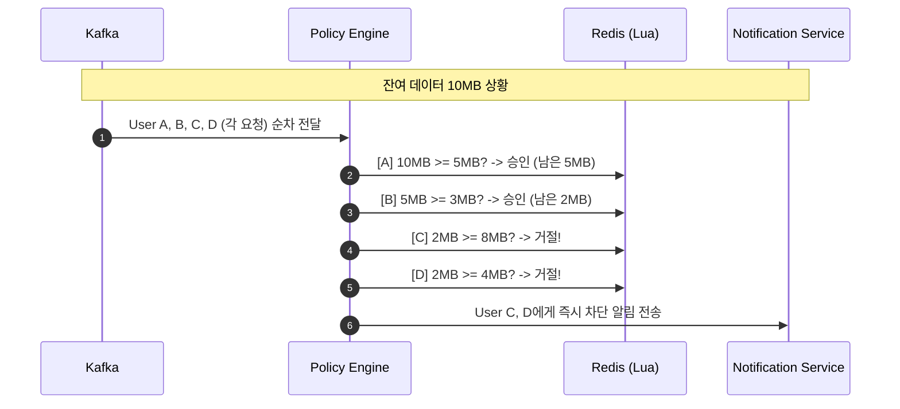

# 실시간 가족 데이터 통합 관리 및 스마트 제약 시스템 - 기획서

> **문서 버전**: v23.0
> **작성일**: 2026-03-15
> **작성자**: DABOM 팀 (김동혁, 나원빈, 박예진, 임지우, 백승우, 장예찬, 최승언)
> **변경 이력**: v22.0 - API_SPECIFICATION v22.2 Major 버전 동기화: 백오피스 기능에 보상 템플릿 관리·이미지 업로드 추가 | v21.0 - API_SPECIFICATION v21.6 동기화: 협상→이의제기(Appeal) 용어 전면 갱신, 알림 트리거 APPEAL_* 전환, 소통 지수 반영 | v11.0 - 2차기획서 Phase 2 기능 반영: 협상/미션/보상/리포트 시나리오, 기능 요구사항, 알림 트리거 추가 | v10.2 - ERD v10.2 동기화: POLICY 테이블 is_active → is_active 리네이밍 | v10.0 - web-core 서브도메인 분리: web-service (www.dabom.site) + web-admin (admin.dabom.site) 반영 | v9.0 - api-spec 최종 동기화: API 경로 참조 업데이트 | v8.1 - ERD v8.1 동기화: POLICY 템플릿 필드에 is_active 추가 | v8.0 - 전체 문서 버전 통일 (공유 Major + 독립 Minor 체계 도입) | v7.0 - simulator-traffic → simulator-usage 리네이밍 동기화 | v6.0 - ERD v6.0 동기화: POLICY 필드(description, require_role, default_rules) 문서화, customerId 네이밍 반영 | v5.0 - ERD v5.0 동기화: daily→monthly 전환, DAILY_LIMIT→MONTHLY_LIMIT, CUSTOMER/ADMIN 분리 반영 | v4.0 - API URL 업데이트 (/api/v1 prefix 제거, JWT familyId 추론 반영)

---

## 1. 프로젝트 개요

### 1.1 프로젝트명
**실시간 가족 데이터 통합 관리 및 스마트 제약 시스템 (Data Policy Control System, DPCS)**

### 1.2 프로젝트 목적
가족(그룹) 단위로 공유되는 데이터(총량)를 **실시간으로 집계·시각화**하고, 부모/관리자가 정책(차단/개인 한도/시간대 제한 등)을 변경하면 **즉시 반영**되도록 하는 시스템을 구축한다.

### 1.3 프로젝트 배경
- 가족 구성원 간의 데이터를 실시간으로 공유하고, 부모가 자녀의 데이터 사용을 제어하는 니즈 증가
- 통신사의 가족 데이터 공유 서비스(SKT 데이터 공유, KT 패밀리 박스, LG U+ 데이터 공유) 벤치마킹
- 대규모 트래픽 처리, 동시성 제어, 실시간 정책 반영 기술 학습

### 1.4 학습 목표

| 영역 | 학습 목표 |
|------|----------|
| **백엔드** | 대용량 이벤트 스트리밍 파이프라인, 동시성 제어(정합성), 분산락/원자 연산, 장애 및 재처리(Idempotency) 설계 경험 |
| **프론트엔드** | 실시간 UI(대시보드), 실시간 알림/상태 반영(WebSocket/SSE) 경험, PWA 푸시 알림 |

### 1.5 전제 조건 및 규모

| 항목 | 값 | 비고 |
|------|-----|------|
| 가상 사용자 수 | **1,000,000명** | 시뮬레이션 대상 |
| 가족 그룹 수 | **250,000개** | 그룹당 평균 4인, **최대 10명** |
| 이벤트 처리량 | **5,000 TPS** | 초당 Usage Event |
| 차단 판정 지연 | **100ms 이하** | P99 기준 |
| 이벤트 발생 방식 | simulator-usage | 시뮬레이터를 통한 실시간 데이터 소모 이벤트 생성 |

---

## 2. 사용자 정의

### 2.1 일반 가족 구성원 (Family Member)

**역할**: 가족 공유 데이터를 사용하는 일반 사용자

**권한 및 기능**:
- 본인의 실시간 데이터 사용량 조회
- 가족 전체 잔여 데이터 조회
- 가족 구성원별 사용 비중 시각화 조회
- 알림 수신 (잔여량 경고, 차단 알림 등)
- Owner가 설정한 정책(차단, 한도 등)의 적용을 받음
- 이의제기 요청 (조르기/긴급)
- 보상 요청
- 미션 목록 조회
- 월간 리포트 조회
- 프로필 수정
- 약관 동의

### 2.2 Owner 계정 (Owner)

**역할**: 가족 그룹 내 **수정 권한**을 가진 관리 사용자 (**복수 Owner 가능** — 한 가족 그룹에 여러 OWNER가 존재할 수 있음)

**권한 및 기능** (일반 구성원 기능 포함):
- 구성원별 데이터 한도 설정 (슬라이더 UI)
- 특정 사용자 실시간 차단/해제
- 시간대별 데이터 사용 차단 정책 설정 (예: 야간 22시~07시)
- 알림 임계값 설정 (50%, 30%, 10%)
- 가족 구성원 추가/삭제/권한 변경
- 다른 구성원을 OWNER로 승격 가능
- 구성원 탈퇴 시 데이터 할당량 수동 재배치
- 사용량 상세 분석 리포트 조회 (시간대별, 앱별, 구성원별)
- 미션 생성/삭제
- 보상 승인/거절
- 이의제기 승인/거절
- 가족 이름 수정
- 보상 템플릿 조회

**Last Write Wins 충돌 해결**: 복수 Owner가 동일 정책을 동시에 수정할 경우, 마지막으로 수정한 값이 적용됩니다. 모든 정책 변경은 `audit_log`에 기록되어 변경 이력을 추적할 수 있습니다.

### 2.3 운영자 (Backoffice Admin)

**역할**: 시스템 전체를 관리하는 내부 관리자

**권한 및 기능**:
- 정책 템플릿 CRUD (생성/조회/수정/삭제)
- **개별 가족 정책 직접 수정** (고객 요청 시)
- 가족 그룹별 데이터 사용량 조회 및 리포트
- 사용자/그룹 검색 및 상세 조회
- 가족 구성원 권한 관리 (Owner 계정 지정/해제 — 복수 Owner 허용)
- 시스템 모니터링 및 감사 로그(Audit Log) 조회
- 정책 변경 시 **즉시 적용** 보장

---

## 3. 핵심 시나리오

### 3.1 시나리오 1: "Last 10MB" 동시성 제어

#### 상황
김씨 가족(부모 2명, 자녀 2명)이 공유 데이터 잔여량 **10MB**인 상태에서 4명이 **동시에** 데이터를 사용하려 함

#### 시나리오 흐름

```
[T0] 초기 상태
├─ 가족 잔여량: 10MB
└─ 동시 요청 발생:
   ├─ 아빠: 5MB 사용 요청 (뉴스 앱)
   ├─ 엄마: 3MB 사용 요청 (메시지)
   ├─ 자녀1: 8MB 사용 요청 (유튜브)
   └─ 자녀2: 4MB 사용 요청 (게임)

[T1] simulator-usage → Kafka (직접 발행)
├─ 4개의 Usage Event 동시 발행
├─ simulator-usage가 eventId 부여 (UUID v4, 중복 처리 대비)
└─ Kafka 토픽(usage-events)으로 직접 발행
    └─ 파티션 키: familyId (가족 단위 순서 보장)

[T2] processor-usage 처리 (검증 + 정책 평가 + 쿼터 차감)
├─ usage-events 소비 (동일 파티션 → 순차 처리)
├─ 이벤트 검증 + 중복 체크 (Redis SETNX)
├─ Redis 원자 연산 (Lua 스크립트)
│   ├─ 잔여량 확인: 10MB
│   ├─ 아빠 5MB 차감 → 잔여 5MB ✅ (선착순 완전 승인)
│   ├─ 엄마 3MB 차감 → 잔여 2MB ✅
│   ├─ 자녀1 8MB 요청 > 잔여 2MB → 차단 ❌
│   └─ 자녀2 4MB 요청 > 잔여 2MB → 차단 ❌
└─ notification-events 토픽으로 통합 발행
    ├─ QUOTA_UPDATED (잔여량 변경)
    ├─ CUSTOMER_BLOCKED (자녀1, 자녀2)
    └─ THRESHOLD_ALERT (10% 미만 도달)

[T3] 실시간 반영
├─ Redis 상태 업데이트 (즉시)
├─ RDS 이력 저장 (Write-Behind 비동기)
├─ 알림 발송 (PWA 푸시)
└─ SSE를 통해 대시보드 실시간 업데이트
```

#### 핵심 설계 포인트
- **정책**: 선착순 완전 승인 (먼저 도착한 요청만 승인, 나머지 즉시 차단)
- **Kafka 파티션 키 = familyId**: 동일 가족 이벤트는 같은 파티션에서 순서 보장
- **Redis Lua Script**: "잔여량 확인 → 차감 → 상태 변경"을 단일 트랜잭션처럼 처리
- **eventId 기반 Idempotency**: 중복 이벤트 무시 (TTL 기반 처리 기록)


```mermaid
sequenceDiagram
    autonumber
    participant K as Kafka
    participant PE as Policy Engine
    participant R as Redis (Lua)
    participant NS as Notification Service

    Note over K, NS: 잔여 데이터 10MB 상황
    K->>PE: User A, B, C, D (각 요청) 순차 전달

    PE->>R: [A] 10MB >= 5MB? -> 승인 (남은 5MB)
    PE->>R: [B] 5MB >= 3MB? -> 승인 (남은 2MB)
    PE->>R: [C] 2MB >= 8MB? -> 거절!
    PE->>R: [D] 2MB >= 4MB? -> 거절!

    PE->>NS: User C, D에게 즉시 차단 알림 전송
```

---

### 3.2 시나리오 2: Owner의 실시간 정책 변경

#### 상황
Owner(부모 중 한 명)가 자녀1의 월별 한도를 **2GB → 500MB**로 축소. 자녀1은 이미 이번 달 **1.2GB** 사용 중

> **Note**: 복수 Owner가 존재하는 경우, 어떤 Owner든 정책 변경이 가능합니다. 정책 충돌 시 Last Write Wins 방식으로 마지막 수정이 적용됩니다.

#### 시나리오 흐름

```
[T0] Owner가 web-service(Owner 모드)에서 한도 변경
├─ UI: 자녀1 한도 슬라이더 → 500MB
└─ API 호출: PATCH /families/policies

[T1] api-core 처리
├─ RDS에 정책 원본 저장 (Source of Truth)
├─ Redis constraints Hash 즉시 갱신
│   └─ HSET family:{id}:customer:{cid}:constraints LIMIT:DATA:MONTHLY 536870912
├─ policy-updated 이벤트 발행 (Kafka)
└─ 응답: 200 OK

[T2] processor-usage 정책 즉시 반영
├─ policy-updated 이벤트 수신
├─ 최신 정책으로 constraints Hash 갱신
├─ 현재 사용량(1.2GB) vs 신규 한도(500MB) 비교
├─ 사용량 > 한도 → 즉시 차단 (진행 중인 요청도 즉시 중단)
│   └─ HSET family:{id}:customer:{cid}:constraints BLOCK:ACCESS "1"
└─ notification-events 발행 (CUSTOMER_BLOCKED)

[T3] 실시간 반영
├─ 자녀1 앱: 즉시 차단 화면 표시 (차단 사유 + 부모 연락처)
├─ 가족 대시보드: 자녀1 상태 "차단됨"으로 변경
├─ 부모 관리 페이지: 변경 완료 확인
└─ 자녀1에게 PWA 푸시: "데이터 한도 초과로 차단되었습니다"
```

#### 핵심 설계 포인트
- **정책 즉시 반영**: api-core → RDS + Redis + Kafka(policy-updated)
- **소급 적용**: 이미 초과한 경우 즉시 차단 처리
- **즉시 차단**: 진행 중인 요청도 즉시 중단하고 차단 적용
- **이중 경로**: Redis 직접 갱신 + 이벤트 발행으로 일관성 보장

---

### 3.3 시나리오 3: 시간대별 차단 정책

#### 상황
부모가 자녀들에게 **밤 22시 ~ 아침 07시** 데이터 사용 차단 정책 설정

#### 시나리오 흐름

```
[T0] 정책 설정
├─ 부모 → web-service에서 시간대 차단 정책 등록
├─ 대상: 자녀1, 자녀2
├─ 차단 시간: 22:00 ~ 07:00 (서버 시간 KST 기준)
└─ api-core → RDS 저장 + Redis 캐시 + policy-updated 발행

[T1] 22:00 도달 (정책 활성화)
├─ Lua Script가 constraints의 BLOCK:TIME:START/END 확인
├─ 현재 시각(2200) >= 시작(2200) → 시간대 차단 활성
├─ notification-events 발행 (CUSTOMER_BLOCKED, reason: BLOCKED_TIME)
└─ 알림: "야간 차단 정책이 활성화되었습니다"

[T2] 차단 중 데이터 요청
├─ 자녀1 → simulator-usage → Kafka (usage-events)
├─ processor-usage → Lua Script 실행
│   └─ constraints BLOCK:TIME:START/END 확인 → "BLOCKED_TIME" 반환
└─ 결과: BLOCKED_TIME (해제 예정: 07:00)

[T3] 07:00 도달 (정책 비활성화)
├─ Lua Script가 현재 시각(0700) >= END(0700) 확인 → 차단 해제
├─ notification-events 발행 (CUSTOMER_UNBLOCKED)
└─ 알림: "야간 차단이 해제되었습니다"
```

#### 핵심 설계 포인트
- **시간 기준**: 서버 고정 시간대 (KST) 기준으로 통일
- **정책 구조**: Redis에 JSON 형태로 시간대 정책 저장

---

### 3.4 시나리오 4: 단계별 소진 알림 (50%/30%/10%)

#### 알림 정책
- **임계치당 1회만 발송**: 50%, 30%, 10% 각 임계치별로 한 번만 발송
- **중복 방지**: Redis에 알림 발송 기록 저장 (TTL: quota reset까지)

```
family:{familyId}:alert:threshold:50 -> "1" (발송 완료)
family:{familyId}:alert:threshold:30 -> "1" (발송 완료)
family:{familyId}:alert:threshold:10 -> "1" (발송 완료)
```

---

### 3.5 시나리오 5: 긴급 요청 흐름

#### 상황
자녀가 데이터가 부족한 긴급 상황에서 즉각적인 데이터 추가를 필요로 함

#### 시나리오 흐름

```
[T0] 자녀가 긴급 데이터 추가 요청
├─ 요청 범위: 100MB ~ 300MB 이내
├─ 월 1회 제한 (emergency_grant_month UNIQUE 제약으로 DB 레벨 중복 방지)
└─ API 호출: POST /appeals/emergency

[T1] 긴급 요청 처리
├─ INSERT with emergency_grant_month=현재 월 1일 (UNIQUE 위반 시 429 에러)
├─ 자동 승인 처리
│   ├─ status = APPROVED
│   └─ resolved_by_id = NULL (자동 승인이므로 관리자 없음)
└─ customer_quota에 즉시 반영 (추가 데이터 지급)

[T2] 알림 발송
├─ 부모(Owner)에게 긴급 요청 자동 승인 알림 발송
└─ 자녀에게 승인 완료 알림 발송
```

#### 핵심 설계 포인트
- **월 1회 제한**: `emergency_grant_month` UNIQUE 제약으로 DB 레벨에서 동시성 안전하게 중복 방지
- **자동 승인**: 부모 개입 없이 즉시 처리 (resolved_by_id=NULL)
- **즉시 반영**: customer_quota에 즉시 데이터 추가
- **사후 알림**: 부모에게 사후 알림으로 투명성 확보

---

### 3.6 시나리오 6: 미션 보상 흐름

#### 상황
부모가 자녀에게 미션을 부여하고, 자녀가 미션을 완료하면 보상을 지급함

#### 시나리오 흐름

```
[T0] 부모가 미션 생성
├─ 자유 텍스트로 미션 내용 작성
├─ 보상 템플릿 선택 (상품 선택)
├─ MISSION_ITEM.status = ACTIVE 로 생성
└─ 가족 구성원에게 미션 생성 알림 발송

[T1] 자녀가 미션 달성 후 보상 요청
├─ 조건: MISSION_ITEM.status = ACTIVE 인 경우만 요청 가능
├─ 보상 요청 API 호출
└─ Owner에게 보상 요청 알림 발송

[T2-A] 부모가 승인
├─ MISSION_ITEM.status = COMPLETED
├─ completed_at 기록
└─ 자녀에게 승인 알림 + 보상 지급 (쿠폰 발급)

[T2-B] 부모가 거절
├─ 자녀에게 거절 알림 발송
└─ 자녀는 재요청 가능 (status 유지)

[T3] 미션 수정/삭제
├─ 미션은 생성 후 수정 불가
└─ 수정 필요 시 삭제 후 재생성
```

#### 핵심 설계 포인트
- **단방향 상태 전이**: ACTIVE → COMPLETED (수정 불가, 삭제 후 재생성)
- **보상 템플릿**: 사전 정의된 보상 상품 선택으로 일관성 확보
- **재요청 가능**: 거절 후 자녀가 재요청 가능 (유연한 이의제기 구조)
- **완료 이력**: REWARD_GRANT 테이블로 보상 지급 이력 추적

---

### 3.7 시나리오 7: 월간 리포트

#### 상황
매월 말 가족의 데이터 사용 현황과 이의제기/미션 실적을 자동으로 집계하여 가족 회의 자료를 생성함

#### 시나리오 흐름

```
[T0] 월말 배치 잡 실행
├─ 스케줄러가 월말에 자동 트리거
└─ 대상: 전체 가족 그룹

[T1] 데이터 집계
├─ 사용량: 구성원별/시간대별 월간 데이터 사용량
├─ 이의제기 현황: 이의제기 요청 수, 승인 수, 거절 수
├─ 긴급 요청: 월간 긴급 요청 횟수 및 지급량
└─ 미션 보상: 완료된 미션 수, 지급된 보상 총량

[T2] 소통 지수 계산
├─ 소통 지수 = (승인율 × 0.5) + (이의제기 활용도 × 100 × 0.3) + (행동 실행력 × 100 × 0.2)
├─ 승인율: 승인된 이의제기 수 / 전체 이의제기 요청 수
├─ 이의제기 활용도: 이의제기 활용 비율 (0~1)
└─ 행동 실행력: 미션 완료 비율 (0~1)

[T3] 리포트 저장
├─ 스냅샷 방식으로 저장 (과거 데이터 불변 보장)
├─ 가족 구성원에게 월간 리포트 생성 알림
└─ 월말 가족 회의 자료로 활용 장려
```

#### 핵심 설계 포인트
- **배치 자동화**: 월말 자동 실행으로 수동 개입 불필요
- **스냅샷 불변성**: 한 번 생성된 리포트는 변경 불가 (과거 데이터 신뢰성)
- **소통 지수**: 정량화된 지표로 자녀의 이의제기 습관 시각화
- **가족 회의 장려**: 데이터 기반으로 가족 간 소통 촉진

---

## 4. 기능 요구사항

### 4.1 가족 앱/웹 (web-service, www.dabom.site) - PWA

#### 4.1.1 공통 기능 (모든 구성원)

| 기능 | 설명 | 실시간 여부 |
|------|------|------------|
| 가족 통합 대시보드 | 가족 잔여 데이터량, 구성원별 사용 비중 시각화 | ✅ SSE |
| 개인 사용량 상세 | 시간대별/앱별/구성원별 상세 분석 리포트 | ✅ SSE |
| 알림 센터 | 잔여량 경고, 차단 알림, 정책 변경 알림 | ✅ PWA Push |
| 차단 상태 표시 | 즉시 차단 화면 (차단 사유, 부모 연락처) | ✅ SSE |
| 가족 구성원 목록 | 가족 구성원 및 각자의 상태 확인 | - |

#### 4.1.2 Owner 전용 기능 - 중간 수준 복잡도

| 기능 | 설명 | 실시간 여부 |
|------|------|------------|
| 구성원별 한도 설정 | 슬라이더 UI로 월별 데이터 한도 조절 | 즉시 적용 |
| 실시간 차단/해제 | 특정 구성원의 데이터 사용 즉시 차단 또는 해제 | 즉시 적용 |
| 시간대 정책 설정 | 야간 등 특정 시간대 차단 정책 설정 | 즉시 적용 |
| 앱별 차단 설정 | 특정 앱/서비스 사용 차단 (MVP 제외) | 즉시 적용 |
| 알림 임계값 설정 | 50%, 30%, 10% 등 잔여량 알림 기준 설정 | - |
| 상세 분석 리포트 | 시간대별, 앱별, 구성원별 사용량 분석 | - |
| 구성원 관리 | 추가/삭제, 탈퇴 시 할당량 수동 재배치 | - |
| 미션 CRUD | 미션 항목 생성/삭제 (수정 불가, 삭제 후 재생성) | - |
| 보상 승인/거절 | 자녀의 보상 요청에 대한 승인 또는 거절 처리 | - |
| 이의제기 응답 | 자녀의 이의제기(조르기/긴급) 요청에 승인/거절 응답 | - |
| 가족 이름 수정 | 가족 그룹 이름 변경 | - |

#### 4.1.3 Member 전용 기능

| 기능 | 설명 | 실시간 여부 |
|------|------|------------|
| 이의제기 요청 (조르기) | Owner에게 데이터 한도 증량 이의제기 요청 | - |
| 이의제기 요청 (긴급) | 긴급 데이터 추가 요청 (월 1회 제한, 자동 승인, UNIQUE 제약 기반) | - |
| 보상 요청 | 완료한 미션에 대한 보상 지급 요청 | - |
| 프로필 수정 | 본인 프로필 정보 수정 | - |
| 약관 동의 | 서비스 이용 약관 동의/철회 | - |

### 4.2 백오피스 관리 시스템 (web-admin, admin.dabom.site)

| 기능 | 설명 |
|------|------|
| 정책 관리 | 정책 템플릿 CRUD (시간대 차단, 한도 유형 등) |
| 개별 가족 정책 수정 | 고객 요청 시 관리자가 직접 정책 수정 가능 |
| 정책 즉시 적용 | 정책 변경 시 다음 이벤트부터 즉시 반영 보장 |
| 가족 그룹 검색/조회 | 그룹 ID, 사용자 이름, 전화번호 등으로 검색 |
| 사용량 모니터링 | 그룹별/사용자별 실시간 사용량 및 이력 조회 |
| 권한 관리 | Owner 계정 지정/해제 (복수 Owner 허용), 그룹 내 역할 변경 |
| 상세 리포트/통계 | 시간대별, 앱별, 구성원별 사용량 집계 리포트 |
| 감사 로그 | 정책 변경, 차단/해제 이력 등 감사 로그 조회 |
| 보상 템플릿 관리 | 보상 상품 템플릿 CRUD (목록/상세 조회, 생성, 수정, 삭제) |
| 이미지 업로드 | 보상 썸네일 등 이미지 업로드 (R2 → CDN URL 반환, 5MB 제한) |

### 4.3 simulator-usage (시뮬레이터) - 기본 부하 테스트

| 기능 | 설명 |
|------|------|
| 이벤트 생성 | familyId, userId, appId, bytesUsed, timestamp 포함 |
| RPS 제어 | 초당 이벤트 발생률 조절 (고정 RPS) |
| 랜덤 이벤트 | 무작위 사용자에 대한 데이터 사용 이벤트 생성 |

---

## 5. 정책 유형 정의

### 5.1 MVP 구현 대상

| 정책 유형 | 설명 | 우선순위 |
|----------|------|---------|
| **월별 한도 정책** | 구성원별 월별 데이터 한도 설정 | 높음 |
| **즉시 차단 정책** | Owner가 특정 구성원을 즉시 차단/해제 | 높음 |
| **시간대 차단 정책** | 특정 시간대(야간 등) 자동 차단 (KST 기준) | 중간 |
| **임계값 알림 정책** | 잔여량 기준(50/30/10%) 알림 발송, 임계치당 1회 | 높음 |

### 5.2 설계만 진행 (MVP 제외)

| 정책 유형 | 설명 |
|----------|------|
| **앱별 차단 정책** | 특정 앱/서비스 사용 차단 (유튜브, 게임 등) |
| **앱별 가속 정책** | 특정 앱 우선순위 상향 (QoS) |
| **속도 제한 정책** | 한도 초과 시 속도 제한 (차단 대신) |

### 5.3 정책 템플릿 필드 설명 (ERD v6.0)

POLICY 테이블에는 정책 템플릿의 메타데이터를 저장하는 다음 필드가 추가되었습니다:

| 필드 | DB 컬럼 | 설명 |
|------|---------|------|
| 정책 설명 | `description` | 정책 템플릿의 상세 설명. 운영자가 관리하며, 프론트엔드 툴팁 표시용 |
| 최소 요구 역할 | `require_role` | 정책 적용 시 최소 요구 역할. `MEMBER`이면 모든 구성원에게 적용 가능, `OWNER`이면 OWNER만 대상 |
| 기본 규칙 | `default_rules` | 정책 타입별 기본 규칙 JSON. POLICY_ASSIGNMENT 생성 시 초기값으로 복사됨 |
| 활성화 여부 | `is_active` | 정책 템플릿의 활성화 상태. FALSE이면 정책 목록에서 제외되며 신규 적용 불가 |

**default_rules vs rules 관계**:
- `POLICY.default_rules`: 템플릿 수준의 기본값 (운영자가 설정)
- `POLICY_ASSIGNMENT.rules`: 실제 적용된 규칙 (Owner가 커스터마이즈 가능)
- **적용 흐름**: Owner가 정책을 적용하면 `default_rules`가 `rules`로 복사되고, 이후 독립적으로 수정 가능

### 5.4 컨셉/아이디어 단계

| 아이디어 | 설명 |
|----------|------|
| 예약 차단 | 특정 날짜/시간에 자동 차단/해제 예약 |
| 위치 기반 정책 | 특정 위치(학교, 집)에서만 정책 적용 |
| AI 추천 한도 | 사용 패턴 분석 후 최적 한도 추천 |
| 데이터 선물 | 가족 간 잔여 데이터 이전 |
| 지능형 예측 알림 | "현재 속도로 쓰면 15분 뒤에 소진됩니다" |
| Adaptive Throttling | 완전 차단 vs 속도 제한 선택 |

---

## 6. 알림 정책

### 6.1 알림 트리거 조건

| 트리거 | 알림 대상 | 알림 내용 | 이벤트 |
|--------|----------|----------|--------|
| 잔여 50% 도달 | 전체 가족 | "가족 데이터가 50% 남았습니다" | notification-events (THRESHOLD_ALERT) |
| 잔여 30% 도달 | 전체 가족 | "가족 데이터가 30% 남았습니다" | notification-events (THRESHOLD_ALERT) |
| 잔여 10% 도달 | 전체 가족 | "가족 데이터가 10% 미만입니다!" | notification-events (THRESHOLD_ALERT) |
| 개인 한도 초과 | 해당 구성원 + 부모 | "데이터 한도 초과로 차단됩니다" | notification-events (CUSTOMER_BLOCKED) |
| 시간대 차단 시작 | 차단 대상 | "야간 차단이 활성화되었습니다" | notification-events (CUSTOMER_BLOCKED) |
| 시간대 차단 종료 | 차단 대상 | "야간 차단이 해제되었습니다" | notification-events (CUSTOMER_UNBLOCKED) |
| 정책 변경 | 영향받는 구성원 | "데이터 정책이 변경되었습니다" | policy-updated |
| 이의제기 요청 | Owner | "새로운 이의제기 요청이 도착했습니다" | notification-events (APPEAL_REQUESTED) |
| 이의제기 승인 | 요청자 (Member) | "이의제기 요청이 승인되었습니다" | notification-events (APPEAL_APPROVED) |
| 이의제기 거절 | 요청자 (Member) | "이의제기 요청이 거절되었습니다" | notification-events (APPEAL_REJECTED) |
| 긴급 요청 자동 승인 | Owner | "긴급 데이터 요청이 자동 승인되었습니다" | notification-events (EMERGENCY_AUTO_APPROVED) |
| 미션 생성 | 가족 구성원 전체 | "새로운 미션이 생성되었습니다" | notification-events (MISSION_CREATED) |
| 보상 요청 | Owner | "보상 요청이 도착했습니다" | notification-events (REWARD_REQUESTED) |
| 보상 승인 | 요청자 (Member) | "보상 요청이 승인되었습니다" | notification-events (REWARD_APPROVED) |
| 보상 거절 | 요청자 (Member) | "보상 요청이 거절되었습니다" | notification-events (REWARD_REJECTED) |

### 6.2 알림 채널
- **인앱 알림**: SSE 기반 실시간 (즉시)
- **PWA 푸시 알림**: Service Worker 기반 (즉시)

### 6.3 중복 발송 방지
- **임계치당 1회**: 50%, 30%, 10% 각 임계치별로 한 번만 발송
- **Redis 기록**: `family:{familyId}:alert:threshold:{value}` 키로 발송 기록 (TTL: quota reset까지)

---

## 7. 화면 설계 (UI/UX)

### 7.1 web-service (가족 앱/웹, www.dabom.site) - PWA

```
[메인 대시보드]
├─ 가족 잔여 데이터 (게이지/숫자) - Progress Bar
├─ 구성원별 사용 비중 (파이 차트)
├─ 최근 알림 요약
└─ 빠른 액션 버튼 (차단/한도 변경) - 부모만 표시

[개인 사용량 상세]
├─ 오늘/이번주/이번달 사용량
├─ 시간대별 사용 그래프 (상세 분석)
└─ 앱별 사용량 (상세 분석)

[정책 관리 - Owner]
├─ 구성원 목록 + 상태 (차단/활성)
├─ 개인별 한도 슬라이더 (Debouncing 적용)
├─ 시간대 차단 설정
└─ 즉시 차단/해제 토글

[차단 화면]
├─ 차단 사유 표시 (한도 초과 / 시간대 차단 / 부모 차단)
├─ 해제 조건/예정 시간
└─ 부모 연락처

[알림 센터]
├─ 읽지 않은 알림 배지
├─ 알림 목록 (시간순)
└─ 알림 상세 + 관련 액션

[미션/보상 화면]
├─ 미션 카드 목록 (ACTIVE/COMPLETED 상태별 필터)
├─ 미션 생성 (Owner) - 자유 텍스트 + 보상 템플릿 선택
├─ 보상 요청 (Member) - 완료 미션 선택 후 요청
├─ 미션 상태 로그 - 미션 상태 변화 타임라인 조회
└─ 미션 요청 이력 - 보상 요청 처리 결과 조회

[이의제기/긴급요청 화면]
├─ 조르기 요청 (Member) - 데이터 한도 증량 이의제기 요청 폼
├─ 긴급 요청 (Member) - 100~300MB 범위 긴급 데이터 요청 폼
├─ 이의제기 목록/상세 - 요청 현황 및 상세 내용 조회
├─ 코멘트 - 이의제기 관련 의견 작성
└─ 이의제기 응답 (Owner) - 승인/거절 처리

[월간 리포트 대시보드]
├─ 사용량 - 구성원별/시간대별 월간 데이터 사용 현황
├─ 이의제기 현황 - 이의제기 요청 수, 승인율, 거절율
├─ 미션 보상 실적 - 완료 미션 수, 지급된 보상 총량
└─ 소통 지수 - 정량 지표 시각화 (승인율/이의제기 활용도/행동 실행력)

[프로필/약관 화면]
├─ 프로필 조회 - 본인 정보 확인
├─ 프로필 수정 - 이름, 연락처 등 정보 변경
└─ 약관 동의 - 서비스 이용 약관 동의/철회

[알림 관리]
├─ 알림 목록 - 전체 수신 알림 시간순 조회
├─ 개별 읽음 처리 - 알림 단건 읽음 표시
└─ 전체 읽음 처리 - 전체 알림 일괄 읽음 표시
```

### 7.2 web-admin (백오피스, admin.dabom.site)

```
[대시보드]
├─ 전체 사용량 통계
├─ 활성 가족 그룹 수
└─ 최근 차단 현황

[가족 그룹 관리]
├─ 검색 (ID, 이름, 전화번호)
├─ 그룹 상세 조회
├─ 구성원 권한 관리
├─ 개별 가족 정책 직접 수정
└─ 사용량 이력

[정책 관리]
├─ 정책 템플릿 목록
├─ 정책 CRUD
└─ 정책 적용 대상 관리

[리포트]
├─ 시간대별/앱별/구성원별 상세 분석
└─ 일/주/월 단위 집계

[로그/모니터링]
├─ 감사 로그 조회
├─ 시스템 메트릭 (Observability)
└─ 에러 로그
```

### 7.3 디자인 가이드라인
- **색상 팔레트**: 초록색 기반 (#0cc459 Primary)
- **접근성**: WCAG AA 등급 준수
- **반응형**: 모바일/태블릿/PC 지원
- **캐릭터 아이콘**: 친근한 분홍색 캐릭터 사용

---

## 8. 가족 초대 및 구성원 관리

### 8.1 가족 초대 방식
- **전화번호 기반**: 전화번호로 초대, SMS 인증 후 자동 가입
- **초대 코드 (대안)**: 6자리 코드 발급, 코드 입력으로 가입

### 8.2 구성원 제한
- **최대 10명**: 가족 그룹당 최대 구성원 수

### 8.3 탈퇴 시 처리
- **Owner 수동 재배치**: 탈퇴 후 Owner가 직접 데이터 할당량 재배치

---

## 9. 구현 로드맵 (7주)

### Phase 1: Core Engine & Pipeline (1-3주차) - "흐르게 하라"

가장 리스크가 큰 트래픽 처리와 **동시성 제어**(최우선 기능)를 먼저 검증합니다.

- **W1 (설계 및 세팅)**
  - Kafka 토픽 설계 (`usage-events`, `policy-updated`, `notification-events`, `usage-persist`)
  - Redis Cluster 구성 및 Lua Script 프로토타이핑
  - simulator-usage 제작: 고정 RPS 랜덤 이벤트 생성

- **W2 (수집 및 제어)**
  - simulator-usage 구현 (eventId 생성, Kafka 직접 발행)
  - processor-usage 핵심 로직 (Kafka Consumer, 검증, Redis Lua Script, 선착순 완전 승인)
  - "Last 10MB" 동시성 테스트 수행

- **W3 (시각화 및 연동)**
  - SSE 서버 구현
  - 기본 프론트엔드 연동 (실시간 대시보드)

### Phase 2: Business Logic & Admin (4-5주차) - "제어하라"

- **W4 (정책 고도화)**
  - 동적 정책 적용 (Owner가 한도 변경 시 Redis 값 즉시 갱신)
  - 시간대별 차단 정책 (KST 기준)
  - 가족 구성원 권한 관리 (RBAC)
  - JWT 인증 시스템 구현

- **W5 (백오피스 & 정산)**
  - Admin API 개발 (정책 CRUD, 개별 가족 수정)
  - Write-Behind 패턴: Kafka를 통한 RDS 비동기 저장
  - 상세 분석 리포트 구현

### Phase 3: Reliability & Optimization (6-7주차) - "견고하게 하라"

- **W6 (안정성)**
  - Circuit Breaker 전체 적용 (Redis, Kafka 포함)
  - DB Fallback: Redis 장애 시 MySQL 전환
  - Dead Letter Queue(DLQ) 처리: 3회 실패 시 DLQ
  - Flyway 자동 마이그레이션

- **W7 (최종 검증)**
  - 부하 테스트 (simulator-usage)
  - 전체 Observability 구성 (로그 + 메트릭 + 트레이싱)
  - 테스트 커버리지 70% 달성
  - 최종 발표 자료 및 데모 준비

---

## 10. R&R (역할 분담)

### 10.1 Backend 역할 분담 (5인)

| 역할 | 담당 영역 | 주요 기술 스택 & 책임 |
|------|----------|----------------------|
| **BE 1 (Core)** | Policy Engine & Concurrency | Redis(Lua), Kafka Consumer, 동시성 제어 (최우선) |
| **BE 2 (Ingest)** | Traffic Gateway & Simulator | Kafka Producer, simulator-usage 개발 |
| **BE 3 (Biz)** | Family Service & API | Spring Boot, JPA, JWT 인증, SSE |
| **BE 4 (Data)** | Settlement & Persistence | Write-Behind, MySQL, Flyway |
| **BE 5 (Ops)** | Backoffice & DevOps | Admin API, Docker/K8s, Observability |

### 10.2 Frontend 역할 분담 (2인)

| 역할 | 담당 영역 | 주요 기술 스택 |
|------|----------|---------------|
| **FE 1** | web-service (가족 앱, www.dabom.site) | Next.js, TypeScript, Tailwind, SSE, PWA |
| **FE 2** | web-admin (백오피스, admin.dabom.site) | Next.js, TypeScript, Tailwind |

---

## 11. 논의 필요 사항

### 11.1 확정된 기술적 결정 사항

| 항목 | 결정 |
|------|------|
| 동시성 정책 | 선착순 완전 승인 |
| 정책 변경 시 진행 중 요청 | 즉시 차단 |
| Redis 장애 대응 | DB Fallback (MySQL) |
| 알림 중복 방지 | 임계치당 1회 |
| 실시간 통신 | SSE |
| 앱 플랫폼 | PWA |
| 인증 시스템 | JWT 자체 구현 |
| 가족 초대 | 전화번호 기반 |
| API 버전 관리 | Accept-Version 헤더 |

### 11.2 추가 논의 필요 사항

- 부분 승인 정책: 잔여량보다 큰 요청 시 거부 vs 잔여량만 승인 (현재: 거부)
- 차단 시 예외 허용 범위: 긴급 연락 앱 등
- 월별 리셋 시점 정의 및 자동 차단 해제 정책

---

## 용어 정의

용어 정의는 [GLOSSARY.md](./GLOSSARY.md) 문서를 참조하세요.

---

## 관련 문서

- [아키텍처 설계서](./ARCHITECTURE.md)
- [API 명세서](./API_SPECIFICATION.md)
- [데이터 모델](./DATA_MODEL.md)
- [ERD 설계서](./ERD.md)
- [용어집](./GLOSSARY.md)
- [Kafka 메시지 스키마](./designs/kafka/MESSAGE_SCHEMA.md)
- [Kafka 토픽 설계서](./designs/kafka/TOPIC_DESIGN.md)
- [Redis Key 설계서](./designs/redis/KEY_DESIGN.md)
